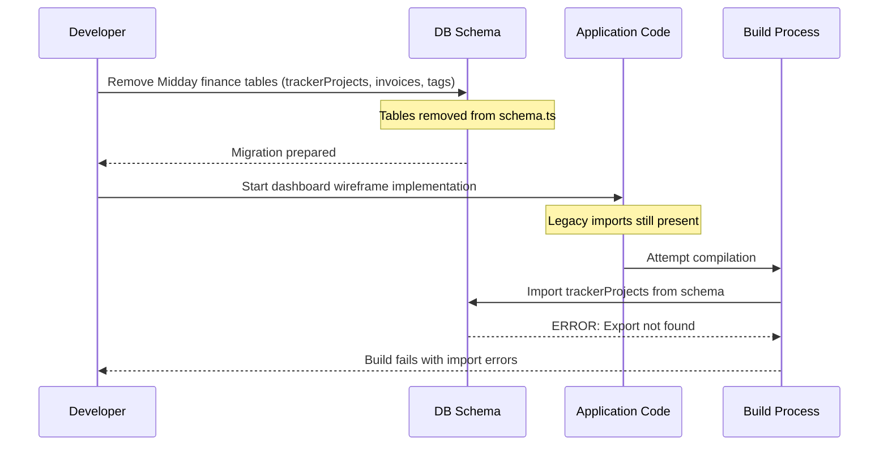

# Root Cause Analysis: Schema Migration Failure

## Executive Summary
The application failed to build due to missing database table exports (`trackerProjects`, `invoices`, `tags`) that were removed during the Midday-to-Zeke migration but still referenced throughout the codebase, causing TypeScript compilation errors.

## Event Sequence

## Multi-Angle Analysis

### 1. Technical Analysis
**Code-level issues:**
- Database schema file (`packages/db/src/schema.ts`) had finance-related tables removed
- 11+ files still importing removed tables (`trackerProjects`, `invoices`, `tags`)
- TypeScript compilation fails due to unresolved imports
- Queries attempting to join on non-existent tables

**Architecture problems:**
- Tight coupling between UI components and database tables
- No abstraction layer to handle schema changes gracefully
- Missing feature flags to toggle between old/new implementations

### 2. Operational Analysis
**Process failures:**
- Incomplete migration checklist - schema changed but dependent code not updated
- No automated checks to verify schema consistency with codebase
- Lack of staged migration approach (should have deprecated before removing)

**Human factors:**
- Migration focused on adding new tables but didn't fully clean up removed ones
- Dashboard wireframe work started before migration was complete
- No clear ownership of migration completeness

### 3. Environmental Analysis
**Infrastructure issues:**
- Local development environment doesn't match production schema
- No schema validation in CI/CD pipeline
- Missing integration tests that would catch schema mismatches

**External dependencies:**
- Invoice module (`@zeke/invoice/token`) still being imported despite removal
- Finance-specific UI components still present in dashboard

### 4. Monitoring Analysis
**Detection gaps:**
- No pre-build schema validation
- TypeScript errors only caught at compile time
- No automated dependency graph analysis

**Alerting failures:**
- Build failures not immediately obvious until runtime
- No warnings for deprecated table usage before removal

## Root Cause Analysis

### Primary Root Cause
**Incomplete database migration execution** - The Midday-to-Zeke migration removed finance-related tables from the schema but failed to update or remove all code dependencies on these tables, creating a broken state where the codebase expects tables that no longer exist.

### Contributing Factors

1. **Lack of migration tooling**: No automated tool to identify all references to removed tables
2. **Missing abstraction layer**: Direct table imports throughout codebase instead of through a data access layer
3. **Incomplete migration plan**: Focus on new functionality without complete removal of old
4. **No feature flags**: Unable to gradually transition between implementations
5. **Insufficient testing**: No integration tests to catch schema/code mismatches

### Timeline of Failure

1. **Initial State**: Midday finance app with `trackerProjects`, `invoices`, `tags` tables
2. **Migration Start**: Decision to pivot to Zeke research platform
3. **Schema Update**: Tables removed from `packages/db/src/schema.ts`
4. **Partial Code Update**: Some components updated but many missed
5. **Build Attempt**: Developer tries to run dashboard wireframe implementation
6. **Compilation Failure**: TypeScript can't resolve removed table imports
7. **Cascade Effect**: Multiple files fail preventing any development progress

### Impact Assessment

**Systems affected:**
- Build pipeline completely blocked
- Development velocity reduced to zero
- Cannot test new dashboard wireframe features
- CI/CD pipeline would fail on deployment

**Components impacted:**
- `/packages/db/src/queries/customers.ts` - Core customer queries broken
- `/apps/dashboard/src/components/tracker-*.tsx` - All tracker UI components
- `/apps/api/src/schemas/tracker-projects.ts` - API schemas invalid
- `/apps/website/src/lib/fetch-stats.ts` - Website statistics broken

## Prevention Recommendations

### Immediate Fixes Required
1. **Comment out all references to removed tables** ✓ (Completed)
2. **Update imports to exclude removed tables** ✓ (Completed)
3. **Create placeholder implementations for critical functions**
4. **Add schema validation to build process**

### Process Improvements Needed
1. **Migration Checklist**: Create comprehensive checklist including:
   - Schema changes
   - Code updates required
   - Test updates
   - Documentation updates

2. **Staged Migration**: Implement deprecation warnings before removal:
   - Phase 1: Mark as deprecated
   - Phase 2: Add runtime warnings
   - Phase 3: Remove from schema
   - Phase 4: Clean up code references

3. **Automated Validation**: Add tools to:
   - Verify schema/code consistency
   - Generate migration impact reports
   - Flag unused database references

### Monitoring/Alerting Enhancements
1. **Pre-build Validation**: Check schema consistency before compilation
2. **Dependency Analysis**: Regular scans for orphaned imports
3. **Migration Dashboard**: Track migration progress and remaining work

### Code/Architecture Changes
1. **Data Access Layer**: Create abstraction between UI and database
2. **Feature Flags**: Enable gradual rollout of new implementations
3. **Schema Versioning**: Maintain schema versions for compatibility
4. **Generated Types**: Auto-generate TypeScript types from schema

### Training or Documentation Updates
1. **Migration Guide**: Document standard migration procedures
2. **Schema Change Protocol**: Define process for schema modifications
3. **Dependency Management**: Best practices for managing cross-module dependencies

## Lessons Learned

1. **Complete migrations atomically**: Either fully migrate or don't - partial states cause more problems than they solve

2. **Automate dependency tracking**: Manual tracking of table usage across large codebases is error-prone

3. **Test migrations thoroughly**: Integration tests should verify both schema and code changes work together

4. **Communicate schema changes broadly**: All team members need visibility into breaking schema changes

5. **Implement gradual rollout mechanisms**: Feature flags and deprecation warnings prevent hard breaks

6. **Maintain backwards compatibility temporarily**: Keep deprecated tables as empty/stub implementations during transition

## Resolution Status

### Completed Actions
- Identified all files with broken imports (11 files)
- Commented out references to removed tables in `customers.ts`
- Created comprehensive list of affected components
- Documented migration gaps

### Remaining Work
- Update remaining 10 files with tracker component references
- Remove finance-specific UI components
- Update API schemas to match new data model
- Add integration tests for schema consistency
- Implement schema validation in build pipeline

## Conclusion

This incident resulted from an incomplete migration where database schema changes were not fully propagated through the codebase. The primary lesson is that schema migrations must be treated as atomic operations with comprehensive tooling to ensure consistency. Going forward, implementing proper abstraction layers, automated validation, and staged migration processes will prevent similar issues.