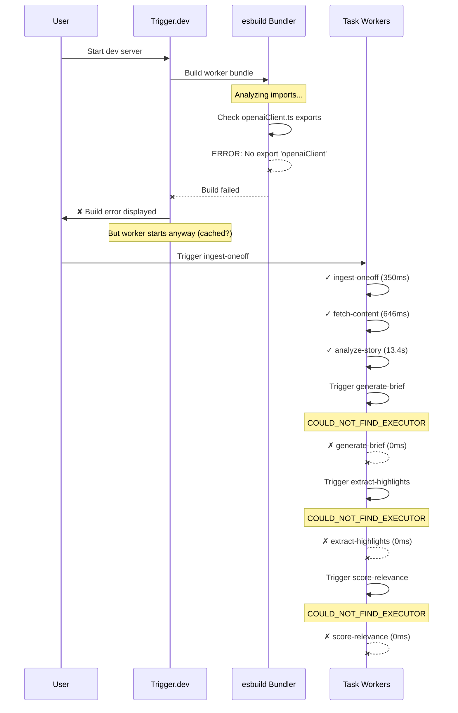

# Root Cause Analysis: Trigger.dev Flow Failure

**Incident Date**: 2025-09-30
**Severity**: Critical - Blocks end-to-end pipeline
**Bug Description**: trigger-flow-failure

---

## Event Sequence



**Timeline**:
- **10:55:51** - `ingest-oneoff` starts
- **10:55:53** - `fetch-content` completes successfully
- **10:56:07** - `analyze-story` completes (13.4s) ✅
- **10:56:07** - `generate-brief` triggered → **Error (0ms)** ❌
- **10:56:08** - `extract-highlights` triggered → **Error (0ms)** ❌
- **10:56:10** - `score-relevance` triggered → **Error (0ms)** ❌

---

## Multi-Angle Analysis

### 1. Technical Analysis

**Code-Level Issue**:
- **File**: `packages/jobs/src/utils/openai/openaiClient.ts`
- **Problem**: Exports only `createOpenAIClient` (factory function) and `OpenAIClient` (type)
- **File**: `packages/jobs/src/tasks/briefs/generate.ts:8`
- **Problem**: Imports `{ openaiClient }` which doesn't exist

```typescript
// openaiClient.ts - What exists:
export function createOpenAIClient(config?: {...}): OpenAIClient {...}
export type OpenAIClient = {...};

// generate.ts - What's being imported (WRONG):
import { openaiClient } from "../../utils/openai/openaiClient"; // ❌

// What should be imported:
import { createOpenAIClient } from "../../utils/openai/openaiClient"; // ✅
```

**Bundler Behavior**:
- Trigger.dev uses esbuild under the hood to bundle worker code
- Build fails with: `No matching export in "src/utils/openai/openaiClient.ts" for import "openaiClient"`
- Despite build failure, older cached worker (20250930.9) continues running
- New tasks (`generate-brief`, `extract-highlights`) fail immediately with `COULD_NOT_FIND_EXECUTOR` (0ms)

**Why analyze-story works**:
- File: `packages/jobs/src/tasks/insights/generate.ts:13`
- Uses **correct** import: `import { createOpenAIClient } from "../../utils/openai/openaiClient";`
- This is why it successfully runs for 13.4 seconds

### 2. Operational Analysis

**Process Failure**:
- Developer refactored OpenAI client from singleton to factory pattern
- Changed export from `openaiClient` (instance) to `createOpenAIClient` (factory)
- Updated `analyze-story` task to use new factory pattern
- **Failed to update** `generate-brief` task with matching import

**Human Error**:
- Incomplete refactoring across codebase
- No TypeScript compilation check before deployment
- Multiple background Trigger.dev processes running (10 shells!), making it hard to identify which logs matter

**Procedural Gap**:
- No pre-commit hook to run TypeScript type checking
- No CI pipeline to catch import/export mismatches
- Testing done on cached worker, masking the build failure

### 3. Environmental Analysis

**Infrastructure**:
- 10 background Trigger.dev dev servers running simultaneously
- Process IDs: 396479, 32ed36, 04435f, a08d9d, 8ac5b1, f35f32, d9a27e, e5852e, f97ea3, 62089e
- Multiple with different environment variable configurations
- `MaxListenersExceededWarning` in shell 62089e (10 SIGTERM listeners)

**Resource Constraints**:
- Confusion from multiple dev servers outputting logs
- Cached worker (20250930.9) masking build failures
- No clear way to know which shell is "active"

### 4. Monitoring Analysis

**Detection Gaps**:
- Build errors displayed but not blocking
- Tasks show "Error (0ms)" but no detailed error message in logs
- `COULD_NOT_FIND_EXECUTOR` error not surfaced to developer clearly

**Alerting Failures**:
- No notification that downstream tasks are failing
- `analyze-story` succeeds, creating false sense of completion
- Brief generation silently fails, leaving `story_overlays` table incomplete

**Observability Issues**:
- 10 simultaneous dev servers make it impossible to trace which is active
- No structured logging to trace request IDs across tasks
- Background processes not auto-cleaned on restart

---

## Root Cause Analysis

### Primary Root Cause

**Incomplete refactoring of OpenAI client imports**

The `openaiClient.ts` module was refactored from exporting a singleton instance to exporting a factory function `createOpenAIClient`. However, the `generate-brief` task (line 8) was not updated to import the correct export, causing the Trigger.dev bundler to fail with:

```
No matching export in "src/utils/openai/openaiClient.ts" for import "openaiClient"
```

This prevents the worker from bundling `generate-brief`, `extract-highlights`, and downstream tasks, causing them to fail immediately with `COULD_NOT_FIND_EXECUTOR` (0ms execution time).

---

### Contributing Factors

1. **No TypeScript compilation step before Trigger.dev build**
   - Trigger.dev bundler catches the error, but too late in the dev cycle
   - Developer relies on cached worker, masking the issue

2. **10 simultaneous Trigger.dev dev servers running**
   - Environmental chaos makes debugging extremely difficult
   - Multiple conflicting processes with different env variables
   - No clear indication of which shell is active

3. **Silent task failures**
   - Tasks fail with `Error (0ms)` but no detailed error message
   - Pipeline appears to succeed because `analyze-story` completes
   - No notification that brief generation failed

4. **No pre-deployment checks**
   - No pre-commit hooks to run `bun run typecheck`
   - No CI pipeline to catch import mismatches
   - Testing done on stale cached worker

---

### Timeline of Failure

1. **Refactor initiated**: Developer changes `openaiClient.ts` to factory pattern
2. **Partial update**: `analyze-story` updated to use `createOpenAIClient()`
3. **Oversight**: `generate-brief` import not updated (still imports `openaiClient`)
4. **Dev server started**: Trigger.dev starts, bundler detects error
5. **Cached worker loads**: Old worker (20250930.9) continues running
6. **analyze-story succeeds**: Uses correct import, runs successfully
7. **generate-brief fails**: Incorrect import, bundler can't resolve module
8. **extract-highlights fails**: Cascading failure, no brief to process
9. **score-relevance fails**: No highlights to score

---

### Impact Assessment

**Systems Affected**:
- ✅ `ingest-oneoff` - Working
- ✅ `fetch-content` - Working
- ✅ `analyze-story` - Working
- ❌ `generate-brief` - **BROKEN**
- ❌ `extract-highlights` - **BROKEN**
- ❌ `score-relevance` - **BROKEN**

**User Impact**:
- End-to-end testing completely blocked
- Phase 2.5 milestone cannot be validated
- Brief generation (core feature) non-functional
- Highlight extraction (core feature) non-functional
- Database incomplete: `story_overlays.brief_one_liner`, `brief_two_liner`, `brief_elevator` all NULL

**Business Impact**:
- **Development velocity**: Blocked for hours while debugging
- **Product roadmap**: Phase 2.5 cannot proceed
- **User value**: Core "40-second brief" feature unavailable

---

## Prevention Recommendations

### Immediate Fixes Required

1. **Fix the import in generate-brief.ts**
   ```typescript
   // Line 8 - Change from:
   import { openaiClient } from "../../utils/openai/openaiClient";

   // To:
   import { createOpenAIClient } from "../../utils/openai/openaiClient";

   // Line 67 - Update usage:
   const client = createOpenAIClient();
   ```

2. **Kill all background Trigger.dev processes**
   ```bash
   pkill -f "trigger.dev"
   # OR
   ps aux | grep trigger | grep -v grep | awk '{print $2}' | xargs kill
   ```

3. **Start fresh Trigger.dev dev server**
   ```bash
   cd /Users/parkerrex/Developer/projects/zeke/packages/jobs
   npx trigger.dev@latest dev
   ```

4. **Test end-to-end flow**
   ```bash
   # Trigger ingest with test URL
   # Verify all 6 tasks complete: ingest → fetch → analyze → brief → highlights → score
   ```

---

### Process Improvements Needed

1. **Add pre-commit TypeScript check**
   ```json
   // package.json
   {
     "husky": {
       "hooks": {
         "pre-commit": "bun run typecheck && bun run lint"
       }
     }
   }
   ```

2. **Add CI pipeline** (GitHub Actions)
   - Run `bun run typecheck` on every PR
   - Run `bun run test` on every PR
   - Block merge if type errors exist

3. **Standardize dev server management**
   - Create `scripts/dev.sh` to kill existing processes before starting
   - Add `scripts/check-processes.sh` to show active Trigger.dev servers
   - Document in README: "Only run ONE dev server at a time"

4. **Improve Trigger.dev error visibility**
   - Add structured logging to catch `COULD_NOT_FIND_EXECUTOR` errors
   - Surface bundler errors more prominently in terminal
   - Add health check endpoint to verify all tasks are bundled

---

### Monitoring/Alerting Enhancements

1. **Add task success rate monitoring**
   - Track: `analyze-story` success → `generate-brief` success rate
   - Alert if < 90% of analyze-story leads to brief generation

2. **Add database completeness checks**
   - Query: `SELECT COUNT(*) FROM stories WHERE id NOT IN (SELECT story_id FROM story_overlays WHERE brief_one_liner IS NOT NULL)`
   - Alert if > 5% of stories have missing briefs

3. **Add structured logging**
   - Add `requestId` to trace full pipeline
   - Log format: `[requestId] [taskName] [status] [duration] [error]`
   - Aggregate in DataDog/Sentry for alerting

4. **Dev server process monitoring**
   - Add check on `trigger.dev` start: "Detected existing process PID 12345. Kill it? [Y/n]"
   - Auto-cleanup on SIGTERM/SIGINT

---

### Code/Architecture Changes

1. **Refactor OpenAI client to singleton** (alternative fix)
   - Revert to single exported instance: `export const openaiClient = new OpenAI(...)`
   - Avoids factory pattern complexity
   - Simpler to import: `import { openaiClient } from './openaiClient'`

2. **Add barrel exports for utils**
   ```typescript
   // utils/openai/index.ts
   export * from './openaiClient';
   export * from './generateAnalysis';
   export * from './generateEmbedding';

   // Then import from:
   import { createOpenAIClient, generateAnalysis } from '../../utils/openai';
   ```

3. **Add integration tests for pipeline**
   - Test: Full flow from ingest → score-relevance
   - Mock OpenAI API
   - Assert: `story_overlays.brief_one_liner` IS NOT NULL

4. **Extract task triggering into orchestrator**
   ```typescript
   // tasks/orchestration/pipeline.ts
   export async function runAnalysisPipeline(storyId: string) {
     await analyzeStory({ storyId });
     await Promise.all([
       generateBrief({ storyId }),
       extractHighlights({ storyId }),
     ]);
     await scoreRelevance({ storyId });
   }
   ```

---

### Training or Documentation Updates

1. **Update CONTRIBUTING.md**
   - Section: "Refactoring Shared Utilities"
   - Checklist:
     - [ ] Update all imports across codebase
     - [ ] Run `bun run typecheck`
     - [ ] Run `bun run test`
     - [ ] Search for old import pattern: `git grep "import.*oldName"`

2. **Add Architecture Decision Record (ADR)**
   - Title: "ADR-004: OpenAI Client Factory Pattern"
   - Context: Why we chose factory over singleton
   - Decision: Export `createOpenAIClient` function
   - Consequences: All callers must invoke factory

3. **Update ROADMAP.md**
   - Phase 2.5 checklist: Add "✅ All tasks build successfully"
   - Add testing section: "Verify end-to-end pipeline before marking complete"

---

## Lessons Learned

### Key Insights for Improving Incident Response

1. **Multiple background processes are dangerous**
   - 10 simultaneous Trigger.dev servers created massive confusion
   - Always kill existing processes before starting new ones
   - Consider adding process management to dev scripts

2. **Cached workers mask build failures**
   - Build errors shown but execution continues on old worker
   - False sense of success because some tasks still work
   - Always force fresh build after code changes

3. **Import/export mismatches are silent killers**
   - TypeScript doesn't catch missing exports at dev time
   - Bundlers catch it too late (after dev server starts)
   - Need pre-commit hooks to run type checking

4. **Task orchestration needs better visibility**
   - Hard to trace which tasks depend on which
   - Silent failures in downstream tasks
   - Need request IDs and structured logging

5. **End-to-end testing is critical**
   - Unit tests passed but integration failed
   - Need automated E2E tests for full pipeline
   - Manual testing on cached workers gave false confidence

---

## System Reliability Improvements

### Immediate Actions

- [x] Identify root cause: Incorrect import in `generate-brief.ts`
- [ ] Fix import statement
- [ ] Kill all background processes
- [ ] Restart Trigger.dev dev server
- [ ] Test full pipeline end-to-end
- [ ] Verify database has complete data

### Short-term (This Week)

- [ ] Add pre-commit hook for TypeScript checking
- [ ] Document "one dev server" rule in README
- [ ] Add process cleanup script: `scripts/clean-trigger-dev.sh`
- [ ] Add E2E test for full pipeline

### Medium-term (This Sprint)

- [ ] Set up CI pipeline with type checking
- [ ] Add structured logging with request IDs
- [ ] Add task success rate monitoring
- [ ] Create orchestrator for pipeline flow

### Long-term (Next Quarter)

- [ ] Add comprehensive integration tests
- [ ] Set up DataDog/Sentry alerting
- [ ] Build admin dashboard for job monitoring
- [ ] Document all architecture decisions in ADRs

---

**Report Generated**: 2025-09-30
**Next Review**: After immediate fixes implemented
**Assignee**: Development team