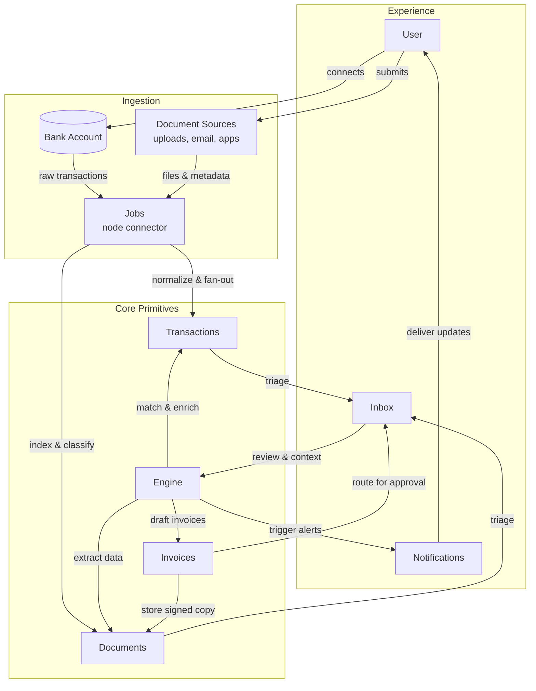

# Midday-to-Zeke Feature Mapping

## How This Architecture Works

### The Three Layers Explained

**Experience Layer (Right side)** - Where humans interact with the system:
- **User**: That's you! The person who feeds data into the system and gets insights back
- **Inbox**: Your command center where stuff that needs your attention piles up (think Gmail but for all your business data)
- **Notifications**: The system tapping you on the shoulder when something important happens

**Ingestion Layer (Left side)** - The data vacuum that sucks everything in:
- **Bank Account**: Direct connection to financial data (automated bank feeds)
- **Document Sources**: All the random files you throw at it - PDFs, emails, spreadsheets, whatever
- **Jobs**: Background workers that process all this crap without you having to babysit them

**Core Primitives (Bottom/Center)** - Where the magic happens:
- **Transactions (TX)**: Individual financial records or in Zeke's world, discrete pieces of information
- **Documents (DOCS)**: Stored files with metadata, searchable and organized
- **Engine (ENG)**: The brain that matches, enriches, and makes sense of everything
- **Invoices (INV)**: Generated outputs/reports (or in Zeke terms, your "Briefs")

### The Data Flow (Follow the Arrows - It's a Loop!)

The genius here is that this isn't a straight line - it's a circular system where data keeps flowing and improving:

1. **Starting Point (Top Right)**: User connects bank accounts or uploads documents
2. **Left Side Processing**: Raw data flows into Jobs which:
   - Normalize and fan out to create Transactions
   - Index and classify to create Documents
3. **Bottom Convergence**: Everything flows down and across to the center where:
   - Transactions and Documents both feed into the Inbox
   - The Inbox becomes the central review point
4. **The Engine Magic (Center-Bottom)**: The Engine processes everything:
   - Enriches transactions with matched documents
   - Extracts data to create new documents
   - Generates invoices/reports
5. **Back Up to Experience (Right Side)**:
   - Notifications flow back up to the User
   - Invoices route through Inbox for approval
   - Approved stuff becomes Documents (feeding back into the system)

**The key insight**: This creates a self-improving loop where processed data becomes better source material for future processing

### Why This Matters for Zeke

This is basically showing how Midday's financial automation flow can be repurposed for Zeke's knowledge management. Instead of:
- Bank transactions → Think "data sources"
- Receipts → Think "evidence/citations"
- Invoice generation → Think "brief/report creation"
- Financial matching → Think "insight correlation"

The beauty is that the same pipeline architecture works whether you're processing bank statements or research documents. It's all just data flowing through transformation stages until it becomes something useful.

This document maps key features of the Midday open-source project to the Zeke platform's core primitives-Stories, Sources, Insights, Briefs, and Playbooks-and outlines how to adapt or rename them. It also highlights architectural patterns from Midday (tRPC structure, Supabase usage, modal flows, sync jobs) that Zeke can emulate. All mappings cover both UI components and backend/data alignment.

## Feature Mappings

### Import Modal (CSV Import for Transactions) -> Sources (Data Ingestion)
**Description / Justification**
Midday's import modal allows users to upload a CSV of bank transactions, acting as an entry point for external data. This aligns with Sources in Zeke, which represent incoming raw information. The multi-step import flow (file selection, field mapping, confirmation) mirrors adding a new source of data.

**Implementation Notes**
- Reuse Midday's multi-stage modal design for "Add Source," e.g., a Source Import Modal with steps: select file/type -> map fields -> confirm import.
- Create a server action such as `importSourceAction`, modeled after Midday's `importTransactionsAction`, to handle file upload and processing, store files in Supabase, and trigger an ingestion job.
- Leverage URL query parameters (for example, `?step=import`) to control modal state, enabling deep links and state persistence.
- Seed the modal with a default catalog of source types (Upload PDF/Doc, RSS feed, Newsletter forward-to-email, Podcast RSS, YouTube subscription) and make the list extensible so teams can register additional connectors without losing the base five options.
- For newsletters, guide users to forward messages to a team-specific inbox address; for feeds (RSS, podcast, YouTube) capture the URL and schedule periodic fetch jobs that drop new items into the Source Inbox.

### Magic Inbox (Automated Receipt Inbox) -> Sources (Ingestion Pipeline)
**Description / Justification**
Midday's Magic Inbox automatically ingests incoming invoices/receipts and matches them to transactions. In Zeke, this concept maps to Sources handling automated input feeds-an inbox of raw source materials (emails, files, etc.) that are processed upon arrival. The Magic Inbox performs OCR and classification on documents, akin to Zeke ingesting and analyzing source content on arrival.

**Implementation Notes**
- Introduce a Source Inbox in Zeke where users can forward emails or upload files to a unique inbox address or folder.
- Use background jobs to extract text, classify content, and link sources to relevant insights or stories; Midday's upload -> OCR -> match pipeline can serve as a baseline playbook.
- Support the inbox via a dedicated table and tRPC router to manage incoming records and their processing status. Rename "Magic Inbox" to Source Inbox or Imports for clarity.
- Let teams register diverse feed connectors (newsletter forwarders, PDF drop folders, RSS/podcast/YT subscriptions) that all funnel into the inbox, each tagged with the originating connector and desired downstream playbook.
- Expose an editable pipeline builder per connector so operators can tweak the default steps (e.g., swap OCR provider, add a summarization stage, invoke custom webhooks) while inheriting sensible defaults from the baseline ingestion playbook.

### Vault (Document Storage & UI) -> Library (Processed Source Catalog)
**Description / Justification**
Midday's Vault is a secure file repository for important documents. Zeke's Library expands that concept into a catalog of every processed source across the ecosystem: uploads, feeds, forwards, and auto-pulled items. Each row reflects the end result of our ingestion and analysis jobs (raw item → content → story overlay), giving operators a single table to review what entered the system and what intelligence ("why it matters," insights, playbook suggestions) was generated on top.

**Implementation Notes**
- Repurpose Midday's Vault module as the Library view: a table/grid backed by `sources`, `raw_items`, `contents`, and `story_overlays` queries that surfaces columns like Source title, connector type, first-seen date, last-sync timestamp, health state (`source_health`), and pipeline progress (ingest → enrich → analyze).
- Show generated intelligence inline: include a clickable "Why it matters" cell (from `story_overlays.why_it_matters`), counts of linked insights/highlights, and quick actions to open the associated Story, Brief, or recommended Playbooks.
- Hook row status badges to the Trigger.dev jobs we run today (`tasks/sources/ingest/*`, `tasks/sources/enrich/fetch-content`, `tasks/insights/generate`) so operators can see whether items completed ingestion, are awaiting content fetch, or failed analysis-with retry controls in-context.
- Keep the existing Supabase storage layout for binary assets, but expose search and filters that fan out across text embeddings and metadata (authority score, tags, goal alignment) using the same query helpers in `packages/db/src/queries/sources.ts`.
- Allow teams to extend the table with custom connectors or fields while shipping with default views for the five starter source types; new connectors should automatically register their pipeline steps so the Library reflects their contributions without manual wiring.

### Transactions (Financial Records & Matching) -> Insights (Discrete Findings or Internal Data Model)
**Description / Justification**
Midday's transactions are granular financial records enriched by matching receipts. Even if Zeke does not handle bank data, an Insight can be treated similarly: an atomic piece of information with metadata linked to source evidence. Transaction status (unmatched/matched) parallels an insight's validation or review state.

**Implementation Notes**
- Adopt a transaction-like schema for insights, with fields for content, source references, tags, and status.
- Use Midday's transaction router and matching logic as guidance for linking insights to source documents (akin to `transaction_attachments`).
- Apply Midday's patterns-Zod schemas and routers-for insight creation and consider automated matching to connect new sources with existing insights or stories.

### Engine (Provider Broker) -> Source Normalization & Enrichment Layer
**Description / Justification**
Midday's Engine is a stateless provider broker that hides Teller/Plaid/etc. behind a single typed API. For Zeke, the Engine becomes our ingestion fabric: it talks to every external data feed (YouTube, Loom, Notion, RSS, CRM exports), normalizes payloads into the `sources → raw_items → contents` shape, and applies the first pass of "LLM sauce" (transcription, topic detection, entity extraction) before the Jobs Service adds higher-level reasoning. The Engine keeps transport adapters, auth, retries, and source metadata consistent so the rest of the stack only sees Zeke primitives.

**Implementation Notes**
- Follow Midday's `engine-patterns.mdc` conventions (Hono + zod-openapi) but swap banking providers for connectors like YouTube, Google Drive, Dropbox, Zoom, Slack. Each provider folder mirrors the `*-api.ts` / `*-provider.ts` / `transform.ts` layout with targeted tests for deterministic transforms.
- Extend provider transforms to emit `SourceEnvelope` objects (ids, lineage, auth scopes) and queue downstream Jobs Service runs by writing `ingestion_tasks` records or invoking Trigger.dev `tasks.trigger("sources.process", ...)`.
- Implement common utilities for transcription setup (OpenAI Whisper, AssemblyAI) and metadata enrichment (duration, speaker guess, permission scopes) so connectors stay thin.
- Surface Engine routes via tRPC wrappers in `apps/api` (e.g., `trpc.sources.ingestExternal`), keeping the dashboard contact minimal. Cache connection health in KV/R2 just like Midday's provider status endpoints.
- **Open gap:** Need a new `packages/engine-clients` or similar to expose typed SDK calls from dashboard/worker land, plus schema updates for `source_connections`, `raw_items`, and `ingestion_tasks` to reflect provider tokens and normalization progress.

### Jobs Service (Story Intelligence Workers) -> Highlight & Playbook Fabric
**Description / Justification**
The Jobs Service is the background lattice that turns raw story material into actionable intelligence. It owns transcript chunking, highlight scoring, narrative synthesis, and the compilation of playbook-ready insights. Whenever a user uploads a source, confirms an insight, or asks the assistant for help, the jobs run the heavy LLM workflows and feed the structured output back into Supabase so the chat UI, Briefs, and Playbooks stay in sync.

**Implementation Notes**
- Model jobs as typed runs (`jobs/highlights.extract`, `jobs/playbooks.compile`, `jobs/briefs.refresh`) that read from `raw_items`/`contents`, annotate `highlights`, and fan results into `playbook_steps` and `assistant_messages`.
- Route long-running LLM work through the existing jobs infrastructure (Trigger.dev today) or a new Bun worker pool; persist run states in `playbook_runs`/`assistant_runs` so the dashboard can stream progress via Supabase realtime.
- Accept goal context and tool parameters as part of the job payload so each run can rank outputs by goal relevance, confidence, and freshness before handing them off to the assistant store.
- Emit webhook-style events (or enqueue cache invalidations) back to the dashboard so `apps/dashboard/src/components/chat/messages.tsx` and related stores can refresh without polling.
- **Open gap:** No concrete implementation exists yet—capture schemas for `jobs_runs`, job payload contracts, and observability hooks (logs/metrics/tracing) before engineering starts.

### Reports (Financial Overview & Analytics) -> Playbooks (Goal-Aligned Action Hub)
**Description / Justification**
Midday's reports module aggregates reconciled transactions into decision-ready summaries. Zeke evolves that concept into a Playbooks page: a goal-sorted hub that turns story-derived insights into contextual business advice. Each playbook reframes the curated highlights from a Story or Brief into recommended actions, metrics to watch, and automation hooks that advance the user's stated goals. Briefs continue to serve as the narrative artifact, while Playbooks present the same intelligence as reusable workflows.

**Implementation Notes**
- Design the Playbooks overview (and individual Playbook view) using Midday's reports layout patterns—cards, comparison tables, and trend visualizations—but swap financial KPIs for story context, key insights, recommended next steps, and triggerable automations.
- Build an aggregation pipeline that converts confirmed `story_insights` and `brief_sections` into playbook entries: cluster insights by goal, attach recommended actions, surface supporting source highlights, and expose confidence/impact scoring.
- Persist goal metadata gathered by the assistant (`user_goals`, constraints, timelines) and map it to playbooks so users can filter by objective, stage, or owner; enable inline collection of missing context before a playbook can run.
- Keep Playbooks and Briefs synchronized by storing references (`playbooks.brief_id`, `playbook_insights.insight_id`) and refreshing both views when Jobs Service enrichment runs emit new highlights or when operators edit a Brief.
- **Open gap:** No compiler exists yet for goal-to-playbook mapping or Jobs Service powered highlight aggregation—document the need for a `jobs/playbooks.compile` job and supporting `playbooks`/`playbook_steps` tables before implementation.

### AI Assistant & Insights (Tailored Analysis) -> Insights (AI-Generated or Query-Driven)
**Description / Justification**
Midday's AI assistant answers financial questions, surfacing insights from underlying data. For Zeke, the assistant gathers goal context, runs Jobs Service powered highlight extraction across every processed source, and promotes the best bits into structured insights. Those goal-aware insights are the raw ingredients for Briefs and the playbook workflows that push the business forward.

**Implementation Notes**
- Implement an AI Insight Assistant that queries embeddings of source content via a tRPC endpoint (`search` or `ask`) similar to Midday's approach with OpenAI and pgvector, while tracking goal-aligned metadata (goal id, time horizon, owner) per insight and archiving the supporting excerpt. `apps/dashboard/src/components/chat` remains the streaming shell and simply swaps the data layer to Zeke's routers.
- Schedule Jobs Service runs to split transcripts, rank highlights, and annotate them with goal relevance scores; the job output should populate `insight_highlights` and notify the assistant so conversations can cite fresh evidence automatically.
- Fold a goal-discovery step into the conversation (assistant asks clarifying questions, fetches past playbooks, infers objectives from briefs) so recommendations always map to tangible outcomes; store responses as structured goal records for downstream filtering.
- Allow operators to confirm, edit, or reject the proposed context before persisting it, then promote confirmed responses into structured insights that seed Brief sections and Playbook steps; rejected items should loop back into a retraining queue.
- Repurpose Midday's intelligent filtering utilities (e.g., `generate-transactions-filters.ts`, `generate-vault-filters.ts`) to help users sift through sources, but extend them with goal and highlight facets so the assistant can spotlight playbook-ready signals instantly.
- Wire the tool-call layer through `apps/dashboard/src/lib/tools` and `apps/dashboard/src/store/assistant`: expose a `useAssistantStore` API for launching tools, stream partial tool results into `Messages`, and let confirmed outputs promote records in `stories`, `insights`, `playbooks`.
- **Open gap:** The highlight extraction job, goal capture prompts, and retraining queue are not yet implemented—flag these as prerequisites when planning the assistant-to-playbook handoff.

_Assistant plumbing concepts to evaluate:_
1. **Server Action Relay:** Keep `useChat` + `/api/assistant` as the transport, but pivot the route to a new `assistantRouter.ask` tRPC endpoint that can invoke tools (stories, insights, playbooks) via `trpc.*` callers before yielding UI components.
2. **Event-sourced Threads:** Persist every user/assistant/tool message in `assistant_threads` and stream updates with Supabase realtime so `apps/dashboard/src/components/assistant/assistant-modal.tsx` can hydrate historical context instantly when reopened.
3. **Goal-first Autopilot:** Let the assistant call a `select_goal` tool that opens the `assistant` store modal, pre-fills goal metadata, and optionally fires a `jobs/playbooks.compile` run if the user requests a ready-to-run playbook.

### Ingestion Workflows (Matching Engine) -> Playbooks (Automated Sequences)
**Description / Justification**
Midday's backend workflows-document matching, background jobs, Trigger.dev sequences-are orchestrated steps (upload -> OCR -> match -> notify). These map directly to Zeke's Playbooks: repeatable automation chains that operate on sources to yield outcomes, with goal-aware insights acting as the playbook inputs. The playbook primitive should only surface when it can drive a concrete next action; if no actionable use case exists, the assistant leaves the insight as informational rather than forcing a workflow.

**Implementation Notes**
- Define playbooks as configurable sequences, using background workers or serverless functions to run long-lived jobs, and parameterize each run with the goals and constraints captured by the assistant.
- Introduce a goal-to-playbook recommendation step: once an insight is confirmed, suggest relevant playbooks (and pre-fill variables) based on matching tags, past outcomes, or Midday-style rule libraries.
- Mirror Midday's Trigger.dev integration (`tasks.trigger(...)`) alongside a realtime status hook (like `useSyncStatus`) to monitor progress in the UI, and surface progress back to the assistant thread so users can ask follow-up questions.
- Combine URL-driven flows, background tasks, and realtime updates so users can launch, observe, and reuse playbooks (e.g., a "Source Ingestion Playbook" modeled after Midday's Magic Inbox) while logging completions to enrich future goal-discovery prompts.
- Add a guardrail stage ("is this actionable?") that validates prerequisites before a playbook run starts; if the answer is no, capture why and feed that back into assistant messaging so the user understands the limitation and can address it manually.

_Notes:_ Midday's Team Management concepts are already ported into Zeke's primitives. Time Tracking still lacks a clear application, though adjacent patterns (project timelines, multi-tenancy) may inspire future work.

### Dashboard Component Plumbing Map
To accelerate the build-out, reuse the Midday component scaffolding with new domain bindings. Each mapping is anchored in existing Zeke tables (see `packages/db/src/schema.ts`) so teams can connect UI, server actions, and jobs without schema guesswork.

| Midday Surface | Ported Components | Zeke Primitive & Behaviour | Schema Anchors |
| --- | --- | --- | --- |
| **Bank Accounts & Connections** | `apps/dashboard/src/components/bank-account*.tsx`, `components/modals/select-bank-accounts.tsx`, `components/bank-connect-button.tsx`, `lib/get-inbox.tsx` (connection health) | Become the **Source Connections** hub. Let users authorize Apple News+, Twitter (via OAuth), YouTube, Notion, etc. Each connection writes/updates `source_connections` and queues Engine syncs so we can ingest paid feeds without per-request API fees. | `sources`, `source_connections`, `source_health`, `raw_items` |
| **Transactions Tables & Sheets** | `components/widgets/transactions/**/*`, `components/modals/transactions-modal.tsx`, `components/forms/transaction-create-form.tsx`, chat tool `components/chat/tools/transactions/transactions.tsx` | Recast as the **Story Feed & Insight Ledger**. Rows list normalized stories or chapters with status (new, reviewed, bookmarked). Inline actions open matching highlights, cite sources, or launch playbooks. | `stories`, `story_chapters`, `team_story_states`, `highlights`, `story_overlays` |
| **Invoices Workflow** | `components/invoice/**/*`, `components/share-report.tsx`, `lib/get-profit.ts` patterns | Transform into the **Brief Publisher**. The existing editor steps (line items, summary, due date) become sections for storyline, takeaways, recommended plays. Export to PDF/email for exec sharing while persisting to `brief_sections` (add table) and linking to `playbooks` for follow-through. | `stories`, `playbooks`, `playbook_outputs`, *(add `briefs`/`brief_sections` tables as spec’d in ER doc)* |
| **Vault / Documents** | `components/vault/**/*`, tools `lib/tools/get-documents.tsx`, search filters | This is the **Library** view over processed sources. Keep grids, tags, filters, but bind to `sources`, `raw_items`, `contents`, `story_overlays`. “Related files” becomes linked highlights and playbooks that reference the source. Upload flows trigger Engine ingestion plus Jobs Service enrichment runs. | `sources`, `raw_items`, `contents`, `story_overlays`, `team_highlight_states` |
| **Customers & CRM Panels** | `components/forms/customer-form.tsx`, `components/sheets/customer-*.tsx`, invoice customer selectors | Repurpose as **Entities & Personas**: track authors, companies, or market segments we build stories/playbooks around. Selecting “Sam Altman” filters stories/highlights tied via `story_authors` or `customers`. Use tags for sectors, power goal recommendations. | `customers`, `customer_tags`, `customer_tag_assignments`, `authors`, `story_authors`, `playbooks.customer_id` |
| **Tracker & Time-based Widgets** | `components/widgets/tracker/*`, `components/tracker-timer.tsx`, tracker sheets & forms | Turn into a **Timeline Radar** for market moves. Plot stories, highlights, and playbook executions on a calendar/Gantt so operators can see when big updates landed (e.g., ChatGPT-5 launch) and what actions followed. | `stories.published_at`, `team_story_states.last_viewed_at`, `playbook_runs.started_at`, `team_goals` |
| **Inbox Matching Views** | `components/inbox/transaction-match-item.tsx`, `components/inbox/match-transaction.tsx`, `components/inbox/transaction-unmatch-item.tsx` | Shift to **Insight Triage**: surface new highlights needing confirmation, conflicting sources, or goal alignment checks. Accept/merge flows update highlight state and spawn playbook suggestions. | `highlights`, `team_highlight_states`, `assistant_threads`, `playbook_step_highlights` |

> Possibility: add a bring-your-own-Claude toggle in Source Connections so teams with the $200 Anthropic Opus plan can authorize their key (much like OpenCode). When a user launches a heavy jobs run, we detect the BYO seat and route the request through their Claude allocation instead of our pooled credits.

#### Widgets To Primitives
- **Account Balance → Coverage Scorecard**: `apps/dashboard/src/components/widgets/account-balance/*` can rank coverage gaps—how many strategic sources are active, which connectors are failing, and what percent of premium feeds (YouTube channels, newsletters) have been refreshed this week. Pull from `source_connections`, `source_health`, and Engine sync metrics so founders see where they’re blind.
- **Transactions → Story Feed Snapshot**: `components/widgets/transactions/*` already renders trend chips and list views. Point it at Story Feed stats (new vs reviewed stories, highlights awaiting triage, stories tagged to each goal). Add tiny spark lines driven by `story_overlays` heat/novelty signals.
- **Spending → Attention Budget & ROI**: `components/widgets/spending/*` becomes a view of time or content volume consumed per theme. Convert runtime and page counts into “hours saved” by comparing against average watch/read speeds and whether the team actually opened the Story (`team_story_states.state = 'read'`). Surface “Hours we saved you” vs “Hours you actually spent,” tied to goals and wins from `playbook_runs`.
- **Invoice → Brief Pipeline**: `components/widgets/invoice/*` summarize draft/published invoices. Swap to counts of Briefs ready to send, plus top recipients (investors, team leads) using future `briefs` tables and `playbook_outputs`.
- **Vault → Library Pulse**: `components/widgets/vault/*` can highlight top new sources, authority score risers, and sources with expiring auth. Back it with `sources`, `raw_items`, and `story_overlays`.
- **Assistant → Goal Copilot**: `components/widgets/assistant/*` should list one-click prompts tied to open goals (“Summarize latest multimodal releases”, “Draft partner brief on Meta’s Horizon update”). Each button triggers an assistant tool call and shows which job runner (OpenAI vs BYO Claude) will be used.
- **Inbox → Insight Queue**: `components/widgets/inbox/*` serves as a mini dashboard of pending confirmations, conflicting claims, and “needs benchmark” items sourced from `highlights` and Jobs run statuses.
- **Tracker → Momentum Dial**: `components/widgets/tracker/*` already handles time windows; reuse it to chart recent story drops, playbook launches, and deadlines so the team always sees what’s in motion. Layer in a forward-looking lane for “upcoming AI drops” so operators can pin rumors/announcements (e.g., “Anthropic Opus X launch”) and prep playbooks ahead of time.

#### Notification Center Signals
- Reuse `apps/dashboard/src/components/notification-center/*` to surface signal-rich events: new frontier model releases, sentiment swings around an author, benchmarks crossing thresholds, or competitor playbooks published. Store events in `activities` with metadata linking to stories, highlights, and playbook runs.
- Attach assistant shortcuts so opening a notification can ask, “Summarize the community sentiment on Claude 3.7 vs GPT-5” or “Pull LMSys and LMArena charts for this release.” The assistant fans out to benchmark tools, composes a quick brief, and queues a relevant playbook.
- Respect noise budgets: let users follow entities/goals so the center highlights what matters to that business owner (e.g., only ping when stories tagged `enterprise-ai` exceed a heat score or when a watched author publishes).

#### Category Taxonomy & Signal Mapping
- **Repurpose `@zeke/categories`**: the package already ships hierarchical categories, colors, and embeddings. Replace finance slugs with an AI intelligence taxonomy (e.g., `model-release`, `inference-infra`, `policy`, `safety`, `benchmarks`, `tooling`, `case-studies`). Parent buckets can align to the Exec Overview pillars (Discover, Apply, Create) while child slugs map to precise event types ("frontier-model-update", "benchmark-win-lmarena", "enterprise-case-study"). Update `packages/categories/src/categories.ts`, `color-system.ts`, and `embeddings.ts` so lookups, color coding, and vector search all reflect the new hierarchy.
- **Wire taxonomy into the schema**: seed `story_categories`, `story_tags`, and `team_goals` with the new slugs so ingestion can stamp incoming stories and the assistant can recommend goals/playbooks by category. `team_highlight_states` should include category filters so Inbox triage can group “safety research” vs “growth tactics.”
- **Drive personalization & notifications**: Notification filters should subscribe to category combinations ("model-release + vision"), allowing the app to ping users only when their tracked categories spike. `activities.metadata` should store category slugs for fast fan-out to notifications, widgets, and assistant prompts.
- **Benchmark & sentiment overlays**: Extend categories with facets like `sentiment`, `confidence`, `benchmark_provider` to enrich “model drop” notifications. Use the taxonomy to pick which comparison charts to pull (e.g., LMArena vs LMSys vs AlpacaEval) and which playbook templates to suggest.
- **UI coherence**: leverage `CATEGORY_COLOR_MAP` so the Story Feed, tracker, widgets, and notification badges all share consistent color cues for categories. This helps operators scan which themes dominate their week.

#### Golden Dataset Strategy
- **Re-scope `packages/db/src/test/golden-dataset.ts`**: transform the existing transaction-matching baseline into a Story Intelligence golden set. Capture curated story/highlight/playbook tuples—for example, “Anthropic Claude 3.7 release” → expected categories, highlight importance scores, recommended playbooks, benchmark sources. Each entry records expected scores for ranking (novelty, confidence, goal relevance) so updates to Jobs Service models don’t regress signal quality.
- **Test coverage**: include cases for model launches, policy shifts, funding rounds, benchmark swings, and misinformation corrections. Store edge cases like conflicting sources or low-confidence rumors to ensure the assistant flags uncertainty instead of overhyping.
- **Automation loop**: when a new story is promoted to the golden set, run the enrichment pipeline, capture observed metrics, and update the expected baseline. CI should run the golden tests to validate highlight extraction, category assignment, and playbook recommendations before deploys.
- **Link to taxonomy**: every golden record references category slugs from `@zeke/categories`, the story row in `stories`, and the supporting highlights (`highlights`, `highlight_references`). This keeps the taxonomy, Jobs Service, and assistant suggestions aligned.

#### App Layer Roles (Midday → Zeke)
- **apps/engine** remains the source adapter layer, now generating uniform `raw_items`/`contents` for media feeds and seeding Jobs Service runs.
- **apps/api** fronts our stories/highlights/playbooks schema with tRPC routers, mirroring Midday’s safe-action and query patterns so the dashboard wiring stays identical.
- **apps/dashboard** hosts the operator cockpit; we keep Midday’s layout/state patterns but wire them to the Story Feed, Library, Playbooks, and Assistant surfaces defined above.
- **apps/desktop** can become the always-on assistant tray—ideal for operators who want notifications, playbook launches, and story previews without the browser.
- **apps/website** tells the Exec Overview story: highlight “discover → apply → create” outcomes, stage the premium feed integrations, and show the BYO Claude option for pros.

Key outcome: business owners connect their premium feeds once, see every new story land in the Story Feed, confirm the gold nuggets in Inbox, publish Briefs from invoice workflows, and schedule playbooks/tasks via tracker—all with the Jobs Service automating insight extraction in the background.

## Architectural Patterns & Best Practices from Midday
- **Modular tRPC router structure:** Separate routers by domain (transactions, documents, inbox, reports) with shared Zod schemas and a dedicated types package. Mirror this by creating routers for each Zeke primitive to maintain end-to-end type safety.
- **Supabase for database and storage:** Use Supabase Postgres (with Row-Level Security) and storage buckets organized by team-scoped paths, issuing signed URLs for access. The same setup suits Zeke's source files, insights, and realtime updates.
- **URL-state driven modal flows:** Manage workflows via query parameters (`?step=import`, etc.) so modals and sidebars are shareable, refresh-safe, and navigable. Implement a hook like Midday's `useQueryStates` for consistent state handling.
- **Sync status and background jobs:** Kick off background work through actions that return a `runId`, then observe job state with hooks (e.g., `useSyncStatus`) and refresh affected queries on completion to keep the UI responsive.
- **Modal & inline server actions:** Follow Midday's pattern of React server actions (wrapped with an auth-aware client) for mutations such as story creation, source uploads, and brief generation to enforce auth and type safety.
- **Supabase realtime & sync:** Subscribe to changes on critical tables (Sources, Insights, etc.) so collaborators see live updates, complementing manual cache invalidation.
- **Design system & UI components:** Reuse Midday's ShadCN/Tailwind component patterns for dialogs, list views, empty states, and layout structure to accelerate Zeke's UI build-out.

## Source Import Modal Vision & Flow
To integrate the patterns above, Zeke can adopt a Source Import Modal flow inspired by Midday's process. The flow covers adding a new Source-uploading a document or connecting an external feed-in a guided, multi-step experience:

1. **Launch import flow:** Clicking "Add Source" updates the URL (for example, `?step=import`) and opens the Import Source modal via a hook that inspects query params.
2. **Choose source type:** Present options such as Upload File, Enter URL, or Connect Account. For connected integrations, initiate OAuth inline or in a pop-up before returning to the modal.
3. **Upload & preview:** After selection, advance automatically (e.g., `?step=import&stage=mapping`). Upload files immediately to Supabase storage, show previews (document text, file metadata, or CSV column mapping), and let users adjust field mappings when applicable.
4. **Confirmation & ingestion:** On submit, call a server action (`importSourceAction`) that stores a Source record, kicks off extraction or parsing jobs, and queues any downstream playbooks (e.g., `tasks.trigger("ingest-source", { sourceId })`).
5. **Progress tracking:** Display progress indicators while the background job runs, subscribing to status updates through Supabase Realtime, Trigger.dev listeners, or polling.
6. **Completion & feedback:** Close the modal when the job reports completion, refresh relevant queries (Sources list, dashboards), and show success or error toasts to guide next steps.
7. **Post-import linking (optional):** Prompt users to link the new source to Stories or convert findings into Insights, similar to Midday's automatic receipt-to-transaction matching.
