# ZEKE Data Pipeline Diagrams

This document contains Mermaid diagrams to visualize the data pipeline, storage, and serving architecture.

**Status (2025-09-05)**: Pipeline is working! 47 raw items → 16 contents → 15 stories processed. LLM analysis jobs complete but produce 0 overlays/embeddings - needs debug.

## Current Implementation (Working)

### System Context (Current)

Shows the main components currently deployed and working.

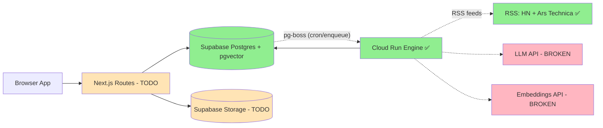

### Deployment Topology (Current)

Shows where processes currently run and their status.

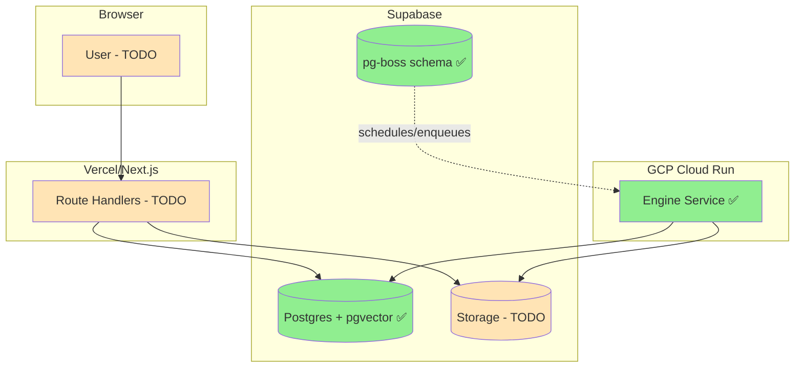

### Current Data Flow (Working)

Shows the actual data flow that's currently processing items.

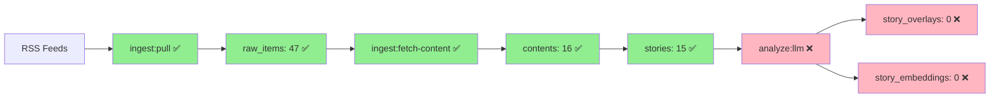

### ERD (Current Tables)

Shows the actual database schema that's deployed and working.

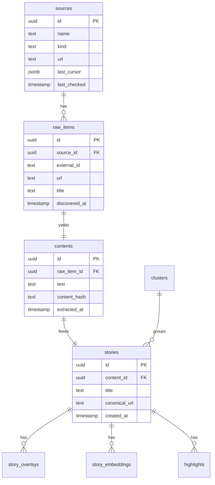

### Job State Machine (Current)

Shows the actual job lifecycle in pg-boss that's working.

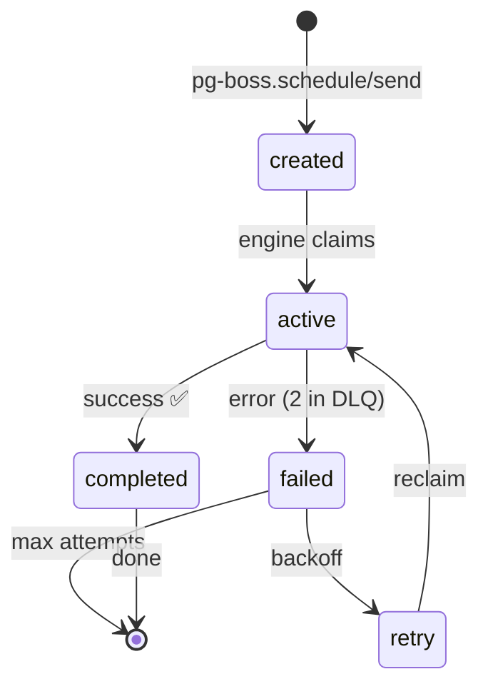

## Future Implementation (Roadmap)

### System Context (Full Vision)

Shows the complete system once all features are implemented.

```mermaid
graph LR
  U[Browser App] --> R[Next.js Routes]
  R --> DB[(Supabase Postgres + pgvector)]
  R --> ST[(Supabase Storage)]
  DB -. pg-boss (cron/enqueue) .-> E[Cloud Run Engine (Node/TS)]
  R -. source fetch .-> Ext[External Sources: RSS, HN, Reddit, YouTube, arXiv]
  U -. Reader/Annotator .- R
  E --> DB
  E --> ST
  E -.-> LLM[LLM API]
  E -.-> EMB[Embeddings API]
  E -.-> YTDLP[yt-dlp/Whisper]
  E -. pdf OCR .-> OCR[[PDF Extraction Service (optional)]]
```

### Trust Boundaries & RLS (Future)

Highlights public vs private components and where RLS/service-role apply.

```mermaid
graph LR
  subgraph Authenticated RLS (no anon)
    Web[Next.js Routes]
  end
  subgraph Private Service Role
    Engine[Cloud Run Engine]
  end
  Web-->PG[(Postgres + RLS)]
  Engine-->PG
  Engine-->STO[(Storage)]
```

### Pipeline DAG (Full End-to-End Vision)

Maps the complete pipeline from ingest pull to overlays and embeddings.

> What is a DAG and why it matters
>
> - DAG = Directed Acyclic Graph: nodes are tasks, edges are dependencies, and there are no cycles.
> - Importance: enforces correct ordering, enables safe parallelism, supports retries/backfills, and improves observability.
> - In this project: each stage (ingest, fetch, extract/transcribe, hash, dedupe/link, cluster, analyze) is a node; edges express dependencies so the queue can run tasks concurrently when possible, rerun failed nodes idempotently, and avoid cycles that would cause infinite loops.

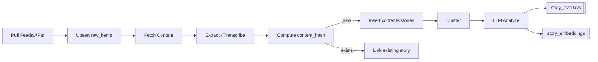

### Ingestion Sequence (Future)

Walks through a single ingest run from cron to queued content fetch.

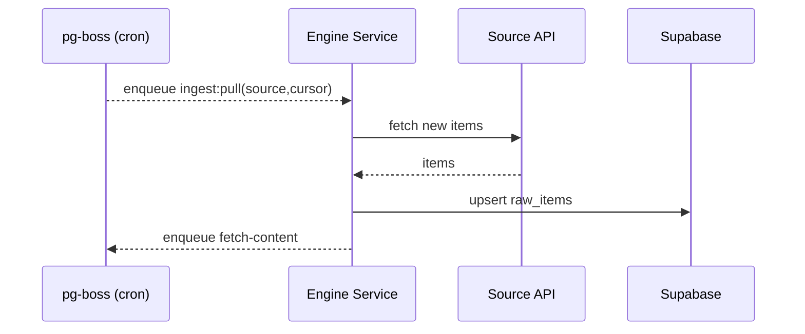

### Content Fetch & Normalization (Future)

Branches for articles vs audio and converges on normalized text/content_hash.

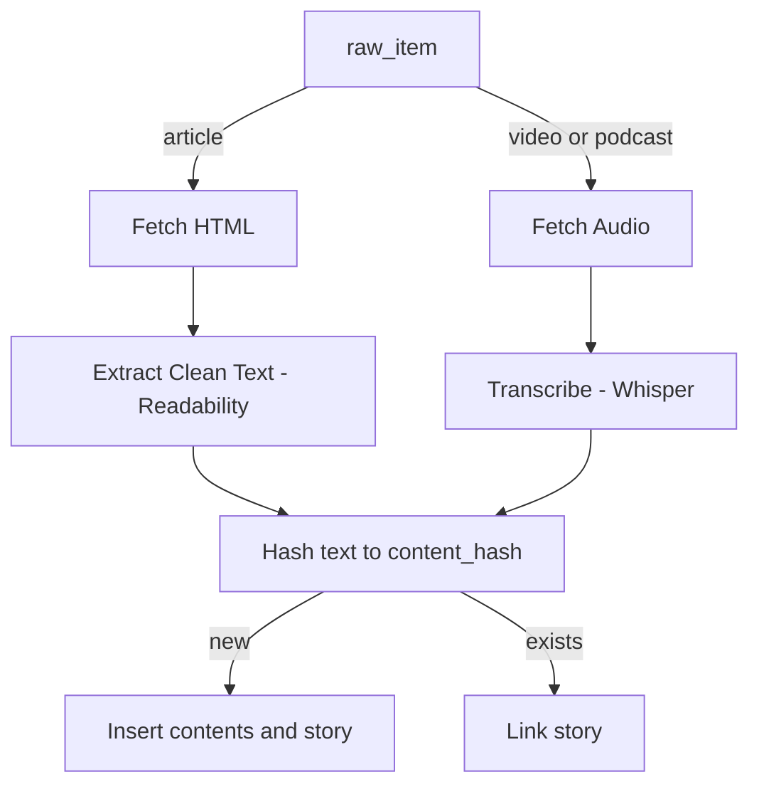

### Analysis & Overlays (Future)

Shows context building, LLM outputs (summaries/scores/citations), and persistence.

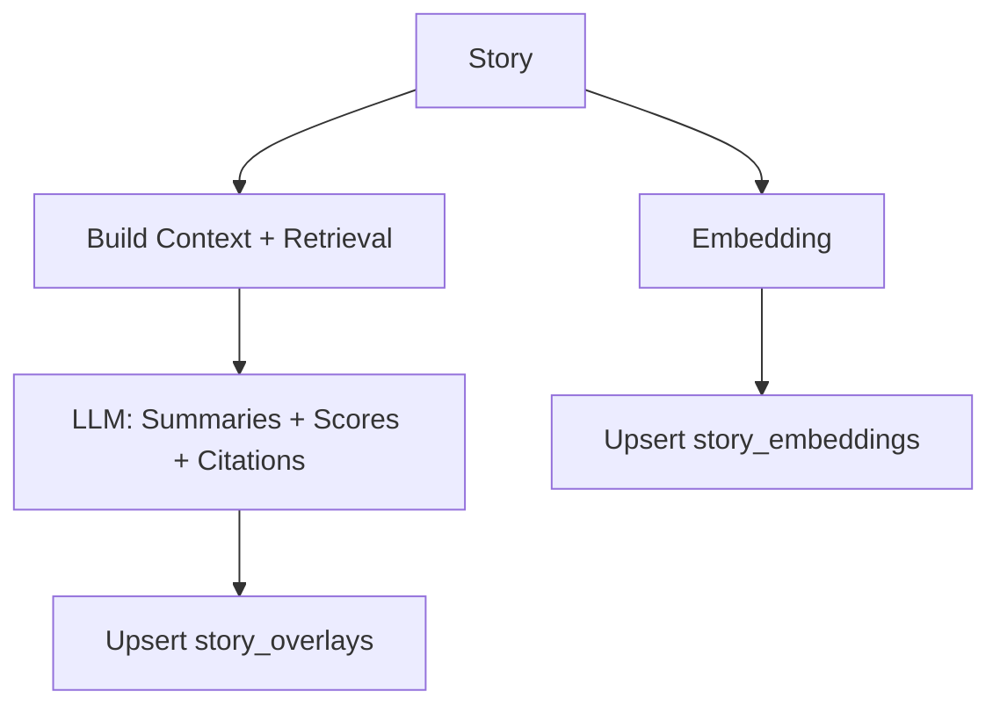

### Clustering Decision Flow (Future)

Decision gates to join an existing cluster or create a new one.

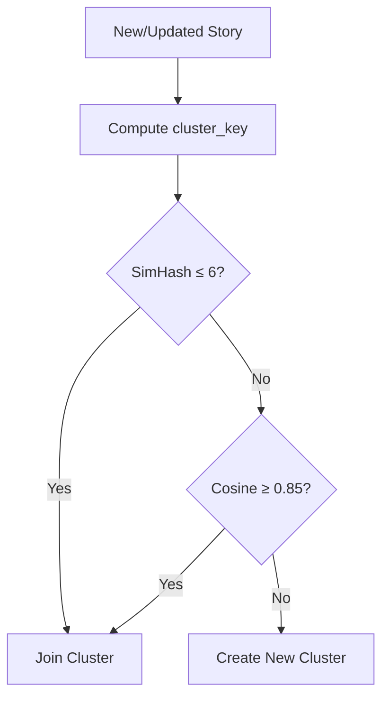

> What is a cluster and why it matters
>
> - Cluster: a group of near-duplicate or closely related stories about the same topic or event, merged via a `cluster_key` and similarity checks (SimHash/Hamming and vector cosine).
> - For development: reduces duplication, gives stable grouping keys for caching/URLs, powers retrieval for LLM context/citations, and simplifies dedupe/debugging and backfills.
> - For users: avoids repetitive listings, shows a representative item with alternatives, aggregates corroboration to boost confidence, and enables trend/hype signals across sources.

### Transcription Pipeline (Future)

Steps to produce transcripts for media and store them alongside content.

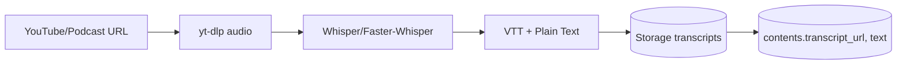

### Reader & Annotation Flow (Future)

End-to-end flow for reading and highlighting across mediums (articles, PDFs, transcripts).

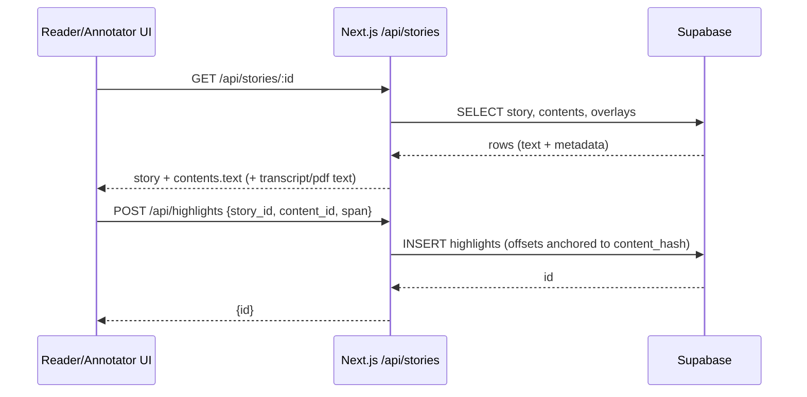

### API Read Path (Future)

How the UI requests story lists and receives clusters with overlays.

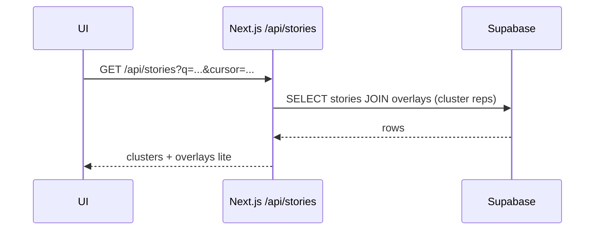

### Data Lineage (Future)

Traceability from raw items through contents to stories and derived artifacts.

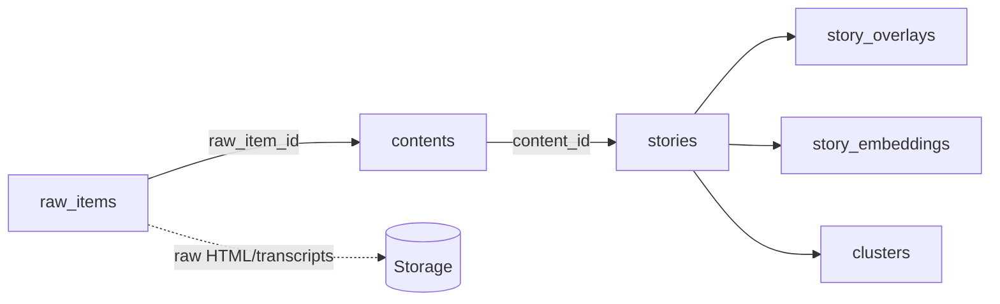
