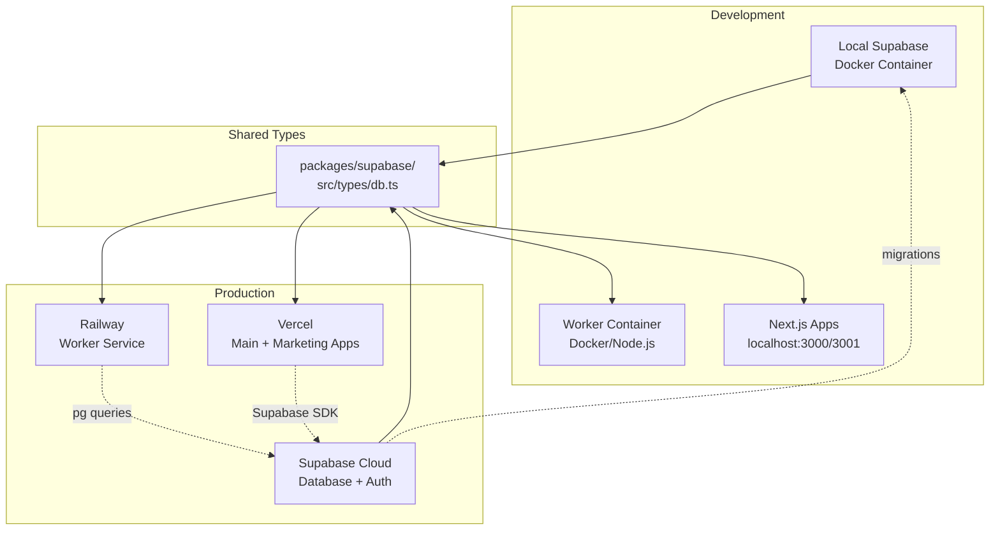
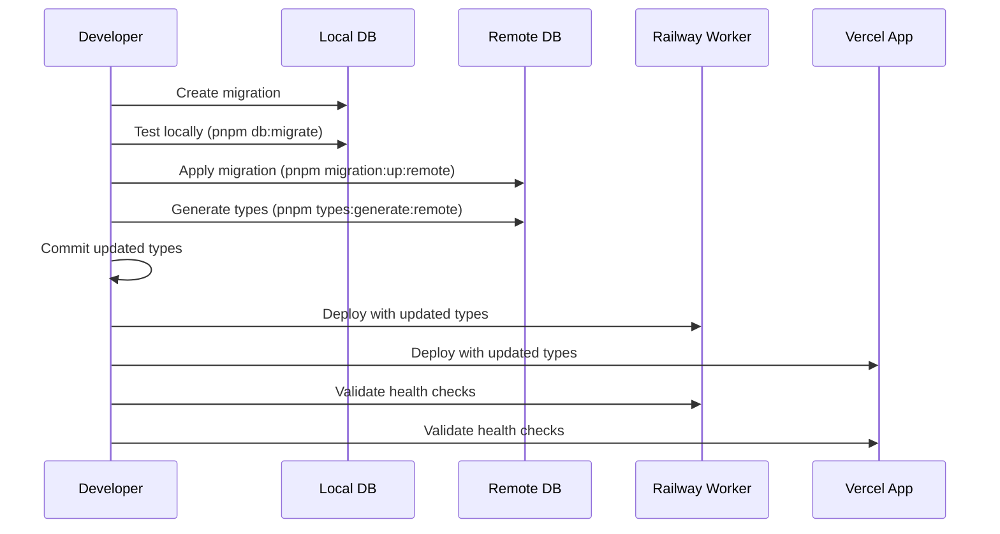
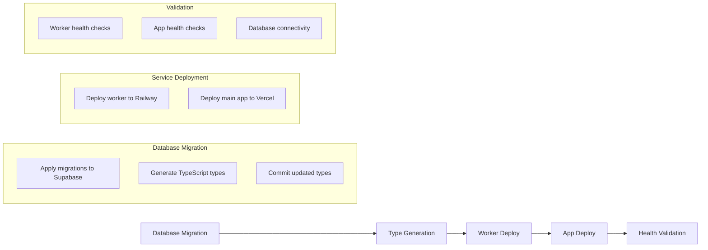

# ∆ / ZEKE

**AI-Powered News Intelligence Platform**

ZEKE ingests news from multiple sources, analyzes it with LLMs, and delivers stories and insights through modern web applications.

## Table of Contents

- [Architecture](#architecture)
- [Quick Start](#quick-start)
- [Development Commands](#development-commands)
- [Development Workflow](#development-workflow)
- [Memory Optimization & Performance](#memory-optimization--performance)
- [VS Code Debugging](#vs-code-debugging)
- [Production Deployment](#production-deployment)
- [Stripe Integration (Optional)](#stripe-integration-optional)
- [Troubleshooting](#troubleshooting)
- [Best Practices](#best-practices)
- [Contributing](#contributing)

## Architecture

**Turborepo Monorepo Structure:**

- **Main App** (`apps/app`) – Primary user interface and API routes (Vercel)
- **Marketing Site** (`apps/web`) – Public marketing website (Vercel)
- **Background Worker** (`apps/worker`) – pg-boss pipeline for ingestion, extraction, analysis (Railway)
- **Supabase/PostgreSQL** – Database with pgvector for storage and embeddings (Supabase Cloud)
- **Shared Packages** (`packages/`) – Reusable utilities, design system, and configurations

### Infrastructure Overview



## Quick Start

### Prerequisites

- **Node.js 20+** (current requirement)
- **pnpm** (package manager)
- **Docker** (for Supabase and worker containers)
- **Supabase CLI** (`npm install -g supabase`)

### Development Setup

```bash
# One-time setup (validates prerequisites, starts services, runs migrations)
pnpm dev:setup

# Start all services (full stack development)
pnpm dev

# Stop all services
pnpm stop
```

### Development Modes

Choose your development mode based on your current work:

```bash
# Normal mode - Balanced performance (default)
pnpm dev

# Fast mode - Optimized for speed, some features disabled
pnpm dev:fast

# Aggressive mode - Maximum speed, most features disabled
pnpm dev:aggressive

# Debug mode - Full features for debugging production issues
pnpm dev:debug
```

**Memory Optimization Philosophy**: "Disable everything not essential for coding" - monitoring, security middleware, and build optimizations are disabled in development for better performance.

### Service URLs

When running `pnpm dev`, access services at:

- **Main App:** http://localhost:3000
- **Marketing Site:** http://localhost:3001
- **Storybook:** http://localhost:6006
- **Supabase Studio:** http://127.0.0.1:54323
- **Worker API:** http://localhost:8082

## Development Commands

### Unified Workflow

```bash
# Full stack development
pnpm dev                    # Start all services with orchestration
pnpm dev:setup             # One-time environment setup
pnpm stop                  # Stop all services gracefully

# Individual services (Turborepo filtering)
pnpm dev --filter=app      # Main app only
pnpm dev --filter=web      # Marketing site only
pnpm dev:worker            # Worker service only

# Build and validation
pnpm build                 # Build all applications
pnpm typecheck            # Type check across packages
pnpm lint                 # Lint all code
pnpm test:pipeline        # Comprehensive health check
```

### Database Management

```bash
# Local database operations
pnpm db:migrate              # Apply migrations locally + generate types
pnpm db:reset               # Reset local database
pnpm types:generate         # Generate TypeScript types from local
pnpm migration:new <name>   # Create new migration

# Production database operations
pnpm migration:up:remote    # Apply migrations to remote Supabase
pnpm types:generate:remote  # Generate types from remote schema
pnpm deploy:schema         # Full schema deployment (local)
pnpm deploy:schema:prod    # Full schema deployment (production)
```

### Type Synchronization Across Services

ZEKE uses a centralized type generation system that ensures all services stay synchronized after database schema changes:

#### How It Works

1. **Centralized Types**: All database types are generated into `packages/supabase/src/types/db.ts`
2. **Shared Package**: Both main app and worker import types from `@zeke/supabase/types`
3. **Automatic Updates**: Type generation commands update the shared package, affecting all services

#### Type Generation Process

```bash
# Local development (generates from local Supabase)
pnpm types:generate
# → Runs: turbo run types:generate --filter=app
# → Executes: supabase gen types typescript --local --schema public > ../../packages/supabase/src/types/db.ts

# Production deployment (generates from remote Supabase)
pnpm types:generate:remote
# → Executes: supabase gen types typescript --project-id hblelrtwdpukaymtpchv --schema public > ../../packages/supabase/src/types/db.ts
```

#### Service Integration

**Main App (`apps/app`):**
- Uses Supabase SDK with generated types
- Imports via `@zeke/supabase/types`
- Gets automatic type safety for all database operations

**Worker Service (`apps/worker`):**
- Uses direct `pg` queries with type assertions
- Imports shared types: `export type { Database, Tables } from '@zeke/supabase/types'`
- Defines type-safe helpers: `export type SourceRow = Tables<'sources'>`

#### After Schema Changes

When you add/modify database tables:

1. **Apply Migration**: `pnpm db:migrate` (local) or `pnpm migration:up:remote` (production)
2. **Generate Types**: `pnpm types:generate` (local) or `pnpm types:generate:remote` (production)
3. **Automatic Sync**: Both main app and worker automatically get updated types
4. **Type Safety**: TypeScript will catch any breaking changes across all services

### Schema Deployment Workflow



## Development Workflow

### 1. Initial Setup

Run the setup command to validate your environment:

```bash
pnpm dev:setup
```

This will:
- Check Node.js 20+, pnpm, Docker, and Supabase CLI
- Start Supabase if not running
- Apply database migrations
- Generate TypeScript types
- Install dependencies

### 2. Full Stack Development

Start all services with proper orchestration:

```bash
pnpm dev
```

This starts services in dependency order:
1. Supabase (if not running)
2. Database migrations
3. Worker container
4. Next.js applications

### 3. Focused Development

Use Turborepo filtering for individual services:

```bash
# Work on main app only
pnpm dev --filter=app

# Work on marketing site only
pnpm dev --filter=web
```

### 4. Pipeline Testing

Validate the entire pipeline:

```bash
pnpm test:pipeline
```

Tests:
- Supabase connectivity
- Worker health and job queue
- Database permissions
- Type checking
- Build processes

## Memory Optimization & Performance

### Environment Variables for Development

The following environment variables are automatically configured for optimal development performance:

```bash
# Core development settings
NODE_ENV=development
NEXT_REDUCE_MEMORY=true
TURBOPACK_MEMORY_LIMIT=2048

# Disable memory-intensive features in development
DISABLE_SENTRY=true
DISABLE_ARCJET=true
DISABLE_LOGTAIL=true
DISABLE_ANALYTICS=true

# Logging control
LOG_LEVEL=error
DEBUG=false

# Node.js memory settings (automatically applied)
NODE_OPTIONS="--max-old-space-size=4096 --max-semi-space-size=128 --gc-interval=100"
```

### Memory Usage Improvements

With these optimizations, you can expect:
- **Initial Memory**: Reduced by ~30-40%
- **Memory Growth**: Significantly slower accumulation
- **Build Speed**: 20-30% faster in development
- **Hot Reload**: More stable, less memory spikes

### Monitoring Memory Usage

```bash
# Monitor Node.js memory usage with Chrome DevTools
node --inspect apps/app/node_modules/.bin/next dev --turbopack
# Then open chrome://inspect in Chrome browser

# Monitor system memory
htop  # or Activity Monitor on macOS
```

## VS Code Debugging

ZEKE includes comprehensive VS Code debugging configurations optimized for the multi-service architecture. The setup supports debugging across Next.js apps, Node.js worker processes, and client-side code.

### Quick Start

1. **Open VS Code** in the project root
2. **Press F5** or go to Run & Debug panel (Ctrl/Cmd+Shift+D)
3. **Choose your debugging scenario** from the dropdown

### Debug Configurations

#### 🚀 **Full Stack Development**
- **ZEKE: Full Stack (All Services)** - Starts all services with `pnpm dev`
- **ZEKE: Full Pipeline Debug** - Adds debug logging with `DEBUG=zeke:*`

#### 📱 **Individual Services**
- **Dashboard App (port 3000)** - Main user interface
- **Marketing Web (port 3001)** - Landing/marketing site
- **Worker (Node.js)** - Background processing with tsx watch
- **Email Templates (port 3003)** - React Email development
- **Supabase Local** - Database services

#### ⚙️ **Worker Debugging** (News Intelligence Pipeline)
- **Worker: Debug with Breakpoints** - Direct Node.js debugging with breakpoints
- **Worker: Docker Container** - Production-like container debugging

#### 🌐 **Browser Debugging**
- **Chrome: Dashboard App** - Client-side debugging at localhost:3000
- **Chrome: Marketing Site** - Client-side debugging at localhost:3001
- **Chrome: Email Templates** - Email template preview at localhost:3003
- **Chrome: Supabase Studio** - Database management at localhost:54323

#### 🔧 **Advanced Full-Stack**
- **Dashboard: Full Stack Debug** - Server + client debugging with Edge runtime
- **Marketing: Full Stack Debug** - Complete marketing site debugging

### Debugging Workflows

#### **News Pipeline Debugging**
Perfect for debugging RSS ingestion, content extraction, and LLM analysis:

1. Set breakpoints in worker code (`apps/worker/src/`)
2. Launch **"🔍 Worker: Debug with Breakpoints"**
3. Trigger ingestion via dashboard or API calls
4. Step through the entire pipeline from source to analysis

#### **Full-Stack Feature Development**
Debug interactions between frontend, API routes, and background processing:

1. Launch **"🔧 Dashboard: Full Stack Debug"**
2. Set breakpoints in both client and server code
3. Debug user actions that trigger background jobs
4. Monitor real-time data flow from UI to worker to database

#### **Multi-Service Coordination**
Debug complex interactions across services:

1. Launch **"🚀 ZEKE: Full Pipeline Debug"** for logging
2. Use individual service debuggers for specific breakpoints
3. Monitor logs and breakpoints across all services simultaneously

### Debugging Features

- **Organized configurations** grouped by purpose and service
- **Proper working directories** for each service
- **Environment variables** configured for development
- **Source maps** enabled for TypeScript debugging
- **Skip node internals** for cleaner debugging experience
- **Integrated terminal** support for background processes

### Supporting Tasks

The setup includes VS Code tasks for common operations:
- **build-worker** - Compile worker TypeScript
- **dev-setup** - Run full development setup
- **test-pipeline** - Validate entire pipeline
- **supabase-start/stop** - Database service management
- **worker-logs** - View Docker container logs

Access tasks via **Ctrl/Cmd+Shift+P** → "Tasks: Run Task"

## Production Deployment

### CI/CD Pipeline

ZEKE uses GitHub Actions for automated deployment across Supabase + Railway + Vercel infrastructure.

#### Deployment Sequence



#### Manual Production Deployment

```bash
# Full schema deployment with validation
./scripts/deploy-schema-changes.sh production

# Individual steps
pnpm run migration:up:remote     # Apply migrations to remote
pnpm run types:generate:remote   # Generate types from remote
git add packages/supabase/src/types/db.ts && git commit -m "chore: update types"
cd apps/worker && pnpm run deploy:railway
# Vercel deployment happens automatically via GitHub integration
```

#### Required GitHub Secrets

```bash
# Supabase
SUPABASE_ACCESS_TOKEN=sbp_xxx
SUPABASE_PROJECT_ID=hblelrtwdpukaymtpchv

# Railway
RAILWAY_TOKEN=xxx
RAILWAY_SERVICE_ID=xxx

# Vercel
VERCEL_TOKEN=xxx
VERCEL_ORG_ID=xxx
VERCEL_PROJECT_ID=xxx

# Health Check URLs
WORKER_URL=https://your-worker.railway.app
APP_URL=https://your-app.vercel.app
```

### Type Synchronization Strategy

The monorepo maintains type consistency across services:

```typescript
// Shared types in packages/supabase/src/types/db.ts
export type { Database, Tables } from '@zeke/supabase/types';

// Worker usage (apps/worker/src/types/database.ts)
export type SourceRow = Tables<'sources'>;
export type RawItemRow = Tables<'raw_items'>;

// Type-safe database operations
export async function getRssSources(): Promise<SourceRow[]> {
  const { rows } = await pool.query(
    `select * from public.sources where kind = 'rss' and active = true`
  );
  return rows as SourceRow[];
}
```

### Emergency Rollback

```bash
# Rollback last migration
cd apps/api
supabase migration repair --status reverted <timestamp>

# Regenerate types
pnpm run types:generate:remote

# Redeploy services
cd apps/worker && pnpm run deploy:railway
```

## Stripe Integration (Optional)

For payment features, set up Stripe webhooks:

### Setup

1. **Start webhook listener:**
   ```bash
   stripe listen --forward-to=localhost:3000/api/webhooks
   ```

2. **Configure environment:**
   Add the webhook secret to `.env.development`:
   ```bash
   STRIPE_WEBHOOK_SECRET=whsec_...
   ```

3. **Seed test data:**
   ```bash
   stripe fixtures ./apps/app/stripe-fixtures.json
   ```

### Webhook Resiliency

The webhook handler (`apps/app/app/api/webhooks/route.ts`) handles out-of-order events:
- Automatically fetches missing Product data when processing Price events
- Retries failed operations with proper error handling
- Maintains data consistency across Stripe and database

## Troubleshooting

### Common Development Issues

**Node.js Version:** Ensure you're using Node.js 20+
```bash
node --version  # Should show v20.x.x or higher
```

**Service Ports:** Check if ports are already in use:
```bash
lsof -i :3000  # Main app
lsof -i :3001  # Marketing site
lsof -i :8082  # Worker
```

**Database Connection:** Test worker database connectivity:
```bash
cd apps/worker && pnpm run test:connection
```

**Pipeline Health:** Run comprehensive checks:
```bash
pnpm test:pipeline
```

### Memory Issues

If you experience memory issues during development:

1. **Check Environment Variables:**
   ```bash
   echo $NODE_OPTIONS
   echo $NEXT_REDUCE_MEMORY
   ```

2. **Verify Optimizations Are Applied:**
   - Check console for "Development optimizations applied" message
   - Verify Sentry/Arcjet are disabled in development

3. **Increase Memory Limits:**
   ```bash
   export NODE_OPTIONS="--max-old-space-size=6144"
   ```

4. **Clear Caches:**
   ```bash
   pnpm clean
   rm -rf .next
   rm -rf node_modules/.cache
   ```

### Deployment Issues

**Type Mismatches After Migration:**
```bash
# Always generate types from the target environment
pnpm run types:generate:remote  # For production
pnpm run types:generate         # For local
```

**Worker Deployment Fails:**
```bash
# Check type freshness (modified within last hour)
find packages/supabase/src/types/db.ts -mmin -60

# Update if needed
pnpm run types:generate:remote
```

**RLS Policy Blocks Worker:**
```sql
-- Check worker policies
SELECT * FROM pg_policies WHERE roles @> '{worker}';

-- Add missing policy if needed
CREATE POLICY "worker_access" ON table_name
  FOR ALL TO worker USING (true) WITH CHECK (true);
```

### Health Checks & Monitoring

```bash
# Development health checks
curl -f http://localhost:8082/healthz
curl -f http://localhost:3000/api/health

# Production health checks
curl -f https://your-worker.railway.app/healthz
curl -f https://your-app.vercel.app/api/health

# Database connectivity
curl -f https://your-worker.railway.app/debug/db-status
```

### Type Validation

```bash
# Validate all TypeScript
pnpm run typecheck

# Validate specific apps
cd apps/app && pnpm run typecheck
cd apps/worker && pnpm run lint
```

### Getting Help

- Check service logs: `docker logs -f zeke-worker-local-8082`
- Validate Supabase: Visit http://127.0.0.1:54323
- Review environment files: `.env.development`, `apps/worker/.env.development`
- Monitor memory usage: `htop` or Activity Monitor on macOS

## Best Practices

### Development Workflow

1. **Always Test Locally First:**
   ```bash
   ./scripts/deploy-schema-changes.sh local
   ```

2. **Use Atomic Deployments:**
   - Apply all related migrations together
   - Deploy all services in sequence
   - Validate before marking complete

3. **Monitor After Deployment:**
   - Check health endpoints
   - Monitor error rates
   - Validate database connectivity

4. **Keep Types in Sync:**
   - Generate types after every migration
   - Commit types with migration PRs
   - Use shared types across services

5. **Plan for Rollbacks:**
   - Test rollback procedures
   - Keep migration backups
   - Document rollback steps

### Memory Optimization Guidelines

**Philosophy**: "Disable everything not essential for coding"

✅ **What Should Be Disabled in Dev:**
- **Monitoring**: Sentry, BetterStack, analytics
- **Security**: Arcjet, rate limiting, bot protection
- **Optimizations**: Source maps, minification, image optimization
- **External Services**: Email sending, payment processing
- **Build Features**: Type checking, linting (run separately)

### Code Quality

- Use TypeScript strict mode across all packages
- Follow the established layer-first architecture
- Prefer server-side execution for database operations
- Keep imports sorted and remove unused code
- Use shared types from `@zeke/supabase/types`

## Contributing

This monorepo uses:
- **Turborepo** for build orchestration and caching
- **TypeScript** strict mode across all packages
- **Biome** for formatting and linting
- **pnpm** for package management

### Architecture Patterns

- **Layer-First Organization**: Queries, mutations, actions, components
- **Shared Types**: Centralized in `packages/supabase/src/types/db.ts`
- **Environment-Specific Configs**: Development optimizations vs production features
- **Service Orchestration**: Proper dependency order and health checks

See `.augment-guidelines` for detailed development guidelines and architecture patterns.
