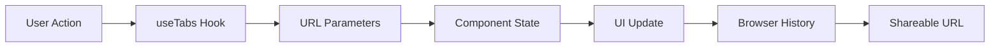

# ZEKE Main Application

The primary user interface for the ZEKE AI-powered news intelligence platform.

## Overview

This Next.js application provides the main user experience for ZEKE, including:

- **Story Discovery**: Browse and search through AI-analyzed news stories
- **Tab-Based Navigation**: Multi-tab interface for efficient story exploration
- **Real-time Updates**: Live content updates and notifications
- **User Management**: Authentication, subscriptions, and account settings
- **Admin Tools**: Content management and system administration

## Tab State Management

The application uses a URL-first architecture for tab state management, powered by [nuqs](https://nuqs.dev/). This means your browser's URL contains all the information needed to restore your exact tab configuration.

### Key Benefits

- **🔗 Shareable URLs**: Copy and share URLs that restore exact tab states
- **🔄 Browser Navigation**: Back/forward buttons work naturally with tabs
- **💾 Persistence**: Tab state survives page refreshes automatically
- **🎯 Single Source of Truth**: URL parameters are the authoritative state

### How It Works



### URL Parameters

The following URL parameters control tab behavior:

- **`tabs`**: Comma-separated list of tab IDs (e.g., `?tabs=story1,story2,story3`)
- **`active`**: Currently active tab ID (e.g., `?active=story1`)
- **`panelStates`**: JSON object of per-tab panel visibility (e.g., `?panelStates={"story1":true}`)
- **`globalPanel`**: Global panel visibility fallback (e.g., `?globalPanel=true`)
- **`metadata`**: JSON object containing tab metadata like titles and settings

### Using the Tab System

The `useTabs` hook provides all tab management functionality:

```typescript
import { useTabs } from '@/hooks/use-tabs';

function MyComponent() {
  const { 
    tabs,           // Array of current tabs
    activeId,       // ID of active tab
    active,         // Active tab object
    openTab,        // Open a new tab
    closeTab,       // Close a tab
    setActive,      // Switch active tab
    sidePanelOpen,  // Panel visibility for active tab
    setSidePanelOpen // Toggle panel visibility
  } = useTabs();

  // Open a new story tab
  const handleOpenStory = (story) => {
    openTab({
      id: story.clusterId,
      title: story.title,
      embedKind: 'article',
      embedUrl: story.url,
      clusterId: story.clusterId,
      overlays: story.overlays,
    });
  };

  // Close current tab
  const handleCloseTab = () => {
    if (activeId) {
      closeTab(activeId);
    }
  };

  return (
    <div>
      <h2>Current Tabs: {tabs.length}</h2>
      <button onClick={handleOpenStory}>Open Story</button>
      <button onClick={handleCloseTab}>Close Tab</button>
    </div>
  );
}
```

### Tab Operations

Common tab operations available through the `useTabs` hook:

```typescript
// Basic operations
openTab(tab)           // Open a new tab
closeTab(id)           // Close specific tab
setActive(id)          // Switch to tab
pinTab(id, pinned)     // Pin/unpin tab
promoteTab(id)         // Convert preview tab to permanent

// Batch operations
closeOthers(id)        // Close all tabs except specified
closeToRight(id)       // Close all tabs to the right
batch(fn)              // Apply multiple changes at once

// Panel management
setSidePanelOpen(open) // Toggle side panel for active tab
resetPanelState()      // Reset all panel states

// URL restoration
restoreFromUrl(id, isShare) // Restore tab from URL parameters
```

### Example URLs

Here are examples of what tab-enabled URLs look like:

```
# Single story tab
/stories/tech-news-123?active=tech-news-123

# Multiple tabs with active selection
/?tabs=story1,story2,story3&active=story2

# Tabs with panel states
/?tabs=story1,story2&active=story1&panelStates={"story1":true,"story2":false}

# Complete tab configuration
/?tabs=story1,story2&active=story1&panelStates={"story1":true}&metadata={"story1":{"title":"Tech News","pinned":true}}
```

## Development

### Getting Started

```bash
# Install dependencies
bun install

# Start development server
bun dev

# Run type checking
bun typecheck

# Run linting
bun lint
```

### Project Structure

```
apps/app/
├── app/                    # Next.js App Router pages
├── components/             # React components
├── hooks/                  # Custom React hooks
│   └── use-tabs.ts        # Tab state management hook
├── lib/                    # Utility libraries
│   └── nuqs.ts            # URL state parsers
├── actions/               # Server actions
├── types/                 # TypeScript type definitions
└── utils/                 # Helper functions
```

### Key Technologies

- **Next.js 14**: React framework with App Router
- **TypeScript**: Type-safe JavaScript
- **Tailwind CSS**: Utility-first CSS framework
- **nuqs**: Type-safe URL state management
- **Supabase**: Backend-as-a-Service
- **React Hook Form**: Form state management
- **Sonner**: Toast notifications

## Architecture

The application follows a URL-first architecture where:

1. **URL parameters** serve as the single source of truth for application state
2. **Components** derive their state from URL parameters via nuqs hooks
3. **User interactions** update URL parameters, which automatically sync to components
4. **Browser navigation** works naturally with application state changes

This approach ensures that every application state is shareable, bookmarkable, and persistent across page refreshes.
