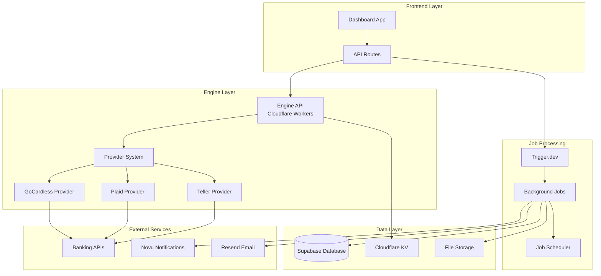
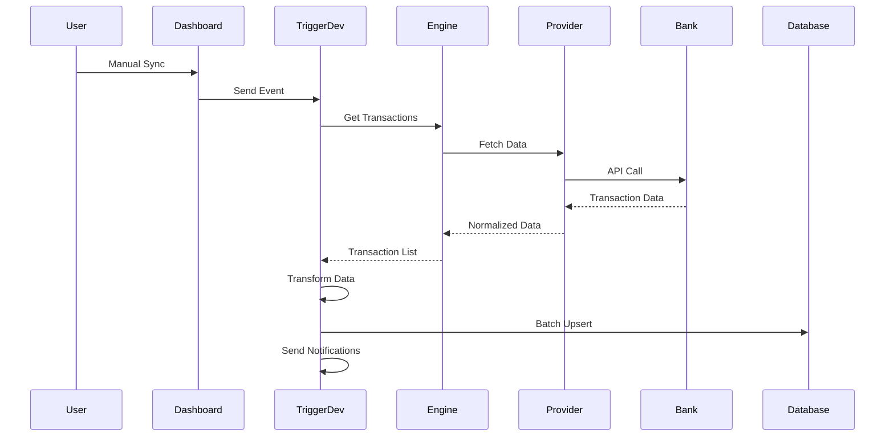

# Midday Engine Architecture

## Overview

The Midday Engine is a sophisticated financial data aggregation and processing system that connects to multiple banking providers, processes financial transactions, and maintains a centralized database. It's built using a modern, event-driven architecture with robust error handling and scalable background processing.

## System Architecture



## Core Components

### 1. Engine API (`apps/engine`)

The Engine API is deployed as a Cloudflare Worker and provides RESTful endpoints for:

- **Transactions**: Fetch transaction data from banking providers
- **Accounts**: Retrieve account information and balances
- **Institutions**: Get supported banking institutions
- **Rates**: Exchange rate data

**Key Features:**
- OpenAPI specification with Zod validation
- Bearer token authentication
- Caching middleware for performance
- Multi-provider abstraction

**Deployment:**
- Production: `engine.midday.ai`
- Staging: `engine-staging.midday.ai`
- Uses Cloudflare KV for caching and mTLS certificates for secure banking connections

### 2. Provider System

The provider system abstracts different banking APIs through a unified interface:

```typescript
interface Provider {
  getTransactions(params: GetTransactionsRequest): Promise<GetTransactionsResponse>;
  getAccounts(params: GetAccountsRequest): Promise<GetAccountsResponse>;
  getAccountBalance(params: GetAccountBalanceRequest): Promise<GetAccountBalanceResponse>;
  getInstitutions(params: GetInstitutionsRequest): Promise<GetInstitutionsResponse>;
  getHealthCheck(): Promise<boolean>;
  deleteAccounts(params: DeleteAccountsRequest): void;
}
```

**Supported Providers:**
- **Teller**: US banking with mTLS authentication
- **Plaid**: US/Canada banking with OAuth
- **GoCardless**: European banking with API keys

### 3. Job Processing System (`packages/jobs`)

Built on Trigger.dev for reliable background processing with multiple trigger types:

#### Event Triggers (Manual/API-initiated)
- `TRANSACTIONS_MANUAL_SYNC`: User-initiated sync
- `TRANSACTIONS_IMPORT`: CSV/image import processing
- `INBOX_MATCH`: Document-transaction matching

#### Scheduled Triggers (Automatic)
- `TRANSACTIONS_SYNC`: Every 8 hours per team
- `EXCHANGE_RATES_UPDATE`: Daily at 12:00 UTC
- `BANK_CONNECTION_EXPIRING`: Weekly on Mondays
- `BANK_CONNECTION_DISCONNECTED`: Weekly on Mondays

#### Database Triggers (Reactive)
- `INBOX_UPLOAD`: File upload processing
- Supabase webhook triggers for real-time processing

## Database Schema

### Core Tables

#### `transactions`
```sql
CREATE TABLE transactions (
    id uuid PRIMARY KEY DEFAULT gen_random_uuid(),
    internal_id text UNIQUE NOT NULL,  -- Format: {team_id}_{provider_transaction_id}
    team_id uuid NOT NULL,
    bank_account_id uuid,
    name text NOT NULL,
    description text,
    amount numeric NOT NULL,
    currency text NOT NULL,
    date date NOT NULL,
    method transactionMethods NOT NULL,
    status transactionStatus DEFAULT 'posted',
    category transactionCategories,
    category_slug text,
    balance numeric,
    manual boolean DEFAULT false,
    created_at timestamp with time zone DEFAULT now()
);
```

#### `bank_accounts`
```sql
CREATE TABLE bank_accounts (
    id uuid PRIMARY KEY DEFAULT gen_random_uuid(),
    account_id text NOT NULL,  -- Provider's account ID
    team_id uuid NOT NULL,
    bank_connection_id uuid,
    name text,
    currency text,
    balance numeric DEFAULT 0,
    base_balance numeric,      -- Balance in team's base currency
    base_currency text,
    type account_type,         -- credit, depository, etc.
    enabled boolean DEFAULT true,
    manual boolean DEFAULT false,
    created_at timestamp with time zone DEFAULT now()
);
```

#### `bank_connections`
```sql
CREATE TABLE bank_connections (
    id uuid PRIMARY KEY DEFAULT gen_random_uuid(),
    team_id uuid NOT NULL,
    institution_id text NOT NULL,
    provider bank_providers,   -- teller, plaid, gocardless
    name text NOT NULL,
    logo_url text,
    access_token text,         -- Encrypted access token
    enrollment_id text,        -- Teller enrollment ID
    reference_id text,         -- GoCardless reference ID
    expires_at timestamp with time zone,
    status connection_status DEFAULT 'connected',
    error_details text,
    last_accessed timestamp with time zone,
    created_at timestamp with time zone DEFAULT now(),
    UNIQUE(team_id, institution_id)
);
```

## Data Flow

### 1. Transaction Sync Process



### 2. Data Transformation Pipeline

1. **Fetch**: Raw data from banking provider
2. **Transform**: Convert to standardized format
3. **Validate**: Ensure data integrity
4. **Batch**: Process in chunks of 500 transactions
5. **Upsert**: Insert/update with conflict resolution
6. **Notify**: Send notifications for new transactions

### 3. Error Handling

The system implements comprehensive error handling:

```typescript
// API Error Parsing
export function parseAPIError(error: unknown) {
  if (typeof error === "object" && error !== null && "error" in error) {
    const apiError = error as { error: { code: string; message: string } };
    return {
      code: apiError.error.code,
      message: apiError.error.message,
    };
  }
  return { code: "unknown", message: "An unknown error occurred" };
}
```

**Error Recovery:**
- Connection status tracking in `bank_connections.status`
- Automatic retry with exponential backoff
- Error details stored for debugging
- Email notifications for persistent failures

## Trigger Mechanisms

### 1. User-Initiated Actions

```typescript
// Manual sync from dashboard
export const manualSyncTransactionsAction = authActionClient
  .action(async ({ parsedInput: { connectionId }, ctx: { user } }) => {
    const event = await client.sendEvent({
      name: Events.TRANSACTIONS_MANUAL_SYNC,
      payload: {
        connectionId,
        teamId: user.team_id,
      },
    });
    return event;
  });
```

### 2. Scheduled Jobs

```typescript
// Automatic sync every 8 hours per team
client.defineJob({
  id: Jobs.TRANSACTIONS_SYNC,
  trigger: scheduler,  // Dynamic scheduler per team
  run: async (_, io, ctx) => {
    const teamId = ctx.source?.id as string;
    // Process all enabled accounts for team
  },
});
```

### 3. Database Webhooks

Supabase triggers for real-time processing:
- File uploads trigger document processing
- New connections trigger initial sync
- Transaction updates trigger notifications

## Performance Optimizations

### 1. Batch Processing

All database operations use batch processing to handle large datasets efficiently:

```typescript
export async function processBatch<T, R>(
  items: T[],
  limit: number,
  fn: (batch: T[]) => Promise<R[]>,
): Promise<R[]> {
  const batches: T[][] = [];

  // Split into batches of 500
  for (let i = 0; i < items?.length; i += limit) {
    batches.push(items.slice(i, i + limit));
  }

  // Process serially to avoid overwhelming the database
  for (const batch of batches) {
    await fn(batch);
  }
}
```

### 2. Caching Strategy

- **Engine API**: Cloudflare KV caching for institutions and rates
- **Dashboard**: Next.js cache with revalidation tags
- **Database**: Indexed queries with optimized schemas

### 3. Conflict Resolution

Transactions use composite unique keys to prevent duplicates:
```sql
-- Unique constraint on internal_id (team_id + provider_transaction_id)
ALTER TABLE transactions ADD CONSTRAINT transactions_internal_id_key UNIQUE (internal_id);
```

## Security

### 1. Authentication & Authorization
- Bearer token authentication for Engine API
- Row Level Security (RLS) in Supabase
- Team-based data isolation

### 2. Data Encryption
- Access tokens encrypted at rest
- mTLS certificates for banking connections
- Secure webhook signatures

### 3. Banking Compliance
- PCI DSS compliance through providers
- No sensitive banking data stored locally
- Audit trails for all financial operations

## Monitoring & Observability

### 1. Logging
- Structured logging with request IDs
- Error tracking with Sentry integration
- Performance monitoring

### 2. Notifications
- Real-time notifications via Novu
- Email alerts for connection issues
- In-app notifications for new transactions

### 3. Health Checks
- Provider health monitoring
- Connection status tracking
- Automated error recovery

## Deployment

### Engine API
- **Platform**: Cloudflare Workers
- **Environments**: Production, Staging
- **Configuration**: `wrangler.toml`

### Jobs System
- **Platform**: Trigger.dev Cloud
- **Runtime**: Node.js
- **Integrations**: Supabase, Resend, Novu

### Database
- **Platform**: Supabase (PostgreSQL)
- **Migrations**: Automated via Supabase CLI
- **Backups**: Automated daily backups

## Development Workflow

1. **Local Development**: Use Supabase local instance
2. **Testing**: Comprehensive test suites for providers
3. **Staging**: Full environment for testing
4. **Production**: Blue-green deployments

This architecture ensures reliable, scalable, and secure financial data processing while maintaining excellent developer experience and operational visibility.

## Detailed Job Descriptions

### Transaction Jobs

#### 1. Initial Sync (`TRANSACTIONS_INITIAL_SYNC`)
**Purpose**: First-time sync when a bank connection is established
**Trigger**: Event-based (when user connects a bank account)
**Process**:
1. Fetch all historical transactions from provider
2. Transform to internal format
3. Batch insert (500 transactions per batch)
4. Update account balances
5. Schedule recurring sync job (every 8 hours)
6. Send setup completion notification

```typescript
// Key features:
- Handles large transaction volumes efficiently
- Sets up recurring sync scheduler per team
- Comprehensive error handling with connection status updates
- Progress tracking with status updates
```

#### 2. Scheduled Sync (`TRANSACTIONS_SYNC`)
**Purpose**: Regular transaction updates for all connected accounts
**Trigger**: Dynamic scheduler (every 8 hours per team)
**Process**:
1. Query all enabled, non-manual accounts for team
2. Fetch latest transactions from each provider
3. Update account balances
4. Process new transactions in batches
5. Send notifications for new transactions
6. Update connection last_accessed timestamp

#### 3. Manual Sync (`TRANSACTIONS_MANUAL_SYNC`)
**Purpose**: User-initiated sync for specific connection
**Trigger**: User action from dashboard
**Process**:
1. Fetch latest transactions for specific connection
2. Process only new transactions (using `latest: true` flag)
3. Update account balance
4. Immediate cache invalidation
5. Real-time UI updates

#### 4. Transaction Import (`TRANSACTIONS_IMPORT`)
**Purpose**: Import transactions from CSV files or images
**Trigger**: File upload event
**Process**:
1. Parse CSV data or extract from images using OCR
2. Map columns to transaction fields
3. Validate and transform data
4. Handle currency conversion if needed
5. Batch insert with duplicate detection
6. Generate import summary report

### Banking Jobs

#### 1. Connection Expiring (`BANK_CONNECTION_EXPIRING`)
**Purpose**: Notify users of expiring bank connections
**Trigger**: Cron job (weekly on Mondays at 15:30 UTC)
**Process**:
1. Query connections expiring within 7 days
2. Group by team and user
3. Send email notifications
4. Create in-app notifications
5. Track notification delivery

#### 2. Connection Disconnected (`BANK_CONNECTION_DISCONNECTED`)
**Purpose**: Handle and notify about disconnected bank connections
**Trigger**: Cron job (weekly on Mondays at 14:30 UTC)
**Process**:
1. Identify connections with 'disconnected' status
2. Send reconnection instructions via email
3. Disable automatic sync for affected accounts
4. Log disconnection events for analytics

### Utility Jobs

#### 1. Exchange Rates Update (`EXCHANGE_RATES_UPDATE`)
**Purpose**: Daily currency exchange rate updates
**Trigger**: Cron job (daily at 12:00 UTC)
**Process**:
1. Fetch latest rates from engine API
2. Transform rate data for database storage
3. Batch upsert exchange rates
4. Update base currency calculations for accounts

#### 2. Inbox Processing (`INBOX_UPLOAD`, `INBOX_DOCUMENT`, `INBOX_MATCH`)
**Purpose**: Process uploaded documents and match with transactions
**Triggers**: Database triggers and events
**Process**:
1. **Upload**: Extract metadata from uploaded files
2. **Document**: OCR processing and data extraction
3. **Match**: AI-powered transaction matching

## Provider Implementation Details

### Teller Provider
**Authentication**: mTLS certificates
**Endpoints**:
- `GET /accounts` - List accounts
- `GET /accounts/{id}/transactions` - Get transactions
- `GET /accounts/{id}/balances` - Get balance
- `GET /institutions` - List institutions

**Key Features**:
- Real-time transaction data
- Comprehensive US bank coverage
- Strong security with certificate-based auth
- Webhook support for real-time updates

### Plaid Provider
**Authentication**: OAuth 2.0 with client credentials
**Endpoints**:
- `/accounts/get` - List accounts
- `/transactions/get` - Get transactions
- `/accounts/balance/get` - Get balance
- `/institutions/get` - List institutions

**Key Features**:
- US and Canada coverage
- Extensive transaction categorization
- Identity verification capabilities
- Sandbox environment for testing

### GoCardless Provider
**Authentication**: API key-based
**Endpoints**:
- `/accounts/` - Account management
- `/transactions/` - Transaction data
- `/institutions/` - Institution data

**Key Features**:
- European bank coverage
- Open Banking compliance
- Strong regulatory compliance
- Multi-country support

## Error Handling Patterns

### 1. Provider API Errors
```typescript
try {
  const transactions = await engine.transactions.list(params);
} catch (error) {
  if (error instanceof Midday.APIError) {
    const parsedError = parseAPIError(error);

    // Update connection status
    await supabase
      .from("bank_connections")
      .update({
        status: parsedError.code,
        error_details: parsedError.message,
      })
      .eq("id", connectionId);
  }
}
```

### 2. Retry Logic
The system implements exponential backoff retry logic:
- Initial retry after 1 second
- Maximum 3 retry attempts
- Exponential backoff (1s, 2s, 4s)
- Circuit breaker for persistent failures

### 3. Graceful Degradation
- Continue processing other accounts if one fails
- Partial sync completion tracking
- User notification of partial failures
- Automatic recovery attempts

## Notification System

### 1. Real-time Notifications (Novu)
**Types**:
- New transaction alerts
- Connection status changes
- Import completion
- Document matches

**Delivery Channels**:
- In-app notifications
- Email notifications
- Push notifications (mobile)

### 2. Email Notifications (Resend)
**Templates**:
- Transaction summaries
- Connection expiry warnings
- Import reports
- Error notifications

**Features**:
- Internationalization support
- Custom reply-to addresses
- Tracking and analytics
- Template versioning

## Cache Strategy

### 1. Engine API Caching
```typescript
// Cache middleware for specific routes
app.get("/institutions", cacheMiddleware);
app.get("/accounts", cacheMiddleware);
app.get("/transactions", cacheMiddleware);

// Cache configuration
const cacheMiddleware = cache({
  cacheName: "engine",
  cacheControl: "max-age=3600", // 1 hour
});
```

### 2. Dashboard Caching
```typescript
// Next.js cache with revalidation tags
export const getTransactions = async (params) => {
  return unstable_cache(
    async () => getTransactionsQuery(supabase, params),
    ["transactions", teamId],
    {
      revalidate: 180, // 3 minutes
      tags: [`transactions_${teamId}`],
    },
  );
};
```

### 3. Cache Invalidation
Strategic cache invalidation on data updates:
- Transaction sync invalidates transaction caches
- Account updates invalidate balance caches
- Connection changes invalidate account caches

## Development Guidelines

### 1. Adding New Providers
1. Implement the `Provider` interface
2. Add provider-specific API client
3. Implement data transformation functions
4. Add comprehensive tests
5. Update provider factory
6. Add configuration options

### 2. Creating New Jobs
1. Define job constants in `constants.ts`
2. Implement job with proper schema validation
3. Add error handling and logging
4. Include progress tracking
5. Add comprehensive tests
6. Document job behavior

### 3. Database Migrations
1. Use Supabase migration system
2. Include rollback procedures
3. Test with production data volumes
4. Coordinate with application deployments
5. Monitor performance impact

This comprehensive architecture documentation provides a complete understanding of how the Midday Engine operates, from high-level architecture to implementation details.

## Technical Implementation Details

### Complete Technology Stack

#### Frontend Stack
```json
{
  "framework": "Next.js 14.2.1",
  "runtime": "React 18.3.1",
  "language": "TypeScript 5.6.2",
  "styling": "Tailwind CSS with @todesktop/tailwind-variants",
  "state_management": "Zustand 4.5.5",
  "forms": "React Hook Form 7.53.0 + Zod validation",
  "ui_components": "@midday/ui (custom component library)",
  "animations": "Framer Motion 11.5.4",
  "charts": "Recharts 2.12.7",
  "internationalization": "next-international 1.2.4",
  "themes": "next-themes 0.3.0"
}
```

#### Backend Stack
```json
{
  "api_framework": "Hono 4.6.2 (Cloudflare Workers)",
  "database": "Supabase (PostgreSQL 15+)",
  "job_processing": "Trigger.dev 2.3.19",
  "authentication": "Supabase Auth + Row Level Security",
  "file_storage": "Supabase Storage + Cloudflare R2",
  "caching": "Cloudflare KV + Next.js Cache",
  "email": "Resend 3.5.0",
  "notifications": "Novu 2.0.0",
  "monitoring": "Sentry 8.x"
}
```

#### Banking Integrations
```json
{
  "providers": {
    "teller": "mTLS certificate-based authentication",
    "plaid": "OAuth 2.0 with Plaid SDK 27.0.0",
    "gocardless": "API key-based with Open Banking"
  },
  "security": "PCI DSS compliant through providers",
  "data_encryption": "TLS 1.3 + encrypted storage"
}
```

### Type Safety Implementation

#### 1. Database Schema to TypeScript Generation

The system maintains end-to-end type safety through automated type generation:

```typescript
// packages/supabase/package.json - Type generation script
{
  "scripts": {
    "db:generate": "supabase gen types --lang=typescript --project-id $PROJECT_ID --schema public > src/types/db.ts"
  }
}
```

Generated types provide complete type safety:

```typescript
// packages/supabase/src/types/db.ts
export type Database = {
  public: {
    Tables: {
      transactions: {
        Row: {
          id: string;
          internal_id: string;
          team_id: string;
          bank_account_id: string | null;
          name: string;
          amount: number;
          currency: string;
          date: string;
          method: Database["public"]["Enums"]["transactionMethods"];
          status: Database["public"]["Enums"]["transactionStatus"];
          // ... complete type definitions
        };
        Insert: {
          // Insert-specific types with optional fields
        };
        Update: {
          // Update-specific types with all optional fields
        };
      };
    };
    Enums: {
      transactionMethods: "payment" | "card_purchase" | "transfer" | "ach" | "wire" | "fee";
      transactionStatus: "posted" | "pending" | "excluded" | "completed";
      bank_providers: "gocardless" | "plaid" | "teller";
    };
  };
};
```

#### 2. Type-Safe Database Operations

All database operations use generated types for compile-time safety:

```typescript
// packages/supabase/src/client/server.ts
import type { Database } from "../types";

export const createClient = (options?: CreateClientOptions) => {
  return createServerClient<Database>(
    process.env.NEXT_PUBLIC_SUPABASE_URL!,
    key,
    {
      cookies: {
        get(name: string) {
          return cookieStore.get(name)?.value;
        },
        set(name: string, value: string, options: CookieOptions) {
          try {
            cookieStore.set({ name, value, ...options });
          } catch (error) {}
        },
      },
    },
  );
};

// Type-safe client usage
export type Client = SupabaseClient<Database>;
```

#### 3. Zod Schema Validation Patterns

The system uses Zod for runtime validation and type inference:

```typescript
// apps/dashboard/src/actions/schema.ts
export const connectBankAccountSchema = z.object({
  referenceId: z.string().nullable().optional(), // GoCardless
  accessToken: z.string().nullable().optional(), // Teller
  enrollmentId: z.string().nullable().optional(), // Teller
  provider: z.enum(["gocardless", "plaid", "teller"]),
  accounts: z.array(
    z.object({
      account_id: z.string(),
      bank_name: z.string(),
      balance: z.number().optional(),
      currency: z.string(),
      name: z.string(),
      institution_id: z.string(),
      enabled: z.boolean(),
      logo_url: z.string().nullable().optional(),
      type: z.enum([
        "credit",
        "depository",
        "other_asset",
        "loan",
        "other_liability",
      ]),
    }),
  ),
});

// Type inference from schema
export type ConnectBankAccountSchema = z.infer<typeof connectBankAccountSchema>;
```

#### 4. API Contract Enforcement

Engine API uses OpenAPI with Zod for strict contract enforcement:

```typescript
// apps/engine/src/routes/transactions/schema.ts
export const TransactionSchema = z
  .object({
    id: z.string().openapi({
      example: "9293961c-df93-4d6d-a2cc-fc3e353b2d10",
    }),
    description: z.string().openapi({
      example: "Transfer to bank account",
    }).nullable(),
    amount: z.number().openapi({
      example: 100,
    }),
    name: z.string().openapi({
      example: "Vercel Inc.",
    }),
    date: z.string().openapi({
      example: "2024-06-12",
    }),
    currency: z.string().openapi({
      example: "USD",
    }),
    status: z.enum(["pending", "posted"]).openapi({
      example: "posted",
    }),
  })
  .openapi("TransactionSchema");

// Route definition with validation
const indexRoute = createRoute({
  method: "get",
  path: "/",
  summary: "Get transactions",
  request: {
    query: TransactionsParamsSchema,
  },
  responses: {
    200: {
      content: {
        "application/json": {
          schema: TransactionsSchema,
        },
      },
      description: "Retrieve transactions",
    },
  },
});
```

### Supabase RPC Implementation

#### 1. Custom Database Functions

Complex business logic is implemented as PostgreSQL functions for performance:

```sql
-- Calculate total transaction sum across currencies
CREATE OR REPLACE FUNCTION public.calculate_total_sum(target_currency text)
RETURNS numeric
LANGUAGE plpgsql
AS $function$
declare
    total_sum numeric := 0;
    currency_rate numeric;
    currency_sum record;
begin
    for currency_sum in
        select currency, sum(abs(amount)) as sum_amount
        from transactions
        group by currency
    loop
        select rate into currency_rate
        from exchange_rates
        where base = currency_sum.currency
          and target = target_currency
        limit 1;

        if currency_rate is null then
            raise notice 'no exchange rate found for currency % to target currency %',
                currency_sum.currency, target_currency;
            continue;
        end if;

        total_sum := total_sum + (currency_sum.sum_amount * currency_rate);
    end loop;

    return round(total_sum, 2);
end;
$function$;
```

#### 2. Transaction Frequency Analysis

Advanced analytics implemented as database functions:

```sql
-- Analyze transaction patterns for recurring detection
CREATE OR REPLACE FUNCTION public.calculate_transaction_frequency(
    p_transaction_group text,
    p_team_id uuid,
    p_new_date date
)
RETURNS TABLE(
    avg_days_between double precision,
    transaction_count integer,
    is_recurring boolean,
    latest_frequency text
)
LANGUAGE plpgsql
AS $function$
declare
    v_avg_days_between float;
    v_transaction_count int;
    v_is_recurring boolean;
    v_latest_frequency text;
begin
    select
        coalesce(avg(extract(epoch from (p_new_date::timestamp - t.date::timestamp)) / (24 * 60 * 60)), 0),
        count(*) + 1,
        coalesce(bool_or(t.recurring), false),
        coalesce(max(case when t.recurring then t.frequency else null end), 'unknown')
    into v_avg_days_between, v_transaction_count, v_is_recurring, v_latest_frequency
    from transactions t
    where t.name = p_transaction_group
      and t.team_id = p_team_id
      and t.date < p_new_date;

    return query select v_avg_days_between, v_transaction_count, v_is_recurring, v_latest_frequency;
end;
$function$;
```

#### 3. RPC Client Usage

Type-safe RPC calls from the application:

```typescript
// apps/website/src/components/ticker.tsx
export async function Ticker() {
  const client = createServerClient<Database>(
    process.env.NEXT_PUBLIC_SUPABASE_URL!,
    process.env.SUPABASE_SERVICE_KEY!,
    {
      cookies: {
        get() { return null; },
        set() { return null; },
        remove() { return null; },
      },
    },
  );

  const [
    { data: totalSum },
    { count: businessCount },
    { count: transactionCount },
  ] = await Promise.all([
    // Type-safe RPC call
    client.rpc("calculate_total_sum", {
      target_currency: "USD",
    }),
    client.from("teams").select("id", { count: "exact", head: true }).limit(1),
    client.from("transactions").select("id", { count: "exact", head: true }).limit(1),
  ]);

  return (
    <div>
      <span>${totalSum?.toLocaleString()}</span>
      <span>{businessCount} businesses</span>
      <span>{transactionCount} transactions</span>
    </div>
  );
}
```

#### 4. Complex Query Patterns

Advanced queries using RPC for better performance:

```typescript
// packages/supabase/src/queries/index.ts
export async function getSpendingQuery(
  supabase: Client,
  params: GetSpendingParams,
) {
  return supabase.rpc("get_spending_v3", {
    team_id: params.teamId,
    date_from: params.from,
    date_to: params.to,
    base_currency: params.currency,
  });
}

export async function getBurnRateQuery(
  supabase: Client,
  params: GetBurnRateQueryParams,
) {
  const { teamId, from, to, currency } = params;

  const fromDate = new UTCDate(from);
  const toDate = new UTCDate(to);

  const { data } = await supabase.rpc("get_burn_rate_v3", {
    team_id: teamId,
    date_from: startOfMonth(fromDate).toDateString(),
    date_to: endOfMonth(toDate).toDateString(),
    base_currency: currency,
  });

  return {
    data,
    currency: data?.at(0)?.currency,
  };
}
```

### Integration Patterns

#### 1. API Client Implementations

**Engine API Client (Jobs System)**:
```typescript
// packages/jobs/src/utils/engine.ts
import Midday from "@midday-ai/engine";

export const engine = new Midday({
  environment: process.env.MIDDAY_ENGINE_ENVIRONMENT as
    | "production"
    | "staging"
    | "development"
    | undefined,
  bearerToken: process.env.MIDDAY_ENGINE_API_KEY ?? "",
});

// Usage in jobs
const transactions = await engine.transactions.list({
  provider: account.bank_connection.provider,
  accountId: account.account_id,
  accountType: getClassification(account.type),
  accessToken: account.bank_connection?.access_token,
  latest: "true",
});
```

**Supabase Client Configuration**:
```typescript
// packages/supabase/src/client/server.ts
export const createClient = (options?: CreateClientOptions) => {
  const { admin = false, ...rest } = options ?? {};
  const cookieStore = cookies();

  const key = admin
    ? process.env.SUPABASE_SERVICE_KEY!
    : process.env.NEXT_PUBLIC_SUPABASE_ANON_KEY!;

  const auth = admin
    ? {
        persistSession: false,
        autoRefreshToken: false,
        detectSessionInUrl: false,
      }
    : {};

  return createServerClient<Database>(
    process.env.NEXT_PUBLIC_SUPABASE_URL!,
    key,
    {
      ...rest,
      cookies: {
        get(name: string) {
          return cookieStore.get(name)?.value;
        },
        set(name: string, value: string, options: CookieOptions) {
          try {
            cookieStore.set({ name, value, ...options });
          } catch (error) {}
        },
        remove(name: string, options: CookieOptions) {
          try {
            cookieStore.set({ name, value: "", ...options });
          } catch (error) {}
        },
      },
      auth,
      global: {
        headers: {
          "user-agent": headers().get("user-agent") as string,
        },
      },
    },
  );
};
```

#### 2. Database Query Patterns

**Cached Query Pattern**:
```typescript
// packages/supabase/src/queries/cached-queries.ts
export const getTransactions = async (
  params: Omit<GetTransactionsParams, "teamId">,
) => {
  const supabase = createClient();
  const user = await getUser();
  const teamId = user?.data?.team_id;

  if (!teamId) {
    return null;
  }

  return unstable_cache(
    async () => {
      return getTransactionsQuery(supabase, { ...params, teamId });
    },
    ["transactions", teamId],
    {
      revalidate: 180, // 3 minutes
      tags: [`transactions_${teamId}`],
    },
  )(params);
};
```

**Complex Join Query**:
```typescript
// packages/supabase/src/queries/index.ts
export async function getTeamUserQuery(
  supabase: Client,
  params: GetTeamUserParams,
) {
  const { data } = await supabase
    .from("users_on_team")
    .select(`
      id,
      role,
      team_id,
      user:users(id, full_name, avatar_url, email)
    `)
    .eq("team_id", params.teamId)
    .eq("user_id", params.userId)
    .throwOnError()
    .single();

  return { data };
}
```

#### 3. Event Handling and Job Triggering

**Server Action to Job Event**:
```typescript
// apps/dashboard/src/actions/transactions/manual-sync-transactions-action.ts
import { Events, client } from "@midday/jobs";

export const manualSyncTransactionsAction = authActionClient
  .schema(manualSyncTransactionsSchema)
  .metadata({
    name: "manual-sync-transactions",
    track: {
      event: LogEvents.TransactionsManualSync.name,
      channel: LogEvents.TransactionsManualSync.channel,
    },
  })
  .action(async ({ parsedInput: { connectionId }, ctx: { user } }) => {
    const event = await client.sendEvent({
      name: Events.TRANSACTIONS_MANUAL_SYNC,
      payload: {
        connectionId,
        teamId: user.team_id,
      },
    });

    return event;
  });
```

**Job Definition with Type Safety**:
```typescript
// packages/jobs/src/transactions/manual-sync.ts
client.defineJob({
  id: Jobs.TRANSACTIONS_MANUAL_SYNC,
  name: "Transactions - Manual Sync",
  version: "0.0.1",
  trigger: eventTrigger({
    name: Events.TRANSACTIONS_MANUAL_SYNC,
    schema: z.object({
      connectionId: z.string(),
      teamId: z.string(),
    }),
  }),
  integrations: { supabase },
  run: async (payload, io) => {
    const supabase = io.supabase.client;
    const { connectionId, teamId } = payload;

    // Type-safe database operations
    const { data: accountsData } = await supabase
      .from("bank_accounts")
      .select(`
        id, team_id, account_id, type,
        bank_connection:bank_connection_id(id, provider, access_token)
      `)
      .eq("bank_connection_id", connectionId)
      .eq("enabled", true);

    // Process each account
    const promises = accountsData?.map(async (account) => {
      const transactions = await engine.transactions.list({
        provider: account.bank_connection.provider,
        accountId: account.account_id,
        accountType: getClassification(account.type),
        accessToken: account.bank_connection?.access_token,
        latest: true,
      });

      const formattedTransactions = transactions.data?.map((transaction) => {
        return transformTransaction({
          transaction,
          teamId: account.team_id,
          bankAccountId: account.id,
        });
      });

      // Batch processing for performance
      await processBatch(
        formattedTransactions,
        BATCH_LIMIT,
        async (batch) => {
          await supabase.from("transactions").upsert(batch, {
            onConflict: "internal_id",
            ignoreDuplicates: true,
          });
        },
      );
    });

    await Promise.all(promises ?? []);
  },
});
```

#### 4. Webhook Security Implementation

**Signature Verification**:
```typescript
// apps/dashboard/src/app/api/webhook/registered/route.ts
export async function POST(req: Request) {
  const text = await req.clone().text();
  const signature = headers().get("x-supabase-signature");

  if (!signature) {
    return NextResponse.json({ message: "Missing signature" }, { status: 401 });
  }

  const decodedSignature = Buffer.from(signature, "base64");
  const calculatedSignature = crypto
    .createHmac("sha256", process.env.WEBHOOK_SECRET_KEY!)
    .update(text)
    .digest();

  const hmacMatch = crypto.timingSafeEqual(
    decodedSignature,
    calculatedSignature,
  );

  if (!hmacMatch) {
    return NextResponse.json({ message: "Not Authorized" }, { status: 401 });
  }

  // Process webhook payload
  const payload = JSON.parse(text);
  // ... handle webhook logic
}
```

### Advanced Error Handling Patterns

#### 1. Provider API Error Handling

**Structured Error Parsing**:
```typescript
// packages/jobs/src/utils/error.ts
export function parseAPIError(error: unknown) {
  if (typeof error === "object" && error !== null && "error" in error) {
    const apiError = error as { error: { code: string; message: string } };
    return {
      code: apiError.error.code,
      message: apiError.error.message,
    };
  }
  return { code: "unknown", message: "An unknown error occurred" };
}

// Usage in jobs
try {
  const transactions = await engine.transactions.list(params);
} catch (error) {
  if (error instanceof Midday.APIError) {
    const parsedError = parseAPIError(error);

    // Update connection status in database
    await io.supabase.client
      .from("bank_connections")
      .update({
        status: parsedError.code,
        error_details: parsedError.message,
      })
      .eq("id", account.bank_connection.id);
  }
}
```

#### 2. Retry Logic with Exponential Backoff

**Provider API Retry Pattern**:
```typescript
// apps/engine/src/utils/retry.ts
export async function withRetry<T>(
  fn: () => Promise<T>,
  maxRetries: number = 3,
  baseDelay: number = 1000,
): Promise<T> {
  let lastError: Error;

  for (let attempt = 0; attempt <= maxRetries; attempt++) {
    try {
      return await fn();
    } catch (error) {
      lastError = error as Error;

      if (attempt === maxRetries) {
        throw lastError;
      }

      // Exponential backoff: 1s, 2s, 4s
      const delay = baseDelay * Math.pow(2, attempt);
      await new Promise(resolve => setTimeout(resolve, delay));
    }
  }

  throw lastError!;
}

// Usage in providers
export class Provider {
  async getTransactions(params: GetTransactionsRequest) {
    logger("getTransactions:", `provider: ${this.#name} id: ${params.accountId}`);

    const data = await withRetry(() => this.#provider?.getTransactions(params));

    if (data) {
      return data;
    }

    return [];
  }
}
```

#### 3. Circuit Breaker Pattern

**Connection Health Monitoring**:
```typescript
// apps/engine/src/providers/index.ts
export class Provider {
  #healthCheckCache = new Map<string, { healthy: boolean; lastCheck: number }>();

  async getHealthCheck(): Promise<boolean> {
    const cacheKey = this.#name || 'unknown';
    const cached = this.#healthCheckCache.get(cacheKey);
    const now = Date.now();

    // Cache health check for 5 minutes
    if (cached && (now - cached.lastCheck) < 300000) {
      return cached.healthy;
    }

    try {
      const healthy = await withRetry(() => this.#provider?.getHealthCheck());
      this.#healthCheckCache.set(cacheKey, { healthy: !!healthy, lastCheck: now });
      return !!healthy;
    } catch (error) {
      this.#healthCheckCache.set(cacheKey, { healthy: false, lastCheck: now });
      return false;
    }
  }
}
```

### AI/ML Integration Patterns

#### 1. Document Processing with AI

**Supabase Edge Functions for AI Processing**:
```typescript
// apps/api/supabase/functions/generate-document-embedding/index.ts
import { createClient } from "npm:@supabase/supabase-js@2.45.2";
import { openai } from "https://esm.sh/@ai-sdk/openai@0.0.54";
import { generateObject } from "https://esm.sh/ai@3.3.20";
import { z } from "https://esm.sh/zod@3.21.4";
import type { Database, Tables } from "../../src/types";

type DocumentsRecord = Tables<"documents">;

interface WebhookPayload {
  type: "INSERT";
  table: string;
  record: DocumentsRecord;
  schema: "public";
  old_record: null | DocumentsRecord;
}

const supabase = createClient<Database>(
  Deno.env.get("SUPABASE_URL")!,
  Deno.env.get("SUPABASE_SERVICE_ROLE_KEY")!,
);

Deno.serve(async (req) => {
  const payload: WebhookPayload = await req.json();
  const { id, name, metadata, team_id } = payload.record;

  // Download file from storage
  const { data: fileData } = await supabase.storage
    .from("vault")
    .download(name);

  if (!fileData) {
    return new Response("File not found", { status: 404 });
  }

  // Extract text based on file type
  let document: string | null = null;

  if (name.endsWith('.pdf')) {
    const { extractText, getDocumentProxy } = await import("https://esm.sh/unpdf@0.11.0");
    const pdf = await getDocumentProxy(new Uint8Array(await fileData.arrayBuffer()));
    const { text } = await extractText(pdf, { mergePages: true });
    document = text;
  }

  if (document) {
    // Use AI to extract structured data
    const { object } = await generateObject({
      model: openai("gpt-4o-mini"),
      schema: z.object({
        title: z.string().describe("Document title or subject"),
        body: z.string().describe("Main content summary"),
        tag: z.string().describe("Document category tag"),
        amount: z.number().optional().describe("Any monetary amount found"),
        date: z.string().optional().describe("Document date if found"),
      }),
      prompt: `Extract key information from this document: ${document.slice(0, 4000)}`,
    });

    // Update document with extracted data
    await supabase
      .from("documents")
      .update({
        title: object.title,
        body: object.body,
        tag: object.tag,
        metadata: {
          ...metadata,
          extracted: object,
        },
      })
      .eq("id", id);
  }

  return new Response("OK");
});
```

#### 2. Transaction Categorization with Embeddings

**Category Embedding Generation**:
```typescript
// apps/api/supabase/functions/generate-category-embedding/index.ts
import { createClient } from "npm:@supabase/supabase-js@2.45.2";
import type { Database, Tables } from "../../src/types";

type TransactionCategoriesRecord = Tables<"transaction_categories">;

const supabase = createClient<Database>(
  Deno.env.get("SUPABASE_URL")!,
  Deno.env.get("SUPABASE_SERVICE_ROLE_KEY")!,
);

// Use Supabase's built-in AI model
const model = new Supabase.ai.Session("gte-small");

Deno.serve(async (req) => {
  const payload: WebhookPayload = await req.json();
  const { id, name } = payload.record;

  if (name === payload?.old_record?.name) {
    return new Response("No change");
  }

  // Generate embedding for category name
  const embedding = await model.run(name, {
    mean_pool: true,
    normalize: true,
  });

  // Store embedding for similarity search
  const { error } = await supabase
    .from("transaction_categories")
    .update({
      embedding: JSON.stringify(embedding),
    })
    .eq("id", id);

  if (error) {
    console.warn(error.message);
  }

  return new Response(JSON.stringify(embedding, null, 2));
});
```

#### 3. Full-Text Search Implementation

**PostgreSQL Full-Text Search**:
```typescript
// packages/supabase/src/queries/index.ts
export async function getSimilarTransactions(
  supabase: Client,
  params: GetSimilarTransactionsParams,
) {
  const { name, teamId, categorySlug } = params;

  return supabase
    .from("transactions")
    .select("id, amount, team_id", { count: "exact" })
    .eq("team_id", teamId)
    .neq("category_slug", categorySlug)
    .textSearch("fts_vector", `'${name}'`) // Full-text search
    .throwOnError();
}
```

### Production Deployment Configuration

#### 1. Cloudflare Workers Configuration

**Engine Deployment**:
```toml
# apps/engine/wrangler.toml
compatibility_date = "2023-12-01"
workers_dev = false
logpush = true

[env.production]
name = "engine"
route = { pattern = "engine.midday.ai/*", zone_name = "midday.ai" }

kv_namespaces = [
  { binding = "KV", id = "1ce9f0355d854a569f72bfccbfbea369" }
]

mtls_certificates = [
  { binding = "TELLER_CERT", certificate_id = "76fdbac8-e96b-4a1e-922c-e54891b7371c" }
]

r2_buckets = [
  { binding = "STORAGE", bucket_name = "engine-assets", preview_bucket_name = "", jurisdiction = "eu" }
]

[env.staging]
name = "engine-staging"
route = { pattern = "engine-staging.midday.ai/*", zone_name = "midday.ai" }
```

#### 2. Next.js Application Configuration

**Dashboard Deployment**:
```json
// apps/dashboard/package.json
{
  "scripts": {
    "build": "NODE_ENV=production next build",
    "start": "next start",
    "jobs": "bunx @trigger.dev/cli@latest dev -p 3001 --client-id=midday-G6Yq"
  },
  "dependencies": {
    "next": "14.2.1",
    "@trigger.dev/nextjs": "^2.3.19",
    "@sentry/nextjs": "^8",
    "@supabase/sentry-js-integration": "^0.3.0"
  }
}
```

#### 3. Supabase Configuration

**Database Configuration**:
```toml
# apps/api/supabase/config.toml
project_id = "pytddvqiozwrhfbwqazp"

[api]
enabled = true
port = 54321
schemas = ["public", "storage"]
extra_search_path = ["public", "extensions"]
max_rows = 1000000

[auth]
site_url = "http://localhost:3001"
additional_redirect_urls = ["https://localhost:3001", "http://localhost:54321/auth/v1/callback"]
jwt_expiry = 36000

[auth.external.google]
enabled = true
client_id = "env(GOOGLE_CLIENT_ID)"
secret = "env(GOOGLE_SECRET)"
redirect_uri = "http://localhost:54321/auth/v1/callback"

[auth.email]
double_confirm_changes = true
enable_confirmations = true
enable_signup = true
```

#### 4. Monorepo Configuration

**Turborepo Setup**:
```json
// turbo.json
{
  "pipeline": {
    "build": {
      "dependsOn": ["^build"],
      "outputs": [".next/**", "!.next/cache/**", "dist/**"]
    },
    "dev": {
      "inputs": ["$TURBO_DEFAULT$", ".env", ".env.local", ".env.development"],
      "persistent": true,
      "cache": false
    },
    "jobs": {
      "persistent": true,
      "cache": false
    },
    "typecheck": {
      "dependsOn": ["^topo"],
      "outputs": ["node_modules/.cache/tsbuildinfo.json"]
    }
  }
}
```

**Package Manager Configuration**:
```json
// package.json
{
  "name": "midday",
  "private": true,
  "workspaces": ["packages/*", "apps/*", "packages/email/*"],
  "packageManager": "bun@1.1.27",
  "scripts": {
    "build": "turbo build",
    "dev": "turbo dev --parallel",
    "typecheck": "turbo typecheck"
  }
}
```

### Performance Monitoring

#### 1. Sentry Integration

**Error Tracking Setup**:
```typescript
// apps/dashboard/sentry.server.config.ts
import { createClient } from "@midday/supabase/client";
import * as Sentry from "@sentry/nextjs";
import { supabaseIntegration } from "@supabase/sentry-js-integration";

const client = createClient();

Sentry.init({
  dsn: process.env.NEXT_PUBLIC_SENTRY_DSN,
  tracesSampleRate: 1,
  debug: false,
  enabled: process.env.NODE_ENV === "production",
  integrations: [
    supabaseIntegration(client, Sentry, {
      tracing: true,
      breadcrumbs: true,
      errors: true,
    }),
  ],
});
```

#### 2. Analytics Integration

**Event Tracking**:
```typescript
// packages/events/src/server.ts
import { OpenPanel } from "@openpanel/nextjs";
import { waitUntil } from "@vercel/functions";

export const setupAnalytics = async (options?: Props) => {
  const { userId, fullName } = options ?? {};
  const trackingConsent = cookies().get("tracking-consent")?.value === "0";

  const client = new OpenPanel({
    clientId: process.env.NEXT_PUBLIC_OPENPANEL_CLIENT_ID!,
    clientSecret: process.env.OPENPANEL_SECRET_KEY!,
  });

  if (trackingConsent && userId && fullName) {
    const [firstName, lastName] = fullName.split(" ");

    waitUntil(
      client.identify({
        profileId: userId,
        firstName,
        lastName,
      }),
    );
  }

  return {
    track: (options: { event: string } & PostEventPayload["properties"]) => {
      if (process.env.NODE_ENV !== "production") {
        console.log("Track", options);
        return;
      }

      const { event, ...rest } = options;
      waitUntil(client.track(event, rest));
    },
  };
};
```

This comprehensive technical documentation provides concrete, working code examples that demonstrate the sophisticated architecture and implementation patterns used in the Midday Engine system.
```
```
