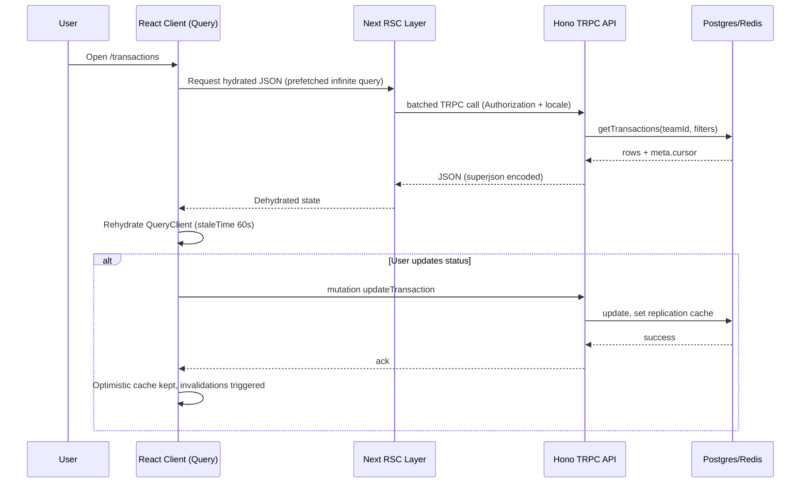
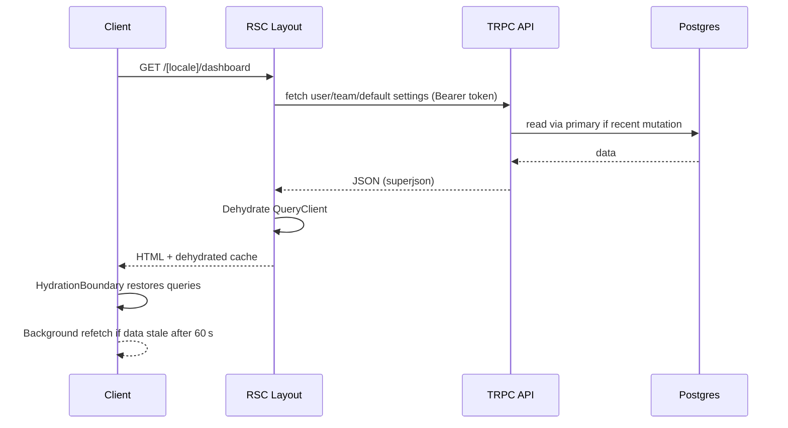

# Data Fetching & State Management Explainer
> Repository: zeke
> Generated: 2025-09-16T23:08:30Z
> Analyzer: Codex GPT-5
> Coverage: client | server | workers | infra | tests

## 0. Method
- Search queries used:
  - "rg \"trpc\\.\" apps/dashboard/src -n"
  - "rg \"fetch(\" apps/dashboard/src -n"
  - "rg \"Cookies\\.\" apps/dashboard/src -n"
- Tools/parsers used: ripgrep, sed, nl, date
- Notes/assumptions: Line numbers captured with `nl -ba`; TRPC query keys observed via generated helpers.
- Limitations: No runtime requests executed; behavior inferred from source and tests only.

## 1. Data Sources & Protocols
### 1.1 External/Internal APIs
- Protocols: REST | GraphQL | RPC | gRPC | WebSockets | SSE | file
- Base URLs / endpoints:
  | Name | Protocol | Base URL/Path | Auth Mode | Serialization | Pagination | File:Lines |
  |------|----------|----------------|-----------|---------------|-----------|-----------|
  | TRPC appRouter | RPC (httpBatchLink) | `${process.env.NEXT_PUBLIC_API_URL}/trpc` | Bearer Supabase session | superjson encode/decode | Cursor via `meta.cursor` on infinite queries | apps/dashboard/src/trpc/client.tsx:41, apps/api/src/trpc/init.ts:26 |
  | zeke REST API | REST (Hono) | `https://api.zeke.ai` | Bearer API key or OAuth token | JSON | Query params, cursor fields | apps/api/src/index.ts:16 |
  | Engine Worker | REST (OpenAPIHono) | `${process.env.ENGINE_API_URL}/` | Bearer engine API key | JSON | Query/cursor per route | packages/engine-client/src/index.ts:3, apps/engine/src/index.ts:17 |
  | Supabase Storage Proxy | REST | `${process.env.NEXT_PUBLIC_SUPABASE_URL}/storage/v1/object/…` | Bearer Supabase access token | Binary streaming | n/a | apps/dashboard/src/app/api/proxy/route.ts:22 |
  | Slack OAuth Exchange | REST | `https://slack.com/api/oauth.v2.access` | Client ID/secret | JSON | n/a | apps/dashboard/src/app/api/apps/slack/oauth_callback/route.ts:45 |
  | Currency Rates CDN | REST | `https://cdn.jsdelivr.net/npm/@fawazahmed0/currency-api@latest/v1` | None | JSON | n/a | apps/engine/src/utils/rates.ts:3 |
  | AI Streaming Chat | SSE/DataStream | Next API route `/api/chat` | None (relies on session tools) | AI SDK streamText | n/a | apps/dashboard/src/app/api/chat/route.ts:17 |
- Schemas / operations:
  - apps/api/src/trpc/routers/transactions.ts:26 – `transactions.get` returns `{ data, meta.cursor }` with filters
  - apps/api/src/trpc/routers/invoice.ts:98 – `invoice.get` and `invoice.invoiceSummary`
  - apps/api/src/trpc/routers/search.ts:10 – semantic fallback with LLM-generated filters
  - apps/engine/src/routes/transactions/index.ts:37 – Teller proxy returning transformed accounts/transactions
- Request construction and headers:
  - apps/dashboard/src/trpc/client.tsx:44 – injects `Authorization: Bearer ${session.access_token}`
  - apps/dashboard/src/trpc/server.tsx:35 – adds timezone/locale/country headers for geo-aware analytics
  - apps/api/src/index.ts:18 – CORS allowlist plus custom `x-user-*` headers

### 1.2 Data Ownership & Persistence
- Source of truth per entity:
  | Entity | Source of Truth | Long-term Store (DB) | Server Cache | Client Cache | Cookie/Storage | Notes |
  |--------|------------------|----------------------|--------------|--------------|----------------|-------|
  | Users & Auth | Supabase Postgres via Drizzle queries | Supabase Postgres | Redis `userCache` | React Query `useUserQuery` | `preferred-signin-provider`, `mfa-setup-visited` | packages/db/src/queries/users.ts references; apps/dashboard/src/hooks/use-user.ts:12 |
  | Teams & Permissions | Drizzle queries (`getTeamById`, `getTeamInvites`) | Postgres | Redis `teamCache`, `teamPermissionsCache` | Prefetch in layout | `hide-connect-flow` cookie | apps/api/src/trpc/routers/team.ts:44, packages/cache/src/team-cache.ts:4 |
  | Transactions | Drizzle `getTransactions` with embeddings | Postgres + embeddings tables | Redis `replicationCache` for primary routing | React Query infinite list | Column visibility cookie `transactions-columns` | packages/db/src/queries/transactions.ts:63, packages/cache/src/replication-cache.ts:4, apps/dashboard/src/components/tables/transactions/data-table.tsx:57 |
  | Invoices | Drizzle `getInvoiceById`, `invoiceSummary` | Postgres | none (read-after-write via replication cache) | React Query tables/widgets | Column cookie `invoices-columns` | apps/api/src/trpc/routers/invoice.ts:98, apps/dashboard/src/components/tables/invoices/data-table.tsx:52 |
  | Inbox Items & Documents | Drizzle `getInbox`, Supabase Storage | Postgres + Supabase Storage (`vault` bucket) | Notifications triggered via Trigger.dev | React Query `trpc.inbox.*` | LocalStorage `inbox-include-already-matched` | apps/api/src/trpc/routers/inbox.ts:34, apps/dashboard/src/hooks/use-local-storage.ts:6 |
  | Notifications | Drizzle `getActivities` | Postgres | none | React Query `useNotifications` | n/a | apps/api/src/trpc/routers/notifications.ts:14 |
  | Exchange Rates | Engine worker fetch + Supabase upsert | Supabase `exchange_rates` | none | Dashboard widgets read via TRPC | n/a | packages/jobs/src/tasks/rates/rates-scheduler.ts:6 |
  | Analytics Consent | Cookie flag | Cookie | n/a | n/a | `tracking-consent` | apps/dashboard/src/actions/tracking-consent-action.ts:12 |
- References:
  - packages/cache/src/redis-client.ts:12 – Redis client initialization for caches
  - packages/cache/src/team-cache.ts:4 – 30-minute permission cache
  - apps/dashboard/src/utils/columns.ts:4 – server cookies hydrate column visibility

## 2. Client-Side Fetching
### 2.1 Libraries & Patterns
- Libraries: `@tanstack/react-query@5.85.5` (apps/dashboard/package.json:39), `@trpc/client@11.5.0` (apps/dashboard/package.json:44), `zustand@5.0.8` (apps/dashboard/package.json:79), `nuqs@2.4.3` (apps/dashboard/package.json:58).
- Fetch wrappers / API clients:
  - `TRPCReactProvider` wraps `httpBatchLink` with Supabase session headers (apps/dashboard/src/trpc/client.tsx:41).
  - Server-side `createTRPCOptionsProxy` adds locale/timezone to requests (apps/dashboard/src/trpc/server.tsx:35).
- Query libraries (React Query/TanStack Query):
  - Default options set `staleTime` 60 s and superjson hydration (apps/dashboard/src/trpc/query-client.ts:7).
  - Prefetch helpers `prefetch`/`batchPrefetch` hydrate server components (apps/dashboard/src/trpc/server.tsx:62).

### 2.2 Query Inventory
| Key/Operation | Hook/Function | Variables | Cache Key | Stale/TTL | Retry | Invalidation Triggers | File:Lines |
|---------------|---------------|-----------|-----------|-----------|-------|-----------------------|------------|
| `trpc.user.me` | `useUserQuery` / layout prefetch | none | `trpc.user.me.queryKey()` | 60 s | TanStack default | `useUserMutation` cancel/rollback/invalidate | apps/dashboard/src/hooks/use-user.ts:12 |
| `trpc.team.current` | layout prefetch | none | `trpc.team.current.queryKey()` | 60 s | default | Redirects on null; revalidated via `revalidateAfterTeamChange` | apps/dashboard/src/app/[locale]/(app)/(sidebar)/layout.tsx:28 |
| `trpc.search.global` | layout prefetch + command palette | `{ searchTerm: "" }` | `trpc.search.global.queryKey({searchTerm:""})` | 60 s | default | Invalidated via `trpc.search.global` consumers on metadata change | apps/dashboard/src/app/[locale]/(app)/(sidebar)/layout.tsx:30 |
| `trpc.invoice.defaultSettings` | layout prefetch | none | `trpc.invoice.defaultSettings.queryKey()` | 60 s | default | Invalidated after invoice delete | apps/dashboard/src/app/[locale]/(app)/(sidebar)/layout.tsx:29 |
| `trpc.invoice.get` | overview + list | `pageSize` filter | `trpc.invoice.get.queryKey()` | 60 s | default | Invalidated in `InvoiceActions` on mutate/delete | apps/dashboard/src/app/[locale]/(app)/(sidebar)/page.tsx:33 |
| `trpc.invoice.paymentStatus` | overview/invoice widgets | none | `trpc.invoice.paymentStatus.queryKey()` | 60 s | default | Invalidated after invoice mutations | apps/dashboard/src/app/[locale]/(app)/(sidebar)/page.tsx:34 |
| `trpc.reports.expense` | overview chart | `{from,to,currency}` | `trpc.reports.expense.queryKey(opts)` | 60 s | default | Re-run when query params change via nuqs | apps/dashboard/src/app/[locale]/(app)/(sidebar)/page.tsx:35 |
| `trpc.reports.profit` | overview chart | same | `trpc.reports.profit.queryKey(opts)` | 60 s | default | Query param change | apps/dashboard/src/app/[locale]/(app)/(sidebar)/page.tsx:40 |
| `trpc.reports.burnRate` | overview widget | same | `trpc.reports.burnRate.queryKey(opts)` | 60 s | default | Query param change | apps/dashboard/src/app/[locale]/(app)/(sidebar)/page.tsx:45 |
| `trpc.reports.runway` | overview widget | same | `trpc.reports.runway.queryKey(opts)` | 60 s | default | Query param change | apps/dashboard/src/app/[locale]/(app)/(sidebar)/page.tsx:50 |
| `trpc.reports.spending` | overview widget | preset period | `trpc.reports.spending.queryKey(opts)` | 60 s | default | Query param change & spending selectors | apps/dashboard/src/app/[locale]/(app)/(sidebar)/page.tsx:58 |
| `trpc.reports.revenue` | overview chart (Promise.all) | same | `trpc.reports.revenue.queryKey(opts)` | 60 s | default | Query param change | apps/dashboard/src/app/[locale]/(app)/(sidebar)/page.tsx:76 |
| `trpc.transactions.get` | overview feed & transactions page | filters, cursor | `trpc.transactions.get.queryKey(params)` | 60 s | default | Invalidate on update/delete, manual refetch poll | apps/dashboard/src/app/[locale]/(app)/(sidebar)/transactions/page.tsx:31 |
| `trpc.transactions.get` (infinite) | `useSuspenseInfiniteQuery` | filters, `getNextPageParam` | `trpc.transactions.get.infiniteQueryKey()` | 60 s | default | `refetch()` on polling, mutations | apps/dashboard/src/components/tables/transactions/data-table.tsx:57 |
| `trpc.transactions.update` | mutation options | payload `status` | `trpc.transactions.update.mutationKey()` | n/a | n/a | Refetch & toast on success | apps/dashboard/src/components/tables/transactions/data-table.tsx:71 |
| `trpc.transactions.deleteMany` | mutation | ids | `trpc.transactions.deleteMany.mutationKey()` | n/a | n/a | Refetch on success | apps/dashboard/src/components/tables/transactions/data-table.tsx:84 |
| `trpc.transactions.searchTransactionMatch` | match dialog | `{query,inboxId}` | `trpc.transactions.searchTransactionMatch.queryKey()` | 60 s | default | Invalidated after match/unmatch | apps/dashboard/src/components/inbox/match-transaction.tsx:49 |
| `trpc.inbox.get` | overview & inbox page | filters/cursor | `trpc.inbox.get.infiniteQueryKey()` | 60 s | default | Invalidate on upload/match actions | apps/dashboard/src/app/[locale]/(app)/(sidebar)/inbox/page.tsx:27 |
| `trpc.inbox.getById` | inbox detail | `{id}` | `trpc.inbox.getById.queryKey({id})` | 60 s | default | Optimistic match/unmatch updates | apps/dashboard/src/components/inbox/match-transaction.tsx:40 |
| `trpc.inbox.matchTransaction` | mutation with optimistic cache | `{id,transactionId}` | n/a | n/a | n/a | Resets inbox & search caches on settle | apps/dashboard/src/components/inbox/match-transaction.tsx:101 |
| `trpc.notifications.list` | useNotifications inbox & archived | `{status,maxPriority}` | `trpc.notifications.list.queryKey(opts)` | 60 s | default | Real-time `invalidateQueries` on Supabase events | apps/dashboard/src/hooks/use-notifications.ts:38 |
| `trpc.notifications.updateStatus` | mutation | `{activityId,status}` | n/a | n/a | n/a | Optimistic move between inbox/archived | apps/dashboard/src/hooks/use-notifications.ts:79 |
| `trpc.notifications.updateAllStatus` | mutation | `{status}` | n/a | n/a | n/a | Optimistic bulk updates | apps/dashboard/src/hooks/use-notifications.ts:185 |
| `trpc.documents.get` | overview vault widget | `{pageSize}` | `trpc.documents.get.queryKey(opts)` | 60 s | default | Invalidated when documents mutate | apps/dashboard/src/app/[locale]/(app)/(sidebar)/page.tsx:57 |
| `trpc.documents.signedUrls` | `useDownloadZip` mutation | file paths | n/a | n/a | n/a | n/a | apps/dashboard/src/hooks/use-download-zip.ts:89 |
| `trpc.invoice.invoiceSummary` | invoices page cards | `{status}` | `trpc.invoice.invoiceSummary.queryKey(opts)` | 60 s | default | Invalidated after invoice mutations | apps/dashboard/src/app/[locale]/(app)/(sidebar)/invoices/page.tsx:43 |
| `trpc.invoice.getById` | Invoice drawer | `{id}` | `trpc.invoice.getById.queryKey({id})` | 60 s | default | Invalidated in `InvoiceActions` | apps/dashboard/src/components/invoice-details.tsx:37 |

### 2.3 Client State Stores
| Store | Type (Redux/Zustand/Context/etc.) | Persistence (memory/localStorage/indexedDB) | Slice/Atom | Selector | File:Lines |
|------|------------------------------------|---------------------------------------------|------------|---------|-----------|
| `useTransactionsStore` | Zustand | memory | row selection, columns, delete flag | direct getters | apps/dashboard/src/store/transactions.ts:1 |
| `useInvoiceStore` | Zustand | memory | invoice columns | `setColumns` | apps/dashboard/src/store/invoice.ts:9 |
| `useDocumentsStore` | Zustand | memory | vault selection | `setRowSelection` | apps/dashboard/src/store/vault.ts:9 |
| `useAssistantStore` | Zustand | memory | assistant open state/message | `setOpen` | apps/dashboard/src/store/assistant.ts:9 |
| `useExportStore` | Zustand | memory | latest export metadata | `setExportData` | apps/dashboard/src/store/export.ts:14 |
| `useSearchStore` | Zustand | memory | global search modal state | `setOpen` | apps/dashboard/src/store/search.ts:8 |
| `useTokenModalStore` | Zustand | memory | OAuth token sheet context | `setData` | apps/dashboard/src/store/token-modal.ts:19 |
| `useOAuthSecretModalStore` | Zustand | memory | OAuth secret viewer | `setSecret` | apps/dashboard/src/store/oauth-secret-modal.ts:11 |

### 2.4 Mutations & Optimistic Updates
- `useUserMutation` performs cancel/optimistic merge/rollback on user profile updates (apps/dashboard/src/hooks/use-user.ts:20).
- Inbox match dialog mutates query caches to preview matches locally before server confirmation (apps/dashboard/src/components/inbox/match-transaction.tsx:101).
- Notifications status updates move records between cached lists with snapshot rollback (apps/dashboard/src/hooks/use-notifications.ts:79).
- Invoice actions invalidate affected aggregates (`invoiceSummary`, list, defaults) after mutate/delete (apps/dashboard/src/components/invoice-actions.tsx:42).
- Server actions wrap analytics & team context, surfacing errors via `next-safe-action` (apps/dashboard/src/actions/safe-action.ts:42).

### 2.5 Error Handling & Retries
- Global error boundary captures uncaught issues and forwards to Sentry in production (apps/dashboard/src/app/global-error.tsx:11).
- Page-level error UI for locale routes prompts retry (apps/dashboard/src/app/[locale]/error.tsx:6).
- Trigger.dev task `process-attachment` retries with exponential backoff and logs before marking pending (packages/jobs/src/tasks/inbox/process-attachment.ts:16).
- React Query mutations cancel in-flight refetches to avoid stale flashes (`queryClient.cancelQueries`) (apps/dashboard/src/hooks/use-user.ts:23).

### 2.6 Client Persistence & Security
- Cookies: `tracking-consent` set via server action (apps/dashboard/src/actions/tracking-consent-action.ts:12), analytics gated by cookie check (packages/events/src/server.ts:14). Column visibility cookies persisted for transactions/invoices (apps/dashboard/src/actions/update-column-visibility-action.ts:12).
- localStorage/sessionStorage: `useLocalStorage` wrapper stores inbox match preferences (`inbox-include-already-matched`) and onboarding toasts (apps/dashboard/src/components/inbox/match-transaction.tsx:32, apps/dashboard/src/hooks/use-local-storage.ts:6).
- Credential mode: TRPC HTTP link injects Bearer tokens instead of relying on browser credentials (apps/dashboard/src/trpc/client.tsx:41). Direct storage fetch uses explicit `authorization` header (apps/dashboard/src/app/api/proxy/route.ts:22).
- CSRF token handling: unknown (Next app relies on authenticated fetch + server actions; no explicit CSRF tokens surfaced).

## 3. Server-Side Fetching
### 3.1 Rendering Modes
| Route/Handler | Mode | Revalidation | Data Source | File:Lines |
|---------------|-----|--------------|-------------|------------|
| `[locale]/(app)/(sidebar)/layout` | SSR (RSC) | Dynamic (uses cookies) | TRPC prefetch + user check | apps/dashboard/src/app/[locale]/(app)/(sidebar)/layout.tsx:27 |
| `[locale]/(app)/(sidebar)/page` | SSR with React Query hydration | Dynamic | Batch TRPC queries + `Promise.all` | apps/dashboard/src/app/[locale]/(app)/(sidebar)/page.tsx:32 |
| `[locale]/(app)/(sidebar)/transactions/page` | SSR + pre-fetched infinite query | Dynamic | TRPC infinite query (cursor) | apps/dashboard/src/app/[locale]/(app)/(sidebar)/transactions/page.tsx:31 |
| `[locale]/(app)/(sidebar)/customers/page` | SSR | Dynamic | TRPC infinite query + summary batch | apps/dashboard/src/app/[locale]/(app)/(sidebar)/customers/page.tsx:38 |
| `[locale]/(public)/i/[token]/page` | SSR (public invoice) | Dynamic (token-specific) | TRPC public procedure + Supabase admin update | apps/dashboard/src/app/[locale]/(public)/i/[token]/page.tsx:94 |
| `api/chat` | Edge-style stream | n/a | AI SDK with TRPC-backed tools | apps/dashboard/src/app/api/chat/route.ts:17 |

### 3.2 Server Caching & Revalidation
- Caches:
  | Layer | Tech | Key Strategy | TTL/Max-Age | Invalidation | Persistence | File:Lines |
  |------|------|--------------|-------------|-------------|--------------------------------------|-----------|
  | React Query hydration | TanStack QueryClient | Query key strings (`trpc.*`) | 60 s stale | Manual invalidations via mutations | in-memory per request | apps/dashboard/src/trpc/query-client.ts:7 |
  | Session cache | React `cache()` | No key (per request) | Request lifetime | new session per request | memory | packages/supabase/src/queries/cached-queries.ts:7 |
  | Replication lag guard | Redis (`replicationCache`) | `replication:{teamId}` | 10 s | Set on mutations | Redis | packages/cache/src/replication-cache.ts:4 |
  | Team membership | Redis (`teamCache`) | `team:{userId}:{teamId}` | 30 min | Delete on membership change | Redis | packages/cache/src/team-cache.ts:4 |
  | API key / user caches | Redis | Hash of token / user ID | 30 min | Cleared on revoke | Redis | packages/cache/src/api-key-cache.ts:4 |
- HTTP caching:
  - `Cache-Control: public, max-age=31536000, immutable` for PDF preview images (apps/dashboard/src/app/api/preview/route.ts:36).
- Revalidation flows:
  - Server action `revalidateAfterTeamChange` invalidates layout/root/team pages (apps/dashboard/src/actions/revalidate-action.ts:6).
  - `withPrimaryReadAfterWrite` reroutes reads to primary DB when mutations occur (apps/api/src/trpc/middleware/primary-read-after-write.ts:15).

### 3.3 Auth Propagation
- Dashboard middleware refreshes Supabase session cookies and enforces login/MFA (apps/dashboard/src/middleware.ts:11).
- TRPC client/server inject Bearer tokens and locale headers before hitting Hono (apps/dashboard/src/trpc/client.tsx:44, apps/dashboard/src/trpc/server.tsx:35).
- API context verifies JWT or API key, populates session/team and attaches Supabase service client (apps/api/src/trpc/init.ts:26).
- REST middleware authenticates Bearer tokens and hydrates scopes with Redis caches (apps/api/src/rest/middleware/auth.ts:14).
- Requests to engine worker sign with static API key (packages/engine-client/src/index.ts:3).

### 3.4 Serialization & Hydration
- Query data serialized with superjson during dehydration to preserve Dates/Maps (apps/dashboard/src/trpc/query-client.ts:13).
- Server components wrap children in `HydrationBoundary` with pre-dehydrated state (apps/dashboard/src/trpc/server.tsx:52).
- Client `TRPCReactProvider` reuses the same QueryClient across suspense boundaries (apps/dashboard/src/trpc/client.tsx:17).

## 4. Routing & Data Loaders
- Router definitions and how data is fetched per route:
  | Route | Loader/Fetcher | Preload Strategy | Parallelization | Suspense/Streaming | File:Lines |
  |------|-----------------|------------------|-----------------|--------------------|-----------|
  | Overview dashboard | TRPC batch + `Promise.all` | `batchPrefetch` + immediate fetch | `Promise.all` for first charts | Charts wrapped in Suspense | apps/dashboard/src/app/[locale]/(app)/(sidebar)/page.tsx:32 |
  | Transactions table | TRPC infinite query | `fetchInfiniteQuery` before render | n/a | Data table Suspense for skeleton | apps/dashboard/src/app/[locale]/(app)/(sidebar)/transactions/page.tsx:31 |
  | Customers page | TRPC infinite + analytics batch | `fetchInfiniteQuery` + `batchPrefetch` | n/a | Cards wrapped in Suspense | apps/dashboard/src/app/[locale]/(app)/(sidebar)/customers/page.tsx:38 |
  | Inbox | TRPC infinite query | `fetchInfiniteQuery` | n/a | Inbox view Suspense fallback | apps/dashboard/src/app/[locale]/(app)/(sidebar)/inbox/page.tsx:27 |
  | Public invoice | TRPC public query + Supabase admin | `queryClient.fetchQuery` per token | Waits sequentially; `waitUntil` for update | Static markup, no Suspense | apps/dashboard/src/app/[locale]/(public)/i/[token]/page.tsx:94 |

## 5. Performance & Concurrency
- Waterfall detection and fixes: overview route fetches primary chart data concurrently via `Promise.all` to avoid sequential waterfalls (apps/dashboard/src/app/[locale]/(app)/(sidebar)/page.tsx:69).
- Request deduping/coalescing: TRPC client reuses QueryClient per browser tab preventing remount duplicates (apps/dashboard/src/trpc/client.tsx:17).
- Batch operations: `batchPrefetch` iterates query options to seed cache server-side (apps/dashboard/src/trpc/server.tsx:74).
- Polling throttled: transactions table only polls when first row lacks enrichment and stops after timeout (apps/dashboard/src/components/tables/transactions/data-table.tsx:113).
- Job batching: inbox matching processes 5 IDs at a time with all-settled handling, logging stats (packages/jobs/src/tasks/inbox/batch-process-matching.ts:31).

## 6. Security & Privacy
- PII handling: analytics setup only identifies users when consent cookie is present (packages/events/src/server.ts:14).
- CORS policy and credentials: API allowlist restricts origins and allowed headers (apps/api/src/index.ts:18).
- Authentication: REST middleware validates API keys and caches hashed tokens (apps/api/src/rest/middleware/auth.ts:14).
- Secret storage: Supabase server client selects service key only for admin contexts and disables session persistence (packages/supabase/src/client/server.ts:39).
- File proxy safeguards: ensures requested storage path stays within `vault/` and requires active session (apps/dashboard/src/app/api/proxy/route.ts:12).

## 7. Observability & Resilience
- Metrics/tracing: Trigger.dev tasks log structured events per inbox or export job (packages/jobs/src/tasks/inbox/process-attachment.ts:56).
- Logging: Shared pino logger formats output in dev/JSON in prod (packages/logger/src/index.ts:1).
- Timeouts / retries: Inbox attachment processing retries with exponential backoff and marks pending on failure (packages/jobs/src/tasks/inbox/process-attachment.ts:16).
- Rate limiting: REST middleware limits authenticated calls to 100 per 10 minutes per user (apps/api/src/rest/middleware/index.ts:17).
- Sentry: Next instrumentation registers server/edge Sentry only in production (apps/dashboard/src/instrumentation.ts:1).

## 8. Dependencies (Fetch/State-Relevant)
| Ecosystem | Package | Version | Purpose | Referenced In |
|-----------|---------|---------|---------|---------------|
| JS/TS | @tanstack/react-query | ^5.85.5 | Client/server state sync and caching | apps/dashboard/package.json:39 |
| JS/TS | @trpc/client | ^11.5.0 | Typed RPC client with batching | apps/dashboard/package.json:44 |
| JS/TS | zustand | ^5.0.8 | Local UI state stores | apps/dashboard/package.json:79 |
| JS/TS | nuqs | ^2.4.3 | URL state/query parsing | apps/dashboard/package.json:58 |
| JS/TS | ai / @ai-sdk/openai | ^4.3.19 / ^1.3.22 | Streaming AI tools, search filters | apps/dashboard/package.json:46, apps/api/src/utils/search-filters.ts:70 |
| Node | redis | workspace (RedisCache) | Shared cache client for API/auth | packages/cache/src/redis-client.ts:12 |
| Node | @trigger.dev/sdk | 4.0.1 | Background job orchestration | packages/jobs/package.json, packages/jobs/src/tasks/inbox/process-attachment.ts:16 |
| Node | @hono/zod-openapi | ^0.19.8 | Typed REST routing | apps/api/package.json, apps/api/src/index.ts:1 |

## 9. Data Flow Diagrams
### 9.1 Client Initiated Fetch (CSR)

### 9.2 Server Render (SSR/ISR) with Rehydration

10. Tests & Migrations
	• Tests validating fetch/state behavior:
	• packages/cache/src/test-redis.ts:1 – exercises Redis set/get/delete paths for all caches
	• packages/db/src/test/transaction-matching.integration.test.ts:1 – verifies matching heuristics used by inbox tasks
	• apps/engine/src/providers/teller/transform.test.ts:1 – ensures provider data transforms before ingestion
	• Migrations relevant to caching tables/materialized views:
	• unknown — Drizzle schema definitions exist (`packages/db/src/schema.ts`) but migration artifacts not bundled; confirm with DB migration history

11. Reverse Index (Where Things Are Referenced)
	• Query key trpc.user.me referenced in:
	• apps/dashboard/src/app/[locale]/(app)/(sidebar)/layout.tsx:35, apps/dashboard/src/hooks/use-user.ts:12, apps/dashboard/src/actions/safe-action.ts:58
	• Query key trpc.team.current referenced in:
	• apps/dashboard/src/app/[locale]/(app)/(sidebar)/layout.tsx:28, apps/dashboard/src/app/[locale]/(app)/(sidebar)/settings/page.tsx:14, apps/dashboard/src/app/[locale]/(app)/oauth/authorize/page.tsx:28
	• Query key trpc.search.global referenced in:
	• apps/dashboard/src/app/[locale]/(app)/(sidebar)/layout.tsx:30, apps/dashboard/src/components/search/search.tsx:662, apps/dashboard/src/components/forms/transaction-create-form.tsx:92
	• Query key trpc.invoice.defaultSettings referenced in:
	• apps/dashboard/src/app/[locale]/(app)/(sidebar)/layout.tsx:29, apps/dashboard/src/components/invoice-actions.tsx:80
	• Query key trpc.invoice.get referenced in:
	• apps/dashboard/src/app/[locale]/(app)/(sidebar)/page.tsx:33, apps/dashboard/src/app/[locale]/(app)/(sidebar)/invoices/page.tsx:39, apps/dashboard/src/components/invoice-form.tsx:52
	• Query key trpc.invoice.paymentStatus referenced in:
	• apps/dashboard/src/app/[locale]/(app)/(sidebar)/page.tsx:34, apps/dashboard/src/app/[locale]/(app)/(sidebar)/invoices/page.tsx:52, apps/dashboard/src/components/invoice-payment-score.tsx:37
	• Query key trpc.reports.revenue referenced in:
	• apps/dashboard/src/app/[locale]/(app)/(sidebar)/page.tsx:76, apps/dashboard/src/components/charts/revenue-chart.tsx:27
	• Query key trpc.reports.profit referenced in:
	• apps/dashboard/src/app/[locale]/(app)/(sidebar)/page.tsx:40, apps/dashboard/src/components/charts/profit-chart.tsx:27
	• Query key trpc.reports.burnRate referenced in:
	• apps/dashboard/src/app/[locale]/(app)/(sidebar)/page.tsx:45, apps/dashboard/src/lib/tools/get-burn-rate.ts:28
	• Query key trpc.reports.runway referenced in:
	• apps/dashboard/src/app/[locale]/(app)/(sidebar)/page.tsx:50, apps/dashboard/src/lib/tools/get-runway.ts:25
	• Query key trpc.reports.spending referenced in:
	• apps/dashboard/src/app/[locale]/(app)/(sidebar)/page.tsx:58, apps/dashboard/src/components/widgets/spending/spending-list.tsx:18
	• Query key trpc.transactions.get referenced in:
	• apps/dashboard/src/app/[locale]/(app)/(sidebar)/transactions/page.tsx:31, apps/dashboard/src/components/tables/transactions/data-table.tsx:57, apps/dashboard/src/lib/tools/get-transactions.ts:95
	• Query key trpc.transactions.searchTransactionMatch referenced in:
	• apps/dashboard/src/components/inbox/match-transaction.tsx:49, apps/dashboard/src/components/inbox/suggested-match.tsx:73
	• Query key trpc.inbox.get referenced in:
	• apps/dashboard/src/app/[locale]/(app)/(sidebar)/page.tsx:55, apps/dashboard/src/app/[locale]/(app)/(sidebar)/inbox/page.tsx:27, apps/dashboard/src/components/inbox/inbox-view.tsx:84
	• Query key trpc.inbox.getById referenced in:
	• apps/dashboard/src/components/inbox/match-transaction.tsx:40, apps/dashboard/src/components/inbox/inbox-details.tsx:44
	• Query key trpc.notifications.list referenced in:
	• apps/dashboard/src/hooks/use-notifications.ts:38
	• Query key trpc.notifications.updateStatus referenced in:
	• apps/dashboard/src/hooks/use-notifications.ts:79
	• Query key trpc.notifications.updateAllStatus referenced in:
	• apps/dashboard/src/hooks/use-notifications.ts:185
	• Query key trpc.documents.get referenced in:
	• apps/dashboard/src/app/[locale]/(app)/(sidebar)/page.tsx:57, apps/dashboard/src/components/widgets/vault/vault-widget.tsx:11
	• Query key trpc.documents.signedUrls referenced in:
	• apps/dashboard/src/hooks/use-download-zip.ts:89
	• Query key trpc.invoice.invoiceSummary referenced in:
	• apps/dashboard/src/app/[locale]/(app)/(sidebar)/invoices/page.tsx:43, apps/dashboard/src/components/invoices-open.tsx:11
	• Query key trpc.invoice.getById referenced in:
	• apps/dashboard/src/components/invoice-details.tsx:37, apps/dashboard/src/components/document-details.tsx:23
	• Store slice useTransactionsStore referenced in:
	• apps/dashboard/src/components/tables/transactions/data-table.tsx:44
	• Store slice useInvoiceStore referenced in:
	• apps/dashboard/src/components/tables/invoices/data-table.tsx:41
	• Store slice useDocumentsStore referenced in:
	• apps/dashboard/src/components/vault/vault-grid.tsx:20
	• Store slice useAssistantStore referenced in:
	• apps/dashboard/src/components/assistant/assistant-modal.tsx:8
	• Endpoint mutation transactions.update referenced in:
	• apps/api/src/trpc/routers/transactions.ts:55, apps/dashboard/src/components/tables/transactions/data-table.tsx:71
	• Endpoint query transactions.get referenced in:
	• apps/api/src/trpc/routers/transactions.ts:26, packages/db/src/queries/transactions.ts:63
	• Endpoint query inbox.get referenced in:
	• apps/api/src/trpc/routers/inbox.ts:34, packages/db/src/queries/inbox.ts:85
	• Endpoint query invoice.get referenced in:
	• apps/api/src/trpc/routers/invoice.ts:98
	• Endpoint public invoice.getInvoiceByToken referenced in:
	• apps/api/src/trpc/routers/invoice.ts:117, apps/dashboard/src/app/[locale]/(public)/i/[token]/page.tsx:94
	• Endpoint search.global referenced in:
	• apps/api/src/trpc/routers/search.ts:10, apps/api/src/utils/search-filters.ts:70
	• Cache replicationCache referenced in:
	• packages/cache/src/replication-cache.ts:4, apps/api/src/trpc/middleware/primary-read-after-write.ts:48
	• Cache teamCache referenced in:
	• packages/cache/src/team-cache.ts:4, apps/api/src/trpc/middleware/team-permission.ts:53
	• Cache apiKeyCache referenced in:
	• packages/cache/src/api-key-cache.ts:4, apps/api/src/rest/middleware/auth.ts:31

12. Open Questions / Ambiguities
	• Global CSRF protection for server actions — impact: unclear whether additional CSRF tokens are needed when actions are invoked from forms; suggested probe: review Next.js `next-safe-action` hardening recommendations and confirm middleware coverage.
	• Database migrations for cache-related tables — impact: schema drift risk if environments miss replication/cache structures; suggested probe: audit Drizzle migration output or Supabase migration history to ensure parity with schema definitions.

---
