# Zeke Domain ER Proposal

## Executive Summary

- **Goal** — replace the finance-heavy schema with a research-to-action model that powers the Discover → Apply wireframe while preserving trusted multi-tenant primitives. Written materials (RSS, blogs, transcripts) live in Supabase for fast search, while large media stays remote via `story_assets.external_url`.
- **Core Data Shape** — global content flows from `sources → raw_items → contents → stories`, augmented by clusters, chapters, and speaker turns. Team-specific interaction layers (`team_story_states`, `highlights`, `playbooks`, `assistant_threads`) capture how customers turn insights into action.
- **Execution Plan** — finalize Drizzle tables per this ER map, upgrade workers to ingest transcripts + compute clusters, implement the query stubs (cached on the server) and matching mutations, then wire the UX with deterministic cache tags. References to each workstream appear in [How the structure maps to the UX](#how-the-structure-maps-to-the-ux), [Query Stubs](#query-stubs-needed-for-the-wireframe), and the [Execution Checklist](#execution-checklist).

This proposal reorganizes the Supabase schema around the Discover → Apply UX we diagrammed. It keeps the multi-tenant patterns we admired (teams, customers, memberships, cached queries) while replacing finance-specific tables with story intelligence, highlights, and playbooks that hand users actionable plans. Stripe remains the source of truth for billing metadata.

## Entity Relationship Diagram

```mermaid
erDiagram
    USERS {
        string id PK
        string email
        string full_name
        string avatar_url
        string created_at
    }
    USER_PROFILES {
        string user_id PK
        string job_title
        json preferences
        string timezone
        string created_at
    }
    TEAMS {
        string id PK
        string name
        string slug
        string owner_id FK
        string stripe_customer_id
        string plan_code
        json metadata
        string created_at
    }
    TEAM_MEMBERS {
        string id PK
        string team_id FK
        string user_id FK
        string role
        string status
        string joined_at
    }
    TEAM_INVITES {
        string id PK
        string team_id FK
        string invited_by FK
        string email
        string role
        string status
        string expires_at
    }
    CUSTOMERS {
        string id PK
        string team_id FK
        string name
        string persona
        string status
        string owner_id FK
        json context
        string created_at
    }
    CUSTOMER_TAGS {
        string id PK
        string team_id FK
        string name
        string color
    }
    CUSTOMER_TAG_ASSIGNMENTS {
        string customer_id FK
        string tag_id FK
    }
    TEAM_GOALS {
        string id PK
        string team_id FK
        string customer_id FK
        string created_by FK
        string title
        string goal_type
        string status
        json success_metrics
        json doc_refs
        string created_at
    }
    SOURCES {
        string id PK
        string type
        string name
        string url
        number authority_score
        boolean is_active
        json metadata
        string created_at
    }
    SOURCE_CONNECTIONS {
        string id PK
        string team_id FK
        string source_id FK
        string sync_status
        string last_synced_at
        json filters
    }
    RAW_ITEMS {
        string id PK
        string source_id FK
        string external_id
        string title
        string url
        string status
        string published_at
        json metadata
    }
    CONTENTS {
        string id PK
        string raw_item_id FK
        string content_type
        string text_body
        number duration_seconds
        string transcript_url
        string language_code
        string extracted_at
    }
    STORY_CLUSTERS {
        string id PK
        string cluster_key
        string label
        string primary_story_id FK
        json metrics
        string created_at
    }
    STORIES {
        string id PK
        string content_id FK
        string cluster_id FK
        string primary_source_id FK
        string title
        string summary
        string kind
        string primary_url
        string published_at
        string created_at
    }
    STORY_ASSETS {
        string id PK
        string story_id FK
        string asset_type
        string external_url
        json metadata
    }
    AUTHORS {
        string id PK
        string name
        string slug
        string avatar_url
        string profile_url
    }
    STORY_AUTHORS {
        string story_id FK
        string author_id FK
        string role
        number position
    }
    STORY_CATEGORIES {
        string id PK
        string slug
        string name
        string description
    }
    STORY_CATEGORY_LINKS {
        string story_id FK
        string category_id FK
    }
    STORY_CHAPTERS {
        string id PK
        string story_id FK
        string title
        string summary
        number start_seconds
        number end_seconds
        number position
    }
    STORY_TURNS {
        string id PK
        string story_id FK
        string chapter_id FK
        string speaker
        number start_seconds
        number end_seconds
        string content
        number position
    }
    STORY_EMBEDDINGS {
        string story_id PK
        string model_version
        string embedding
        string updated_at
    }
    STORY_OVERLAYS {
        string story_id PK
        string why_it_matters
        number confidence
        json citations
        string analysis_state
        string analyzed_at
    }
    HIGHLIGHTS {
        string id PK
        string story_id FK
        string team_id FK
        string created_by FK
        string chapter_id FK
        string kind
        string title
        string summary
        string quote
        number start_seconds
        number end_seconds
        number confidence
        boolean is_generated
        json metadata
        string created_at
    }
    HIGHLIGHT_REFERENCES {
        string id PK
        string highlight_id FK
        string turn_id FK
        string source_url
    }
    HIGHLIGHT_TAGS {
        string id PK
        string highlight_id FK
        string tag
    }
    TEAM_HIGHLIGHT_STATES {
        string id PK
        string team_id FK
        string highlight_id FK
        string state
        string pinned_by FK
        string updated_at
    }
    TEAM_STORY_STATES {
        string id PK
        string team_id FK
        string story_id FK
        string state
        boolean pinned
        number rating
        string last_viewed_at
    }
    STORY_NOTES {
        string id PK
        string story_id FK
        string team_id FK
        string user_id FK
        string visibility
        string body
        string created_at
    }
    PLAYBOOK_TEMPLATES {
        string id PK
        string title
        string description
        string target_role
        string default_channel
        boolean is_public
        json metadata
        string created_by FK
        string created_at
    }
    PLAYBOOK_TEMPLATE_STEPS {
        string id PK
        string template_id FK
        string title
        string output_type
        number position
        json default_payload
    }
    PLAYBOOKS {
        string id PK
        string team_id FK
        string story_id FK
        string template_id FK
        string customer_id FK
        string goal_id FK
        string created_by FK
        string status
        string created_at
        string published_at
    }
    PLAYBOOK_STEPS {
        string id PK
        string playbook_id FK
        string template_step_id FK
        string assigned_to FK
        string status
        string content
        number position
        string completed_at
    }
    PLAYBOOK_STEP_HIGHLIGHTS {
        string id PK
        string playbook_step_id FK
        string highlight_id FK
    }
    PLAYBOOK_OUTPUTS {
        string id PK
        string playbook_id FK
        string output_type
        string external_url
        json metadata
        string created_at
    }
    ASSISTANT_THREADS {
        string id PK
        string team_id FK
        string story_id FK
        string playbook_id FK
        string goal_id FK
        string created_by FK
        string topic
        string status
        string started_at
    }
    ASSISTANT_THREAD_SOURCES {
        string id PK
        string thread_id FK
        string highlight_id FK
        string turn_id FK
        string added_by FK
        number position
        string added_at
    }
    ASSISTANT_MESSAGES {
        string id PK
        string thread_id FK
        string sender_id FK
        string role
        string body
        json metadata
        string created_at
    }
    MESSAGE_SOURCE_LINKS {
        string id PK
        string message_id FK
        string highlight_id FK
        string turn_id FK
        number confidence
    }
    PRODUCTS {
        string id PK
        string name
        string description
        boolean active
    }
    PRICES {
        string id PK
        string product_id FK
        string currency
        string interval
        number interval_count
        number unit_amount
        json metadata
    }
    SUBSCRIPTIONS {
        string id PK
        string team_id FK
        string price_id FK
        string status
        string current_period_start
        string current_period_end
        string canceled_at
        json metadata
    }

    USERS ||--|| USER_PROFILES : "user_id"
    TEAMS ||--o{ TEAM_MEMBERS : "team_id"
    USERS ||--o{ TEAM_MEMBERS : "user_id"
    TEAMS ||--o{ TEAM_INVITES : "team_id"
    USERS ||--o{ TEAM_INVITES : "invited_by (nullable)"

    TEAMS ||--o{ CUSTOMERS : "team_id"
    USERS ||--o{ CUSTOMERS : "owner_id (nullable)"
    TEAMS ||--o{ CUSTOMER_TAGS : "team_id"
    CUSTOMERS ||--o{ CUSTOMER_TAG_ASSIGNMENTS : "customer_id"
    CUSTOMER_TAGS ||--o{ CUSTOMER_TAG_ASSIGNMENTS : "tag_id"
    TEAMS ||--o{ TEAM_GOALS : "team_id"
    CUSTOMERS ||--o{ TEAM_GOALS : "customer_id (nullable)"
    USERS ||--o{ TEAM_GOALS : "created_by"

    TEAMS ||--o{ SOURCE_CONNECTIONS : "team_id"
    SOURCES ||--o{ SOURCE_CONNECTIONS : "source_id"
    SOURCES ||--o{ RAW_ITEMS : "source_id"
    RAW_ITEMS ||--o{ CONTENTS : "raw_item_id"
    STORY_CLUSTERS ||--o{ STORIES : "cluster_id"
    STORIES ||--o{ STORY_CLUSTERS : "primary_story_id (nullable)"
    CONTENTS ||--|| STORIES : "content_id"
    SOURCES ||--o{ STORIES : "primary_source_id (nullable)"
    STORIES ||--o{ STORY_ASSETS : "story_id"
    AUTHORS ||--o{ STORY_AUTHORS : "author_id"
    STORIES ||--o{ STORY_AUTHORS : "story_id"
    STORY_CATEGORIES ||--o{ STORY_CATEGORY_LINKS : "category_id"
    STORIES ||--o{ STORY_CATEGORY_LINKS : "story_id"
    STORIES ||--o{ STORY_CHAPTERS : "story_id"
    STORY_CHAPTERS ||--o{ STORY_TURNS : "chapter_id (nullable)"
    STORIES ||--|| STORY_EMBEDDINGS : "story_id"
    STORIES ||--|| STORY_OVERLAYS : "story_id"

    STORIES ||--o{ HIGHLIGHTS : "story_id"
    TEAMS ||--o{ HIGHLIGHTS : "team_id (nullable)"
    USERS ||--o{ HIGHLIGHTS : "created_by"
    STORY_CHAPTERS ||--o{ HIGHLIGHTS : "chapter_id (nullable)"
    HIGHLIGHTS ||--o{ HIGHLIGHT_REFERENCES : "highlight_id"
    STORY_TURNS ||--o{ HIGHLIGHT_REFERENCES : "turn_id"
    HIGHLIGHTS ||--o{ HIGHLIGHT_TAGS : "highlight_id"
    HIGHLIGHTS ||--o{ TEAM_HIGHLIGHT_STATES : "highlight_id"
    TEAMS ||--o{ TEAM_HIGHLIGHT_STATES : "team_id"
    USERS ||--o{ TEAM_HIGHLIGHT_STATES : "pinned_by (nullable)"
    TEAMS ||--o{ TEAM_STORY_STATES : "team_id"
    STORIES ||--o{ TEAM_STORY_STATES : "story_id"
    STORIES ||--o{ STORY_NOTES : "story_id"
    TEAMS ||--o{ STORY_NOTES : "team_id"
    USERS ||--o{ STORY_NOTES : "user_id"

    PLAYBOOK_TEMPLATES ||--o{ PLAYBOOK_TEMPLATE_STEPS : "template_id"
    USERS ||--o{ PLAYBOOK_TEMPLATES : "created_by"
    TEAMS ||--o{ PLAYBOOKS : "team_id"
    STORIES ||--o{ PLAYBOOKS : "story_id (nullable)"
    PLAYBOOK_TEMPLATES ||--o{ PLAYBOOKS : "template_id (nullable)"
    CUSTOMERS ||--o{ PLAYBOOKS : "customer_id (nullable)"
    TEAM_GOALS ||--o{ PLAYBOOKS : "goal_id (nullable)"
    USERS ||--o{ PLAYBOOKS : "created_by"
    PLAYBOOKS ||--o{ PLAYBOOK_STEPS : "playbook_id"
    PLAYBOOK_TEMPLATE_STEPS ||--o{ PLAYBOOK_STEPS : "template_step_id (nullable)"
    USERS ||--o{ PLAYBOOK_STEPS : "assigned_to (nullable)"
    PLAYBOOK_STEPS ||--o{ PLAYBOOK_STEP_HIGHLIGHTS : "playbook_step_id"
    HIGHLIGHTS ||--o{ PLAYBOOK_STEP_HIGHLIGHTS : "highlight_id"
    PLAYBOOKS ||--o{ PLAYBOOK_OUTPUTS : "playbook_id"

    TEAMS ||--o{ ASSISTANT_THREADS : "team_id"
    STORIES ||--o{ ASSISTANT_THREADS : "story_id (nullable)"
    PLAYBOOKS ||--o{ ASSISTANT_THREADS : "playbook_id (nullable)"
    TEAM_GOALS ||--o{ ASSISTANT_THREADS : "goal_id (nullable)"
    USERS ||--o{ ASSISTANT_THREADS : "created_by"
    ASSISTANT_THREADS ||--o{ ASSISTANT_THREAD_SOURCES : "thread_id"
    HIGHLIGHTS ||--o{ ASSISTANT_THREAD_SOURCES : "highlight_id (nullable)"
    STORY_TURNS ||--o{ ASSISTANT_THREAD_SOURCES : "turn_id (nullable)"
    USERS ||--o{ ASSISTANT_THREAD_SOURCES : "added_by"
    ASSISTANT_THREADS ||--o{ ASSISTANT_MESSAGES : "thread_id"
    USERS ||--o{ ASSISTANT_MESSAGES : "sender_id (nullable)"
    ASSISTANT_MESSAGES ||--o{ MESSAGE_SOURCE_LINKS : "message_id"
    HIGHLIGHTS ||--o{ MESSAGE_SOURCE_LINKS : "highlight_id (nullable)"
    STORY_TURNS ||--o{ MESSAGE_SOURCE_LINKS : "turn_id (nullable)"

    PRODUCTS ||--o{ PRICES : "product_id"
    PRICES ||--o{ SUBSCRIPTIONS : "price_id"
    TEAMS ||--o{ SUBSCRIPTIONS : "team_id"
```



## How the structure maps to the UX

- **Tenant foundations** — `teams`, `team_members`, `team_invites`, and `customers` give every workspace first-class user access control plus customer context. It mirrors the template we admire but points billing (`stripe_customer_id`, `subscriptions`) at the team instead of Polar so we can drive Stripe webhooks directly into the Supabase mutations we already have. `team_goals` ties a customer journey, SOP links (`doc_refs`), and owners together so every generated plan can target a real account.
- **Story intelligence pipeline** — `sources → raw_items → contents → stories` normalize any incoming feed (YouTube, RSS, PDFs). Clusters, categories, authors, and assets let us build the Discover view with filters like “all / articles / RSS” and surface canonical metadata (video embed, author badge, channel health). `story_assets.external_url` always points to remote media (e.g., YouTube) so we avoid storing heavy files; transcripts come directly from YouTube and are broken into `story_turns` for search and playback sync. Embeddings and overlays stay separate for deterministic re-processing without touching the main story row.
- **Dialog + highlight model** — `story_chapters`, `story_turns`, and `highlight_references` capture exact timestamps and speakers. Highlights can be global (null team) or private to a workspace. Team state tables (`team_story_states`, `team_highlight_states`, `story_notes`) persist read progress, pins, and annotations that drive the middle column of the mock along with the blue “source highlight” toggles.
- **Apply & Playbooks** — templates define reusable sequences; instantiated `playbooks` can target a customer + goal and attach highlights to specific steps via `playbook_step_highlights`. Outputs capture links (`playbook_outputs.external_url`) to the generated docs (threads, briefs, experiments) so the Market tab can list deliverables with provenance without storing large files.
- **Assistant sidecar** — each story or playbook can spin up an `assistant_thread`. `assistant_thread_sources` persists the blue source tabs while `message_source_links` keeps citations inside chat messages, giving us the right-hand experience with receipts and the ability to push follow-up steps into playbooks.
- **Billing** — `products`, `prices`, and `subscriptions` stay Stripe-friendly while linking to teams so we can gate ingestion limits, seat counts, or playbook automation per plan.

## What this unlocks

1. **Trust-first stories**: Every highlight, chat reply, and playbook cites `story_turns` and `sources`, so hovering a claim in the UI can jump to the exact timestamp or quote the mock calls out.
2. **Goal-aware application**: By connecting `team_goals`, `customers`, and `playbooks`, the Apply column can immediately suggest the right experiment or campaign template when a user saves a highlight.
3. **Collaboration loops**: Shared `team_story_states`, `story_notes`, and `assistant_threads` let teammates see what’s pinned, what’s in-progress, and respond inside the compact chat UI in the wireframe.
4. **Metrics & automation-ready**: Storing embeddings, cluster metrics, and playbook outputs separately keeps ingestion idempotent and opens the door for the Trend Graph, Hype vs Reality index, and automation ideas noted in the executive overview.
5. **Operational clarity**: Organizing the schema this way gives us clean Supabase query helpers (`getStoryHighlights`, `getTeamPlaybooks`, etc.) and makes it far easier to layer caching and invalidation tags on top of deterministic relationships.

```EOF

## Query Stubs Needed for the Wireframe

These stubs outline the Drizzle query surface we expect to expose from `packages/db/src/queries/*`. Each block mirrors the file that will eventually hold the concrete SQL builder calls. Types sit next to each function so callers know the argument shape before implementation.

```ts
// packages/db/src/queries/stories.ts
import type { Database } from "@db/client";
import {
  stories,
  storyCategories,
  storyCategoryLinks,
  storyAuthors,
  authors,
  storyAssets,
  storyChapters,
  storyTurns,
  storyOverlays,
  storyClusters,
  teamStoryStates,
  sources,
} from "@db/schema";

export type GetStoriesParams = {
  teamId: string;
  filter?: {
    categorySlug?: string | null;
    kinds?: string[];
    clusterKey?: string | null;
    pinnedOnly?: boolean;
  };
  search?: string | null;
  cursor?: string | null;
  limit?: number;
  sort?: "published" | "velocity" | "recent";
};

export const getStories = async (db: Database, params: GetStoriesParams) => {
  // TODO: join stories with categories, overlays, and teamStoryStates to power the sidebar list.
};

export type GetStoryByIdParams = {
  storyId: string;
  teamId: string;
};

export const getStoryById = async (db: Database, params: GetStoryByIdParams) => {
  // TODO: fetch story core metadata, overlays, cluster context, primary source, and team state.
};

export type GetStoryAuthorsParams = {
  storyId: string;
};

export const getStoryAuthors = async (
  db: Database,
  params: GetStoryAuthorsParams,
) => {
  // TODO: return ordered authors with roles for the author badge component.
};

export type GetStoryAssetsParams = {
  storyId: string;
  assetTypes?: string[];
};

export const getStoryAssets = async (
  db: Database,
  params: GetStoryAssetsParams,
) => {
  // TODO: fetch video embeds, transcripts, and related assets to render the media column.
};

export type GetStoryChaptersParams = {
  storyId: string;
};

export const getStoryChapters = async (
  db: Database,
  params: GetStoryChaptersParams,
) => {
  // TODO: pull ordered chapters with timing and summary for the chapter map.
};

export type GetStoryDialogParams = {
  storyId: string;
  chapterId?: string | null;
  afterTurnId?: string | null;
  limit?: number;
};

export const getStoryDialog = async (
  db: Database,
  params: GetStoryDialogParams,
) => {
  // TODO: stream the dialog turns for transcript rendering and highlight anchoring.
};

export const getStoryCategories = async (db: Database) => {
  // TODO: list categories with counts to drive the Discover filter buttons.
};

export const getClusterSiblings = async (
  db: Database,
  clusterKey: string,
) => {
  // TODO: surface related stories from the same cluster for "more like this" navigation.
};
```

```ts
// packages/db/src/queries/team-story-states.ts
import type { Database } from "@db/client";
import { teamStoryStates } from "@db/schema";

export type GetTeamStoryStateParams = {
  teamId: string;
  storyId: string;
};

export const getTeamStoryState = async (
  db: Database,
  params: GetTeamStoryStateParams,
) => {
  // TODO: fetch pinned/rating/progress for a specific story within a team.
};

export type UpsertTeamStoryStateParams = {
  teamId: string;
  storyId: string;
  state?: string;
  pinned?: boolean;
  rating?: number | null;
  lastViewedAt?: string;
};

export const upsertTeamStoryState = async (
  db: Database,
  params: UpsertTeamStoryStateParams,
) => {
  // TODO: insert or update state records when users pin or rate stories.
};

export const getPinnedStories = async (db: Database, teamId: string) => {
  // TODO: gather pinned stories for quick access widgets.
};
```

```ts
// packages/db/src/queries/highlights.ts
import type { Database } from "@db/client";
import {
  highlights,
  highlightReferences,
  highlightTags,
  teamHighlightStates,
  storyTurns,
} from "@db/schema";

export type GetStoryHighlightsParams = {
  storyId: string;
  teamId?: string | null;
  includeGlobal?: boolean;
};

export const getStoryHighlights = async (
  db: Database,
  params: GetStoryHighlightsParams,
) => {
  // TODO: fetch global and team-scoped highlights plus pinned state for the highlight column.
};

export type CreateHighlightParams = {
  storyId: string;
  teamId: string;
  createdBy: string;
  chapterId?: string | null;
  title?: string | null;
  summary?: string | null;
  quote?: string | null;
  startSeconds?: number | null;
  endSeconds?: number | null;
  turnIds?: string[];
  tags?: string[];
  metadata?: unknown;
};

export const createHighlight = async (
  db: Database,
  params: CreateHighlightParams,
) => {
  // TODO: insert highlight, references, and tags when users save a moment.
};

export type UpdateHighlightParams = {
  highlightId: string;
  teamId: string;
  title?: string | null;
  summary?: string | null;
  quote?: string | null;
  startSeconds?: number | null;
  endSeconds?: number | null;
  tags?: string[];
  metadata?: unknown;
};

export const updateHighlight = async (
  db: Database,
  params: UpdateHighlightParams,
) => {
  // TODO: update highlight details and sync tag assignments.
};

export type DeleteHighlightParams = {
  highlightId: string;
  teamId: string;
};

export const deleteHighlight = async (
  db: Database,
  params: DeleteHighlightParams,
) => {
  // TODO: remove highlight and related references for a team.
};

export type UpsertTeamHighlightStateParams = {
  highlightId: string;
  teamId: string;
  state?: string;
  pinnedBy?: string | null;
};

export const upsertTeamHighlightState = async (
  db: Database,
  params: UpsertTeamHighlightStateParams,
) => {
  // TODO: pin/unpin highlights and track workflow states (e.g., todo/doing/done).
};

export const getPinnedHighlights = async (
  db: Database,
  teamId: string,
) => {
  // TODO: list pinned highlights across stories for the Apply tab shortcuts.
};
```

```ts
// packages/db/src/queries/story-notes.ts
import type { Database } from "@db/client";
import { storyNotes } from "@db/schema";

export type GetStoryNotesParams = {
  storyId: string;
  teamId: string;
};

export const getStoryNotes = async (
  db: Database,
  params: GetStoryNotesParams,
) => {
  // TODO: fetch team-visible notes ordered by recency.
};

export type CreateStoryNoteParams = {
  storyId: string;
  teamId: string;
  userId: string;
  visibility: "team" | "personal";
  body: string;
};

export const createStoryNote = async (
  db: Database,
  params: CreateStoryNoteParams,
) => {
  // TODO: insert note tied to a story for collaborative annotations.
};

export type UpdateStoryNoteParams = {
  noteId: string;
  teamId: string;
  body?: string;
  visibility?: "team" | "personal";
};

export const updateStoryNote = async (
  db: Database,
  params: UpdateStoryNoteParams,
) => {
  // TODO: allow edits to note content or visibility.
};

export type DeleteStoryNoteParams = {
  noteId: string;
  teamId: string;
};

export const deleteStoryNote = async (
  db: Database,
  params: DeleteStoryNoteParams,
) => {
  // TODO: remove a note and return the deleted record if needed for UI diffing.
};
```

```ts
// packages/db/src/queries/playbooks.ts
import type { Database } from "@db/client";
import {
  playbooks,
  playbookTemplates,
  playbookTemplateSteps,
  playbookSteps,
  playbookStepHighlights,
  playbookOutputs,
  highlights,
  teamGoals,
  customers,
} from "@db/schema";

export const getPlaybookTemplates = async (db: Database) => {
  // TODO: list public templates and metadata for the Apply tab.
};

export type GetPlaybookTemplateByIdParams = {
  templateId: string;
};

export const getPlaybookTemplateById = async (
  db: Database,
  params: GetPlaybookTemplateByIdParams,
) => {
  // TODO: load template with ordered steps for pre-populating forms.
};

export type GetTeamPlaybooksParams = {
  teamId: string;
  storyId?: string | null;
  customerId?: string | null;
  status?: string[];
};

export const getTeamPlaybooks = async (
  db: Database,
  params: GetTeamPlaybooksParams,
) => {
  // TODO: list playbooks scoped to a story/customer for the Apply column.
};

export type CreatePlaybookParams = {
  teamId: string;
  storyId?: string | null;
  templateId?: string | null;
  customerId?: string | null;
  goalId?: string | null;
  createdBy: string;
  status?: string;
};

export const createPlaybook = async (
  db: Database,
  params: CreatePlaybookParams,
) => {
  // TODO: insert playbook header and optional default steps from a template.
};

export type GetPlaybookByIdParams = {
  playbookId: string;
  teamId: string;
};

export const getPlaybookById = async (
  db: Database,
  params: GetPlaybookByIdParams,
) => {
  // TODO: fetch playbook, steps, attached highlights, and outputs for the Market tab.
};

export type UpdatePlaybookStatusParams = {
  playbookId: string;
  teamId: string;
  status: string;
  publishedAt?: string | null;
};

export const updatePlaybookStatus = async (
  db: Database,
  params: UpdatePlaybookStatusParams,
) => {
  // TODO: move playbooks through draft → published and capture timestamps.
};

export type UpsertPlaybookStepParams = {
  playbookId: string;
  stepId?: string;
  templateStepId?: string | null;
  title?: string | null;
  assignedTo?: string | null;
  status?: string | null;
  content?: string | null;
  position?: number | null;
  completedAt?: string | null;
};

export const upsertPlaybookStep = async (
  db: Database,
  params: UpsertPlaybookStepParams,
) => {
  // TODO: create or update steps within a playbook while maintaining ordering.
};

export type AttachHighlightToStepParams = {
  playbookStepId: string;
  highlightId: string;
};

export const attachHighlightToStep = async (
  db: Database,
  params: AttachHighlightToStepParams,
) => {
  // TODO: link saved highlights to specific steps for traceability.
};

export type RecordPlaybookOutputParams = {
  playbookId: string;
  outputType: string;
  externalUrl?: string | null;
  metadata?: unknown;
};

export const recordPlaybookOutput = async (
  db: Database,
  params: RecordPlaybookOutputParams,
) => {
  // TODO: store generated deliverables (threads, briefs, etc.) for retrieval.
};
```

```ts
// packages/db/src/queries/assistant.ts
import type { Database } from "@db/client";
import {
  assistantThreads,
  assistantMessages,
  messageSourceLinks,
  highlights,
  storyTurns,
  assistantThreadSources,
} from "@db/schema";

export type GetOrCreateAssistantThreadParams = {
  teamId: string;
  storyId?: string | null;
  playbookId?: string | null;
  goalId?: string | null;
  createdBy: string;
  topic?: string | null;
};

export const getOrCreateAssistantThread = async (
  db: Database,
  params: GetOrCreateAssistantThreadParams,
) => {
  // TODO: find the active thread for the context or insert a new one for chat continuity.
};

export type GetAssistantMessagesParams = {
  threadId: string;
  limit?: number;
  before?: string | null;
};

export const getAssistantMessages = async (
  db: Database,
  params: GetAssistantMessagesParams,
) => {
  // TODO: fetch ordered messages with source link aggregates for the chat column.
};

export const getAssistantThreadSources = async (
  db: Database,
  threadId: string,
) => {
  // TODO: list the selected highlight/turn sources that should appear as tabs in the chat UI.
};

export type CreateAssistantMessageParams = {
  threadId: string;
  senderId?: string | null;
  role: "user" | "assistant" | "system";
  body: string;
  metadata?: unknown;
};

export const createAssistantMessage = async (
  db: Database,
  params: CreateAssistantMessageParams,
) => {
  // TODO: append a message record and return it for streaming UI updates.
};

export type AddAssistantThreadSourceParams = {
  threadId: string;
  highlightId?: string | null;
  turnId?: string | null;
  addedBy: string;
  position?: number | null;
};

export const addAssistantThreadSource = async (
  db: Database,
  params: AddAssistantThreadSourceParams,
) => {
  // TODO: attach a highlight/turn to the thread context for quick toggling in chat.
};

export type RemoveAssistantThreadSourceParams = {
  threadSourceId: string;
  threadId: string;
};

export const removeAssistantThreadSource = async (
  db: Database,
  params: RemoveAssistantThreadSourceParams,
) => {
  // TODO: remove a source tab from the thread when the user clicks the close control.
};

export type LinkMessageSourcesParams = {
  messageId: string;
  highlightIds?: string[];
  turnIds?: string[];
};

export const linkMessageSources = async (
  db: Database,
  params: LinkMessageSourcesParams,
) => {
  // TODO: attach citations to messages for proof/receipts rendering.
};
```

```ts
// packages/db/src/queries/team-goals.ts
import type { Database } from "@db/client";
import { teamGoals, customers } from "@db/schema";

export type GetTeamGoalsParams = {
  teamId: string;
  customerId?: string | null;
  status?: string[];
};

export const getTeamGoals = async (
  db: Database,
  params: GetTeamGoalsParams,
) => {
  // TODO: list active goals with linked customers for playbook targeting.
};

export type CreateTeamGoalParams = {
  teamId: string;
  title: string;
  goalType: string;
  customerId?: string | null;
  createdBy: string;
  status?: string;
  successMetrics?: unknown;
  docRefs?: unknown;
};

export const createTeamGoal = async (
  db: Database,
  params: CreateTeamGoalParams,
) => {
  // TODO: insert a new goal aligned to a customer journey.
};

export type UpdateTeamGoalParams = {
  goalId: string;
  teamId: string;
  title?: string;
  status?: string;
  successMetrics?: unknown;
  docRefs?: unknown;
};

export const updateTeamGoal = async (
  db: Database,
  params: UpdateTeamGoalParams,
) => {
  // TODO: keep goals in sync as teams progress through playbooks.
};
```

```ts
// packages/db/src/queries/stats.ts
import type { Database } from "@db/client";
import {
  storyMetricsView,
  highlightEngagementView,
  playbookProgressView,
} from "@db/schema";

export const getStoryPerformanceMetrics = async (
  db: Database,
  teamId: string,
) => {
  // TODO: surface engagement metrics (views, saves, apply rate) for sidebar badges.
};

export const getHighlightEngagement = async (
  db: Database,
  teamId: string,
) => {
  // TODO: pull highlight usage stats to prioritize share-outs.
};

export const getPlaybookProgress = async (
  db: Database,
  teamId: string,
) => {
  // TODO: aggregate playbook and step completion for dashboards.
};
```

These stubs cover the CRUD surface for stories, highlights, playbooks, chat, and goals required by the Discover → Apply wireframe. They intentionally separate team-specific state from global content so we can respect cache layering and invalidation tags when we wire them into server helpers.

## Execution Checklist & References

- **Schema alignment** — update Drizzle models in `packages/db/src/schema` to match this ERD (notably `story_assets.external_url`, `story_turns`, `team_*` tables) and regenerate Supabase types. See [Entity Relationship Diagram](#entity-relationship-diagram).
- **Worker upgrades** — extend ingestion tasks in `apps/worker/src/tasks` to fetch YouTube transcripts, slice into `story_turns`, and maintain clusters/embeddings (`analyze-story.ts`, `ingest-*`). This aligns with the content pipeline noted in [How the structure maps to the UX](#how-the-structure-maps-to-the-ux).
- **Query implementation** — implement the stubs in [Query Stubs Needed for the Wireframe](#query-stubs-needed-for-the-wireframe) under `packages/db/src/queries`, and wrap them with Supabase cached helpers (`packages/supabase/src/queries`).
- **Timestamp sync** — ensure story queries expose `start_seconds`/`end_seconds` so the App Router components can sync the YouTube embed with dialog playback per the wireframe.
- **Instrumentation** — create supporting views/jobs (e.g., `story_metrics_view`) referenced in [Query Stubs](#query-stubs-needed-for-the-wireframe) to power engagement reporting and future automation.
