# ZEKE Data Pipeline Diagrams

This document contains Mermaid diagrams to visualize the data pipeline, storage, and serving architecture. Keep each diagram focused and use them together for clarity.

## System Context

Shows the main components and external dependencies and how they communicate.

```mermaid
graph LR
  U[Browser App] --> R[Next.js Routes]
  R --> DB[(Supabase Postgres + pgvector)]
  R --> ST[(Supabase Storage)]
  DB -. pg-boss (cron/enqueue) .-> W[Cloud Run Worker (Node/TS)]
  R -. source fetch .-> Ext[External Sources: RSS, HN, Reddit, YouTube, arXiv]
  U -. Reader/Annotator .- R
  W --> DB
  W --> ST
  W -.-> LLM[LLM API]
  W -.-> EMB[Embeddings API]
  W -.-> YTDLP[yt-dlp/Whisper]
  W -. pdf OCR .-> OCR[[PDF Extraction Service (optional)]]
```

## Deployment Topology

Shows where processes run (Edge, Worker, Supabase) and how they connect.

```mermaid
graph TB
  subgraph Browser
    UI[User]
  end
  subgraph Vercel/Next.js
    Web[Route Handlers]
  end
  subgraph GCP Cloud Run
    Work[Queue Worker (Node/TS)]
  end
  subgraph Supabase
    PG[(Postgres + pgvector)]
    STO[(Storage)]
    BOSS[(pg-boss schema)]
  end
  UI-->Web
  Web-->PG
  Web-->STO
  BOSS-. schedules/enqueues .->Work
  Work-->PG
  Work-->STO
```

## Trust Boundaries & RLS

Highlights public vs private components and where RLS/service-role apply.

```mermaid
graph LR
  subgraph Authenticated RLS (no anon)
    Web[Next.js Routes]
  end
  subgraph Private Service Role
    Work[Cloud Run Worker]
  end
  Web-->PG[(Postgres + RLS)]
  Work-->PG
  Work-->STO[(Storage)]
```

## Pipeline DAG (End-to-End)

Maps the end-to-end pipeline from ingest pull to overlays and embeddings.

> What is a DAG and why it matters
>
> - DAG = Directed Acyclic Graph: nodes are tasks, edges are dependencies, and there are no cycles.
> - Importance: enforces correct ordering, enables safe parallelism, supports retries/backfills, and improves observability.
> - In this project: each stage (ingest, fetch, extract/transcribe, hash, dedupe/link, cluster, analyze) is a node; edges express dependencies so the queue can run tasks concurrently when possible, rerun failed nodes idempotently, and avoid cycles that would cause infinite loops.

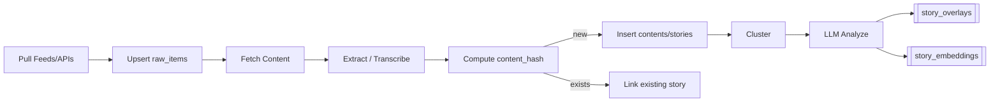

## Ingestion Sequence

Walks through a single ingest run from cron to queued content fetch.

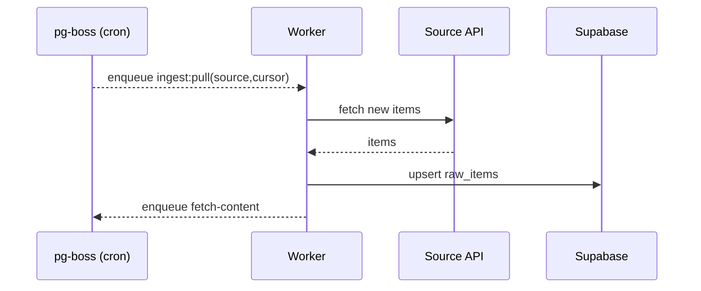

## Scheduling (pg‑boss)

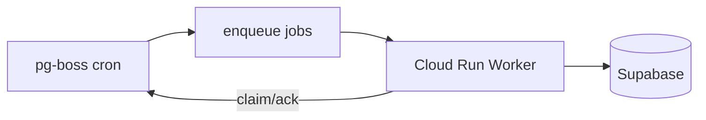

## Content Fetch & Normalization

Branches for articles vs audio and converges on normalized text/content_hash.

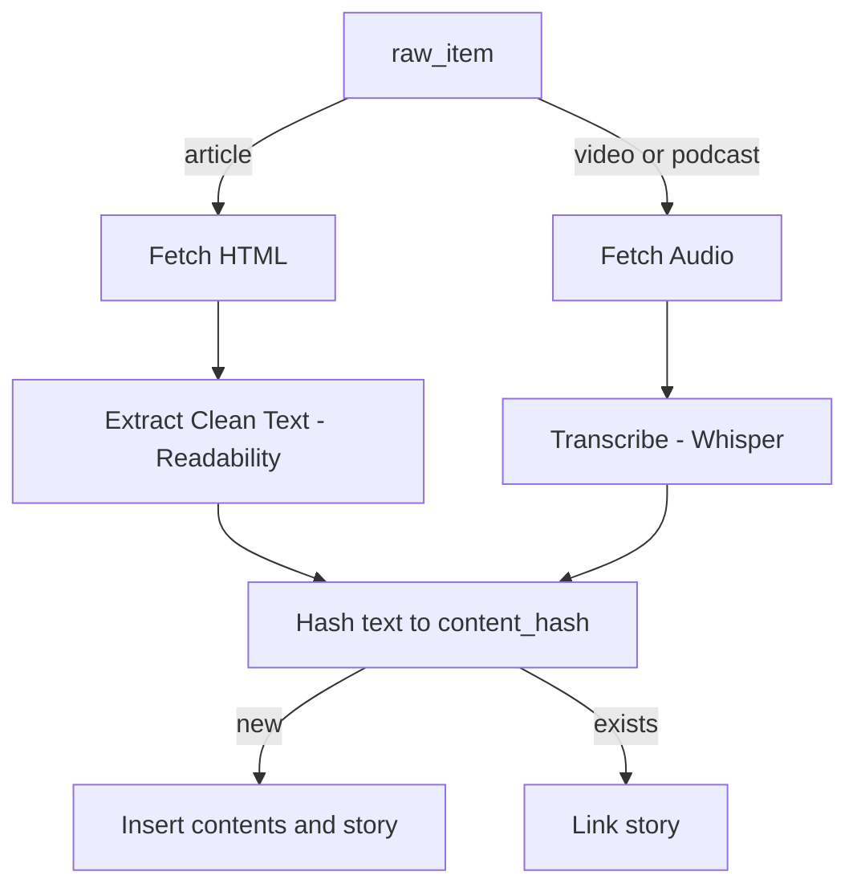

## Analysis & Overlays

Shows context building, LLM outputs (summaries/scores/citations), and persistence.

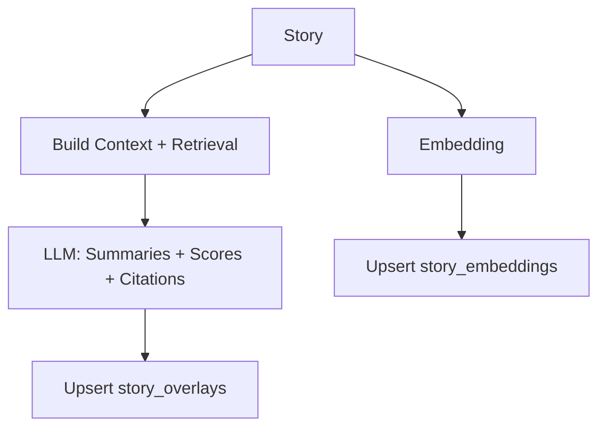

## ERD (Core Tables)

Depicts the core tables and their relationships.

> What is an ERD and why it matters
>
> - ERD = Entity-Relationship Diagram: visual map of entities (tables), their attributes, and how they relate.
> - Importance: clarifies ownership and normalization, reveals join paths and constraints, and informs indexing and RLS before implementation.
> - In this project: captures how `sources`, `raw_items`, `contents`, `stories`, `story_overlays`, `story_embeddings`, and `clusters` connect; guides keys like `content_hash` and `cluster_key`, and safe query patterns for APIs.

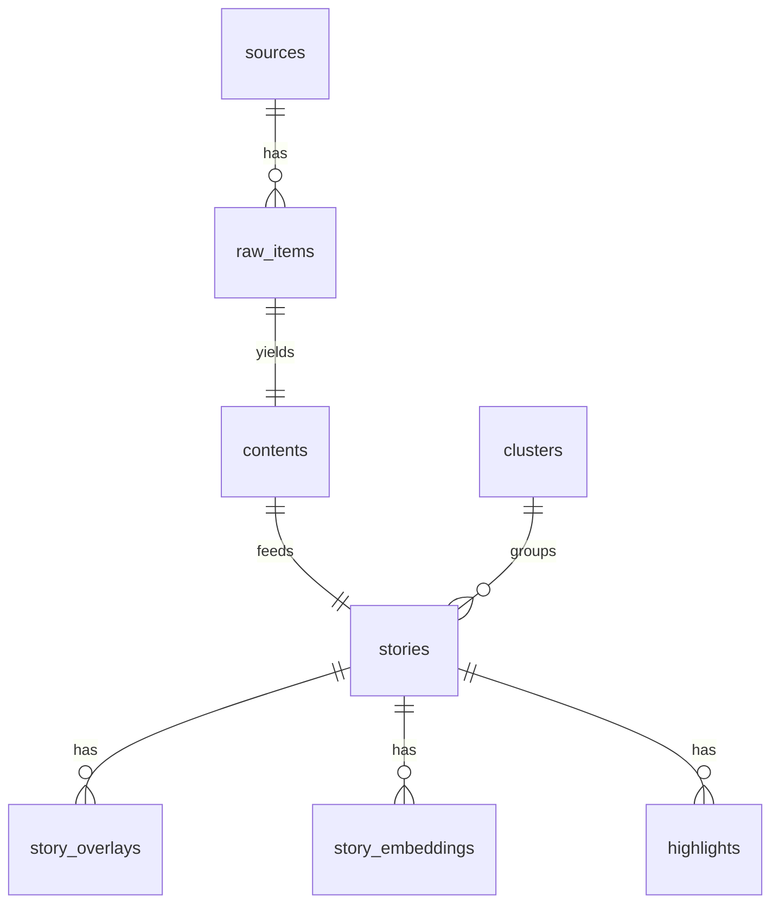

## Clustering Decision Flow

Decision gates to join an existing cluster or create a new one.

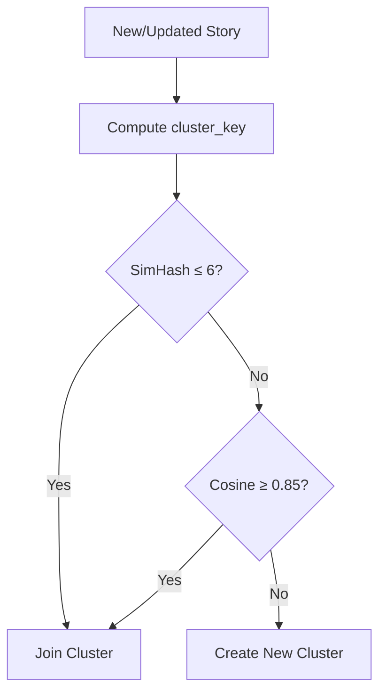

> What is a cluster and why it matters
>
> - Cluster: a group of near-duplicate or closely related stories about the same topic or event, merged via a `cluster_key` and similarity checks (SimHash/Hamming and vector cosine).
> - For development: reduces duplication, gives stable grouping keys for caching/URLs, powers retrieval for LLM context/citations, and simplifies dedupe/debugging and backfills.
> - For users: avoids repetitive listings, shows a representative item with alternatives, aggregates corroboration to boost confidence, and enables trend/hype signals across sources.

## Transcription Pipeline

Steps to produce transcripts for media and store them alongside content.

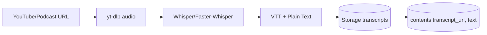

## Reader & Annotation Flow

End-to-end flow for reading and highlighting across mediums (articles, PDFs, transcripts).

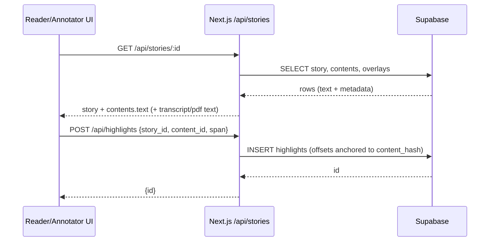

## Job State Machine

Lifecycle of a job with claim, retry, completion, and dead-letter.

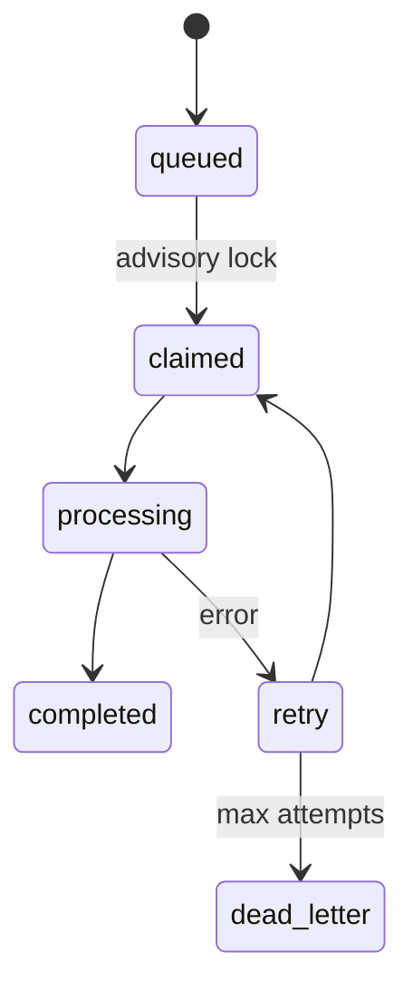

## API Read Path

How the UI requests story lists and receives clusters with overlays.

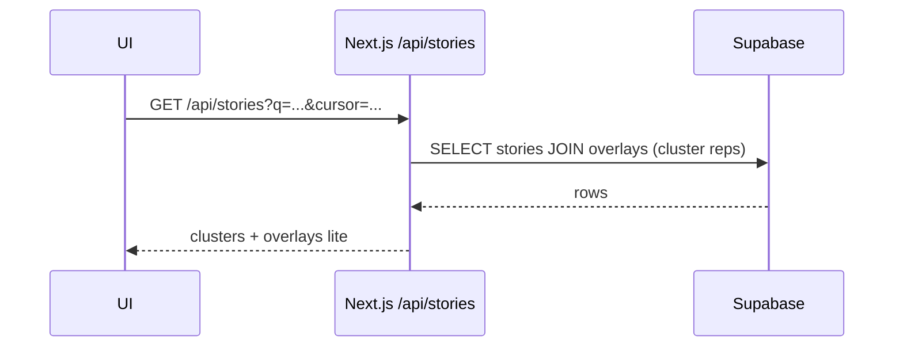

## Data Lineage

Traceability from raw items through contents to stories and derived artifacts.

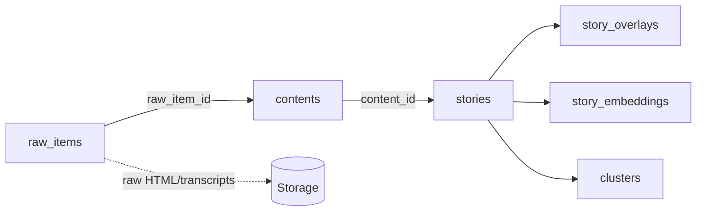
