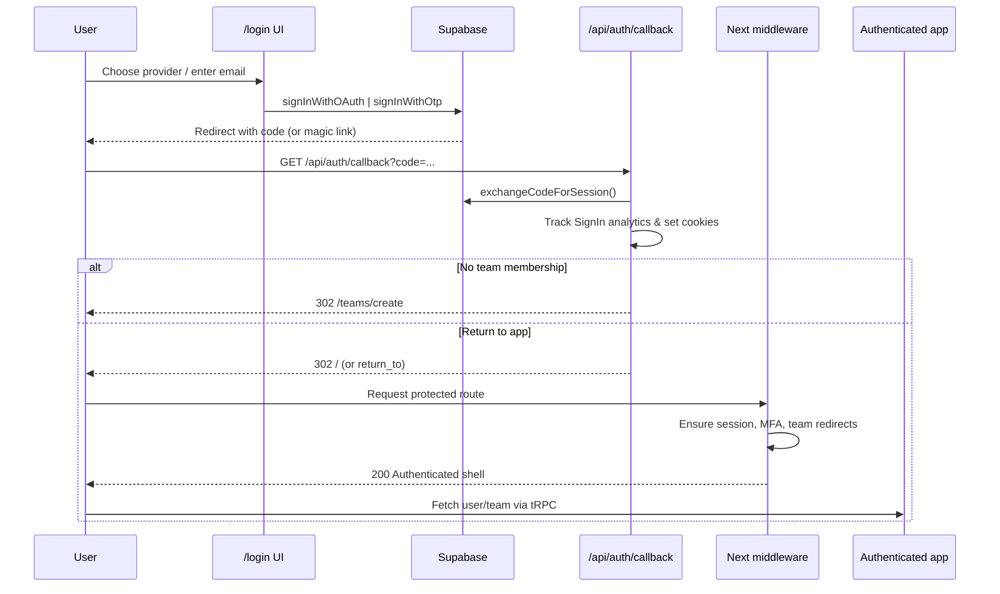

# zeke Login & Subscription Flow Spec

> Source repository context: dashboard app + API surfaces. All file references use workspace-relative paths.

## Overview
- zeke relies on Supabase Auth for identity, exposing Google, Apple, GitHub, and email OTP options via the public login route (`apps/dashboard/src/app/[locale]/(public)/login/page.tsx:27-193`).
- There is no dedicated “sign-up” endpoint; the first successful login seeds an application profile and funnels the user into team creation (`apps/dashboard/src/app/[locale]/(app)/teams/create/page.tsx:12-48`).
- Subscription state is stored on the `teams` table (`packages/db/src/schema.ts:1308-1332`) and updated by Polar webhooks (`apps/dashboard/src/app/api/webhook/polar/route.ts:9-53`). Trial status and cancellation flags influence feature access and UI prompts across the dashboard.

## Public Entry Points
- **Login screen** – renders primary and secondary auth options, remembers the preferred provider, and toggles a consent banner for EU users (`apps/dashboard/src/app/[locale]/(public)/login/page.tsx:27-193`).
- **OAuth buttons** – each button calls `supabase.auth.signInWithOAuth` with provider-specific redirect metadata (`apps/dashboard/src/components/google-sign-in.tsx:20-58`, `apps/dashboard/src/components/apple-sign-in.tsx:17-41`, `apps/dashboard/src/components/github-sign-in.tsx:17-41`).
- **OTP email flow** – posts `signInWithOtp`, then verifies the code through a safe server action that establishes a session and redirects (`apps/dashboard/src/components/otp-sign-in.tsx:47-133`, `apps/dashboard/src/actions/verify-otp-action.ts:16-40`).
- **Desktop hand-off** – desktop clients pass `client=desktop`, which bounces through `/verify` to deep-link back into the native app (`apps/dashboard/src/app/[locale]/(public)/verify/page.tsx:7-10`, `apps/dashboard/src/components/desktop-sign-in-verify-code.tsx:18-42`).

## Core Authentication Flow
### Sequence


### Callback Decision Tree
```mermaid
flowchart TD
    start([GET /api/auth/callback]) --> desktop{client=desktop?}
    desktop -- yes --> verify[/302 → /verify?code=/]
    desktop -- no --> provider{provider query param?}
    provider -- yes --> setCookie[/Set preferred-signin-provider/]
    provider -- no --> skipProvider[
      Preserve existing preference
    ]
    setCookie --> exchange
    skipProvider --> exchange
    exchange[exchangeCodeForSession]
    exchange --> session{Session established?}
    session -- no --> origin[/302 → origin/]
    session -- yes --> track[Track LogEvents.SignIn]
    track --> invite{return_to starts with teams/invite?}
    invite -- yes --> teams[/302 → /teams]
    invite -- no --> teamCount[Count users_on_team]
    teamCount -- zero --> create[/302 → /teams/create]
    teamCount -- >0 --> mfaCookie{mfa-setup-visited cookie?}
    mfaCookie -- no --> setMfa[/Set cookie + 302 → /mfa/setup]
    mfaCookie -- yes --> returnTo{return_to provided?}
    returnTo -- yes --> dest[/302 → /{return_to}]
    returnTo -- no --> home[/302 → origin/]
```

## Scenario Matrix
| Scenario | Conditions | Redirect / UI Outcome | Notes |
| --- | --- | --- | --- |
| **First login (no team)** | Session exists, `users_on_team` count = 0 | `/teams/create` then redirect to `/` after form submission (`apps/dashboard/src/actions/revalidate-action.ts:7-16`) | `teams.plan` defaults to `trial` (`packages/db/src/schema.ts:1308-1325`) |
| **Returning member** | Session + team membership | Middleware lets request through; layout fetches `trpc.user.me` and loads dashboard (`apps/dashboard/src/app/[locale]/(app)/(sidebar)/layout.tsx:24-70`) | Optional `return_to` param preserves deep links |
| **Pending invite** | `return_to` starts with `teams/invite/` | Callback forces `/teams` so user can accept/decline invites (`apps/dashboard/src/app/[locale]/(app)/teams/page.tsx:18-71`) | `/teams` re-routes to `/teams/create` if no invites remain |
| **Trial (no paid subscription)** | Team plan `trial`, created < 14 days | Full feature access; header shows trial badge (`apps/dashboard/src/components/trial.tsx:9-58`) | Bank sync allowed while `isTeamEligibleForSync` returns true (`apps/dashboard/src/utils/check-team-eligibility.ts:15-27`) |
| **Trial expired / subscription revoked** | Team plan `trial` AND created ≥ 14 days OR Polar `subscription.revoked` event | Bank sync webhooks bail early (`apps/dashboard/src/app/api/webhook/plaid/route.ts:73-112`), users get blocking modal (`apps/dashboard/src/components/modals/trial-ended-modal.tsx:15-77`) | UI directs user to upgrade plan |
| **Canceled subscription (scheduled to end)** | Polar `subscription.canceled` sets `canceled_at` but plan stays `starter`/`pro` | Dashboard still accessible; billing page shows manage portal & order history (`apps/dashboard/src/app/[locale]/(app)/(sidebar)/settings/billing/page.tsx:17-45`) | When Polar later sends `subscription.revoked`, plan reverts to `trial` |

## Detailed Flows

### 1. First Login / Implicit Sign-Up
1. User authenticates via OAuth or OTP; callback exchanges the code and finds zero `users_on_team` rows (`apps/dashboard/src/app/api/auth/callback/route.ts:52-67`).
2. Callback redirects to `/teams/create`, prompting for company metadata (`apps/dashboard/src/app/[locale]/(app)/teams/create/page.tsx:12-48`).
3. Submitting the form invokes `trpc.team.create`, which inserts the team, binds the current user as owner, creates default categories, and switches their active team (`packages/db/src/queries/teams.ts:73-160`).
4. The success handler invalidates cached queries, revalidates server paths, and redirects home (`apps/dashboard/src/components/forms/create-team-form.tsx:57-129`, `apps/dashboard/src/actions/revalidate-action.ts:7-16`).

### 2. Returning Authenticated Member
1. Callback detects membership and skips the team creation redirect.
2. Middleware enforces additional guards: login redirect for anonymous requests, invite-path passthrough, and MFA escalation (`apps/dashboard/src/middleware.ts:20-88`).
3. The authenticated layout prefetches critical queries and ensures the user has a profile, active team, and completed setup (`apps/dashboard/src/app/[locale]/(app)/(sidebar)/layout.tsx:24-70`).

### 3. Invite Acceptance Flow
1. Invitation emails link to `/teams/invite/[code]`; when the user clicks a login button, `return_to` carries the invite path.
2. After Supabase exchange, the callback short-circuits to `/teams` so the user can accept/decline within the invite table (`apps/dashboard/src/app/[locale]/(app)/teams/page.tsx:18-94`).
3. Accepting an invite adds the membership and updates the user’s active team via `trpc.team.acceptInvite` (`apps/api/src/trpc/routers/team.ts:73-93`).

### 4. Trial Users (No Paid Subscription Yet)
1. Every new team starts on the trial plan with `created_at` timestamped (`packages/db/src/schema.ts:1308-1332`).
2. The header renders a trial badge and upgrade CTA showing remaining days (`apps/dashboard/src/components/trial.tsx:9-58`).
3. Sync webhooks permit bank updates only while the team is within 14 days (`apps/dashboard/src/utils/check-team-eligibility.ts:15-27`), so trial users maintain full functionality during the grace period.

### 5. Expired Trial or Revoked Subscription
1. When the 14-day window elapses or Polar emits `subscription.revoked`, the team remains on `trial` and `canceled_at` is stamped (`apps/dashboard/src/app/api/webhook/polar/route.ts:33-47`).
2. Subsequent webhook calls bail (`apps/dashboard/src/app/api/webhook/plaid/route.ts:73-112`) to keep the workspace effectively read-only.
3. A modal forces plan selection (`apps/dashboard/src/components/modals/trial-ended-modal.tsx:15-77`), and the upgrade modal is accessible from multiple entry points (`apps/dashboard/src/components/modals/choose-plan-modal.tsx:9-79`).

### 6. Active but Canceled Subscription
1. When Polar sends `subscription.canceled`, only `canceled_at` is set; `plan` stays `starter` or `pro` (`apps/dashboard/src/app/api/webhook/polar/route.ts:19-32`).
2. Users retain access to the full app but can review billing orders and reopen checkout from the billing page (`apps/dashboard/src/app/[locale]/(app)/(sidebar)/settings/billing/page.tsx:17-45`, `apps/dashboard/src/components/manage-subscription.tsx:9-39`).
3. If the subscription later lapses entirely, Polar emits `subscription.revoked`, falling back to the expired trial flow above.

## Implementation Notes
- **Cookies & Preferences** – `preferred-signin-provider` persists the last-used auth method; `mfa-setup-visited` prevents looping back into MFA setup (`apps/dashboard/src/app/api/auth/callback/route.ts:18-75`). EU users without `tracking-consent` must grant analytics consent via the banner on the login screen.
- **MFA** – Middleware leverages Supabase’s AAL checks to reroute users to `/mfa/verify` when an elevated assurance level is required (`apps/dashboard/src/middleware.ts:52-83`).
- **Desktop Clients** – Desktop flows piggyback on the same callback route using `client=desktop` and rely on `/verify` to emit a deep link once Supabase exchanges the code (`apps/dashboard/src/components/desktop-sign-in-verify-code.tsx:18-42`).
- **Analytics** – Successful login attempts emit `LogEvents.SignIn` for downstream tracking (`apps/dashboard/src/app/api/auth/callback/route.ts:40-49`).
- **Team Switching** – The `/teams` selector lists existing teams and pending invites, redirecting to creation when none are available (`apps/dashboard/src/app/[locale]/(app)/teams/page.tsx:18-94`).

## Plan State Reference
| Plan | Description | Primary Acquisition Path | Feature Level |
| --- | --- | --- | --- |
| `trial` | Default for new teams; 14-day full access window | Created via `/teams/create` | Full access until eligibility check fails; afterwards read-only prompts |
| `starter` | Paid entry plan | Polar `subscription.active` for starter SKU | Limited invoice/bank quotas enforced client-side |
| `pro` | Paid premium plan | Polar `subscription.active` for pro SKU | Highest limits; `ManageSubscription` provides customer portal |
| `canceled_at` (timestamp) | Indicates cancellation scheduled/effective | Set on `subscription.canceled` / `subscription.revoked` | Used to surface billing history and eventual downgrade behaviors |

