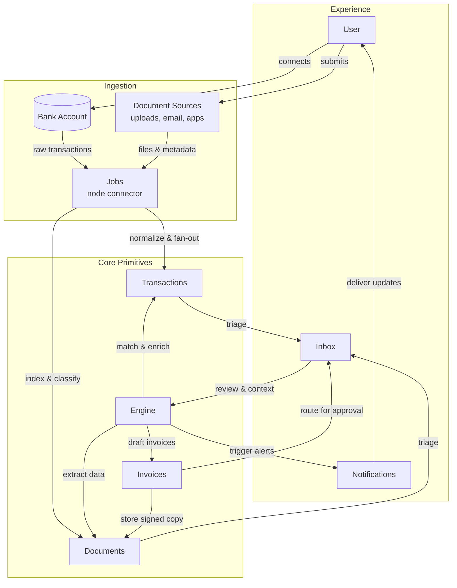

# Zeke Feature Mapping Blueprint (Midday → Zeke)

## 0. Executive Snapshot
- **Promise:** Turn the “10 hours → 5 minutes” outcome from `docs/exec-overview.md` into a build plan. Every intake, triage, and output step maps to Midday plumbing so founders and engineers see why their work matters.
- **Pillars:** Discover signal (ingest + classify), Apply it (goal-aware insights and playbooks), Create outputs (briefs, cited content). Each pillar lists the supporting Zeke primitives, Midday references, UX hooks, and open engineering gaps.
- **Business lens:** Blend Bloomberg-level trust (verifiable data, golden datasets, expert thresholds) with Canva-style accessibility (guided modals, template-driven flows, progressive disclosure).
- **Outcomes:** Users connect premium feeds once, see high-signal stories in minutes, confirm highlights, launch playbooks tied to goals, and publish cited briefs—with the assistant and jobs fabric keeping everything current.

## 1. Journey Overview — Discover → Triage → Apply → Publish
| Stage | User Goal | Key Surfaces | Metrics to Prove “Minutes not Hours” |
| --- | --- | --- | --- |
| **Discover** | “Capture every relevant source with zero setup friction.” | Source Connections hub, Import Modal, Magic Inbox, Engine connectors, Library overview. | Time-to-first-sync, source health, coverage of tracked entities/categories. |
| **Triage** | “Figure out what actually matters and make sure it’s trustworthy.” | Story Feed, Insight Ledger, Inbox triage, Attention Budget widget, Notification Center. | Highlights confirmed vs backlog, hours saved counter, false-positive rate, trust signals surfaced. |
| **Apply** | “Convert insights into action plans that line up with my goals.” | Playbooks hub, assistant goal prompts, taxonomy filters, tracker planning lane. | Playbooks launched, goal coverage, playbook completion rate, benchmark deltas tracked. |
| **Publish & Loop** | “Show stakeholders receipts and keep the system sharp.” | Brief Publisher, exports, golden dataset checks, BYO Claude routing, realtime updates. | Briefs shipped, citation accuracy, jobs regression tests, percentage of runs on user-supplied models. |

## 2. System Blueprint (Keep Midday Architecture Front-and-Center)

### 2.1 Midday → Zeke Legend
| Midday Primitive | Zeke Primitive | Notes |
| --- | --- | --- |
| Bank connections (`bank-account*`, Teller/Plaid) | Source Connections (premium feeds, OAuth, BYO Claude seat) | Same modal flow, new connectors + BYO Claude option. |
| Transactions + matching | Story Feed, Insight Ledger | Replace financial line items with stories/highlights, keep ledger UX. |
| Magic Inbox, Vault | Source Inbox, Library | All sources (uploads, forwards, RSS, API) land here. |
| Invoices & reports | Brief Publisher & Playbooks | Reports pages become goal-aware briefs/playbooks. |
| Engine providers | Engine connectors (YouTube, Loom, Notion, etc.) | Use Midday engine patterns, swap adapters. |
| Jobs service | Highlight, Playbook, Brief jobs | Trigger.dev/Bun workers orchestrating LLM work. |
| Notification center | Signal center (model drops, sentiment shifts) | Same component, new event schema. |

## 3. Stage Mappings (Standard Template)
Each subsection covers: **User job → Zeke experience → Midday references → Implementation notes → Open gaps → UX metrics.** File paths point to Midday components already in the repo to guide engineers.

### 3.1 Discover — Source Intake & Coverage
#### 3.1.1 Source Import Modal (`apps/dashboard/src/components/import/*`)
- **User job:** Quickly add a new source (file, feed, premium integration) without deciphering system internals.
- **Zeke experience:** “Add Source” modal mirrors Midday’s CSV import but offers Upload, Forward-to-Inbox, Connect Account, Enter Feed URL. Progressive steps with previews, mapping, and goal tagging.
- **Midday references:** `components/import/import-csv-modal.tsx`, URL-state hooks, safe actions (`importTransactionsAction`).
- **Implementation notes:**
  - Reuse multi-stage modal with `?step=import&stage=*` query params and `useQueryStates` utility.
  - Store uploads in Supabase via `packages/db/src/queries/sources.ts`, queue `tasks.trigger("sources.process", ...)`.
  - Default connectors: Upload PDF/Doc, Newsletter forwarder, RSS/Podcast, YouTube Channel, Loom, Notion export, Apple News+, Twitter (if authorized).
  - Attach goal selection step so ingestion knows why the user cares; store in `source_goal_links`.
- **Open gaps:** Need `importSourceAction` server action, connector catalog config, OAuth plumbing for premium feeds, pipeline status table (`source_ingestion_runs`).
- **UX metrics:** Time-to-first-ingestion, number of sources per goal, successful import rate, drop-off by stage.

#### 3.1.2 Magic Inbox → Source Inbox (`apps/dashboard/src/components/inbox/*`)
- **User job:** Forward emails or drop files and trust the system to classify and route them.
- **Zeke experience:** Team-specific inbox address + upload dropzone; items appear in Source Inbox with connector badges and pipeline status (ingest → enrich → analyze).
- **Midday references:** Magic Inbox upload pipeline, OCR matching flows, `components/inbox/inbox-upload.tsx`.
- **Implementation notes:**
  - Generate team mailbox via Supabase function or external provider; store inbound metadata in `source_inbox_entries`.
  - Trigger `jobs/sources.extract` (transcription/OCR), then `jobs/sources.classify` to assign categories/entity tags.
  - Provide inline retry controls using Trigger.dev run statuses.
- **Open gaps:** Need schema for Inbox entries, automation to assign connectors, admin UI for editing pipeline recipes.
- **UX metrics:** Auto-processed vs manual sources, failed extraction count, time between arrival and classification.

#### 3.1.3 Engine Connectors (`apps/engine`)
- **User job:** Trust that every connected provider normalizes into a consistent format with receipts.
- **Zeke experience:** Engine hides provider quirks, handles auth refresh, writes `raw_items`/`contents`, and records connector health.
- **Midday references:** `engine-patterns.mdc`, provider adapters (`*-provider.ts`, `*-transform.ts`).
- **Implementation notes:**
  - Follow stateless Hono + zod-openapi pattern; connectors for YouTube, Loom, Zoom, Slack, Notion, RSS.
  - Emit `SourceEnvelope` (ids, auth scopes, sync timestamps) and queue processing jobs.
  - Cache health state in KV/R2 similar to Midday provider status endpoints.
- **Open gaps:** Need `packages/engine-clients` for typed calls, schema updates for `source_connections`, `raw_items`, `ingestion_tasks` to store connector-specific payloads.
- **UX metrics:** Sync success rate, last refresh timestamp per connection, coverage gap alerts.

#### 3.1.4 Library (Vault) Overview (`apps/dashboard/src/components/vault/*`)
- **User job:** Review all processed sources, see why they matter, and jump to linked assets.
- **Zeke experience:** Library table shows Source title, connector, authority score, “Why it matters,” linked stories/highlights/playbooks.
- **Midday references:** Vault listing components, filter utilities (`generate-vault-filters.ts`).
- **Implementation notes:**
  - Combine `sources`, `raw_items`, `contents`, `story_overlays` queries.
  - Include pipeline progress badges (ingest/enrich/analyze) tied to Trigger.dev runs.
  - Provide filters for categories, entities, goal relevance, authority score.
- **Open gaps:** Need `story_overlays` schema finalized, embed search integration, customizing columns per team.
- **UX metrics:** Sources reviewed per week, percent with highlights, filter usage, time-to-insight from Library entry.

### 3.2 Triage — Story Feed, Insights, Attention
#### 3.2.1 Story Feed & Insight Ledger (`apps/dashboard/src/components/widgets/transactions/*`, `transactions` modals)
- **User job:** See the newest high-signal stories, confirm highlights, and understand impact quickly.
- **Zeke experience:** Story Feed table replaces transactions ledger; rows show status (new, reviewed), categories, heat/novelty spark lines, linked highlights and playbooks.
- **Midday references:** Transactions tables, sheets, matching modals, chat tools.
- **Implementation notes:**
  - Use `stories`, `story_chapters`, `team_story_states`, `highlights`, `story_overlays` joined queries.
  - Inline actions: open highlight sheet (`components/widgets/transactions/*` pattern), launch assistant tool, mark as read/bookmarked.
  - Display “Hours saved” metric by comparing runtime vs user attention (Attention Budget widget).
- **Open gaps:** Need `story_overlays` scoring, highlight triage UI parity, state machine for story review.
- **UX metrics:** Stories reviewed per goal, highlight confirmation rate, hours saved delta.

#### 3.2.2 Insight Inbox (`components/inbox/*`)
- **User job:** Approve or reject goal-aligned highlights with minimal friction.
- **Zeke experience:** Inbox surfaces new highlights, conflicting claims, missing benchmarks. Accept/merge flows update states and launch follow-up playbooks.
- **Midday references:** Transaction matching flows (`transaction-match-item.tsx`, `transaction-unmatch-item.tsx`).
- **Implementation notes:**
  - Attach `highlights`, `team_highlight_states`, `playbook_step_highlights` to drive actions.
  - Provide conflict resolution UI (choose correct citation, flag uncertainty) and send outcome to assistant retraining queue.
  - Integrate assistant quick actions (“Validate with LMSys benchmarks”).
- **Open gaps:** Need highlight state schema, conflict resolution workflow, retraining queue design.
- **UX metrics:** Decision latency per highlight, conflicts resolved, retrain queue backlog.

#### 3.2.3 Attention Budget (`components/widgets/spending/*`)
- **User job:** Know whether Zeke actually saved time versus manual research.
- **Zeke experience:** Widget converts story runtime/page counts into “hours saved vs hours spent,” grouped by goal/category.
- **Midday references:** Spending widget (expense categories, budgets).
- **Implementation notes:**
  - Inputs: `stories.runtime_minutes`, `team_story_states.state`, `playbook_runs.impact_minutes`.
  - Show weekly attention budget, highlight gaps (goals with no recent coverage).
  - Offer quick link to playbooks or assistant to fill gaps.
- **Open gaps:** Need runtime metadata fields, baseline watch/read speed constants, analytics pipeline.
- **UX metrics:** Hours saved, coverage by goal, trending attention allocation.

#### 3.2.4 Notification Center (`apps/dashboard/src/components/notification-center/*`)
- **User job:** Get timely alerts only when high-value events occur.
- **Zeke experience:** Notifications for model releases, benchmark shifts, sentiment spikes, new playbooks. Each notification offers assistant shortcuts (e.g., “Summarize sentiment on Claude vs GPT-5”).
- **Midday references:** Notification center components, activities schema.
- **Implementation notes:**
  - Store events in `activities` with category/entity metadata, sentiment, benchmark provider references.
  - Provide follow/unfollow controls per category/goal/entity to manage noise budgets.
  - Integrate assistant tool invocations from notification list.
- **Open gaps:** Need event taxonomy (see §4.1), rate limiting strategy, ROI tracking per notification.
- **UX metrics:** Notification click-through, follow settings per user, noise complaints, actions launched from notifications.

### 3.3 Apply — Playbooks, Assistant, Tracker
#### 3.3.1 Playbooks Hub (`components/reports/*`, `components/invoice/*`)
- **User job:** Turn confirmed insights into ready-to-run action plans aligned with goals and SOPs.
- **Zeke experience:** Playbooks page inherits Midday reports layout—cards, charts, comparison tables—but lists recommended plays per goal with confidence/impact, supporting highlights, automation hooks.
- **Midday references:** Reports module, invoice workflow (multi-step editor, share flow).
- **Implementation notes:**
  - Build aggregator ingesting `story_insights`, `highlight_scores`, `brief_sections` into `playbooks`, `playbook_steps`, `playbook_runs`.
  - Provide filters by goal, entity, category, owner; inline start buttons to trigger jobs or tasks.
  - Sync with Briefs via `playbooks.brief_id` and show last-updated timestamp.
- **Open gaps:** Need `playbooks` schema, compile job, metrics instrumentation.
- **UX metrics:** Playbooks launched, completion rate, impact score improvements, time-to-first-playbook.

#### 3.3.2 Assistant & Goal Copilot (`apps/dashboard/src/components/chat`, `components/assistant`, `lib/tools`, `store/assistant`)
- **User job:** Ask “What should I do?” and get grounded, goal-aware answers with citations.
- **Zeke experience:** Assistant runs highlight extraction, embeddings search, tool calls (stories, playbooks, benchmarks). Conversation threads capture goal context, surface missing info, route heavy jobs to BYO Claude seat when available.
- **Midday references:** Chat components, `useChat`, assistant tool wiring.
- **Implementation notes:**
  - New `assistantRouter.ask` tRPC endpoint that orchestrates tool calls (`trpc.stories.search`, `trpc.playbooks.start`).
  - Event-sourced threads in `assistant_threads`, `assistant_messages`; stream via Supabase realtime.
  - Integrate goal selection tool, autopilot flow to queue `jobs/playbooks.compile`.
  - Support BYO Claude toggle (anthropic key) from Source Connections; route eligible runs accordingly.
- **Open gaps:** Need highlight extraction job, goal capture prompts, retraining queue, BYO routing service.
- **UX metrics:** Assistant sessions leading to confirmed insights, goal completion prompts triggered, BYO Claude usage, NPS-style feedback flags.

#### 3.3.3 Tracker & Momentum Dial (`components/widgets/tracker/*`, `components/tracker-timer.tsx`)
- **User job:** Plan around upcoming AI events and monitor what actions followed major drops.
- **Zeke experience:** Timeline view charts past stories/highlights/playbooks and forward-looking events (rumored releases) with reminders. Offers color-coded categories, entity filters, and playbook suggestions.
- **Midday references:** Tracker widgets and sheets, time tracking utilities.
- **Implementation notes:**
  - Data from `stories.published_at`, `playbook_runs.started_at`, `team_goals.deadline`, `tracked_events` (new table for rumored launches).
  - Provide integration with calendars (ICS export) and assistant prompts to prep.
  - Show dependencies (e.g., “Need benchmark update before launch”).
- **Open gaps:** Need `tracked_events` schema, calendar sync, event ingestion pipeline.
- **UX metrics:** Events tracked vs executed, playbooks launched pre-event, missed critical alerts.

### 3.4 Publish & Loop — Briefs, Exports, Trust
#### 3.4.1 Brief Publisher (`components/invoice/*`, `components/share-report.tsx`)
- **User job:** Deliver executive-ready briefs with citations and next steps.
- **Zeke experience:** Invoice workflow repurposed as Brief creation: sections for storyline, why it matters, recommended plays, metrics. Export to PDF/email, track recipients, tie back to playbooks.
- **Midday references:** Invoice builder, share components, profit helpers.
- **Implementation notes:**
  - Introduce `briefs`, `brief_sections`, `brief_audience` tables.
  - Keep inline editing, preview, share options; add “Publish to dashboard” and “Email to stakeholders”.
  - Auto-update when new insights confirmed; prompt review when stale.
- **Open gaps:** Schema for briefs, diff tracking, audit trail for citations.
- **UX metrics:** Briefs published per week, citation accuracy, audience feedback, follow-up playbooks launched.

#### 3.4.2 Golden Dataset & Regression Guard (`packages/db/src/test/golden-dataset.ts`)
- **User job:** Trust that Zeke’s highlights/playbooks stay reliable as models evolve.
- **Zeke experience:** Golden dataset contains curated story/highlight/playbook tuples (model releases, policy shifts, funding rounds). CI checks run pipeline and alert on regressions.
- **Midday references:** Transaction golden tests.
- **Implementation notes:**
  - Populate dataset with scenarios (model launch, benchmark swing, misinformation correction) referencing `@zeke/categories` slugs, `stories`, `highlights`.
  - Run tests in CI; integrate with attention budget metrics, taxonomy updates.
  - Tag entries with novelty/confidence thresholds and expected playbook recommendations.
- **Open gaps:** Need pipeline to record expected metrics, harness for jobs-run replay, integration with telemetry.
- **UX metrics:** Regression failures caught pre-release, dataset coverage per category, time to update after major AI event.

#### 3.4.3 BYO Claude & Model Routing (`Source Connections` expansion)
- **User job:** Use personal Anthropic subscription to run heavy jobs without waiting for Zeke’s quota.
- **Zeke experience:** Source Connections includes “Bring your own Claude” toggle; assistant/playbook jobs detect seat availability and route requests.
- **Midday references:** Bank connection flows, connection health UI.
- **Implementation notes:**
  - Store user-provided API key encrypted in `source_connections` with type `anthropic_byo`.
  - Update job dispatcher to check BYO key, fall back to pooled OpenAI otherwise.
  - Display usage stats and warnings when hitting limits.
- **Open gaps:** Secure key storage, billing implications, job routing logic.
- **UX metrics:** Percentage of runs using BYO seat, failure rate due to limits, perceived latency improvements.

## 4. Signal Quality & Trust Layer
### 4.1 Taxonomy & Personalization (`packages/categories`)
- Replace finance slugs with AI intelligence taxonomy (`model-release`, `inference-infra`, `policy`, `safety`, `benchmarks`, `tooling`, `case-study`). Align parent categories to product pillars (Discover, Apply, Create).
- Update `categories.ts`, `color-system.ts`, `embeddings.ts` to keep color cues and vector search coherent across UI (Story Feed, Tracker, Notifications).
- Seed `story_categories`, `story_tags`, `team_goals` with taxonomy for personalization and filtering. Notification filters follow category combos; assistant prompts leverage the same tags.

### 4.2 Benchmark & Sentiment Feeds
- Extend taxonomy facets with `sentiment`, `benchmark_provider`, `confidence` to drive Notification Center insights and assistant benchmark pulls (LMSys, LMArena, AlpacaEval).
- Store benchmark snapshots alongside stories to overlay performance trends in widgets and playbooks.

### 4.3 Attention Budget & Coverage Health
- Compute “hours saved” vs “hours spent” using runtime metadata, team engagement states, and playbook outcomes. Present weekly scorecards and highlight blind spots (categories with no recent coverage).
- Integrate with Notification Center to alert when coverage falls below threshold.

### 4.4 Trust Signals & Receipts
- Every highlight/playbook references `highlight_references` with source snippet, timestamp, confidence flag.
- Uncertain claims flagged (per `docs/exec-overview.md` objections); assistant explains uncertainty.
- Brief exports include citation appendix; share flows show proof by default.

## 5. Dashboard Plumbing Matrix (Grouped by Journey Phase)
| Journey Phase | Midday Surfaces | Zeke Surface/Primitive | Primary Owner | User Win |
| --- | --- | --- | --- | --- |
| Discover | Bank accounts & connections (`bank-account*.tsx`, `select-bank-accounts.tsx`) | Source Connections + BYO Claude | Engineering | One-click integrations to premium feeds without custom scripts. |
| Discover | Import modal, Magic Inbox | Source Import Modal, Source Inbox | Design + Engineering | Guided ingestion that handles uploads, forwards, feeds. |
| Discover | Vault | Library | Engineering | Single catalog showing pipeline status and “why it matters.” |
| Triage | Transactions tables/widgets | Story Feed & Insight Ledger | Design + AI | Scan new stories, confirm highlights, see impact. |
| Triage | Inbox matching views | Insight Triage | AI + Ops | Approve/reject highlights quickly with receipts. |
| Triage | Spending widget | Attention Budget | Product Analytics | Shows proof of hours saved vs consumed. |
| Triage | Notification center | Signal Center | Engineering | Only get pinged for high-value events. |
| Apply | Reports, invoices | Playbooks Hub, Brief Publisher | AI + Design | Goal-aligned plans ready to run/share. |
| Apply | Assistant widgets | Goal Copilot | AI | Ask questions, launch tools, keep context. |
| Apply | Tracker widgets | Momentum Dial | Product | Plan around upcoming AI launches and track response. |
| Publish | Invoice exports | Brief exports & sharing | Product Marketing | Cited briefs sent to stakeholders with next steps. |
| Publish | Golden tests | Regression guard | QA + AI | Prevents model drift from breaking trust. |

## 6. Dependencies & Open Items Tracker
| Item | Description | Status | Owner |
| --- | --- | --- | --- |
| `importSourceAction` | Server action for source intake | Spec needed | Eng |
| Connector catalog | Config + OAuth for premium feeds | In discovery | Eng |
| `packages/engine-clients` | Typed SDK for Engine calls | Not started | Eng |
| Highlight extraction job | LLM workflow for chunking & scoring | Prototype needed | AI |
| Goal capture prompts | Assistant onboarding to gather goals | Needs design | AI/Design |
| `story_overlays` schema | Stores why-it-matters, heat, novelty | Drafted | Eng |
| `playbooks` tables + compiler | Aggregation pipeline for plays | Spec in progress | AI |
| `briefs` tables | Persist briefs/sections/audience | Not started | Eng |
| Taxonomy refresh | Replace finance slugs in `@zeke/categories` | Pending | AI |
| Golden dataset | Story intelligence regression suite | Outline ready | QA |
| BYO Claude routing | Secure key storage + dispatcher | Security review | Eng |
| Tracker events | New table + ingestion for future launches | Spec needed | Product |

## 7. Build-Readiness Checklist
- [ ] Source intake (Import modal, Source Inbox, Engine connectors) mapped with schemas and jobs.
- [ ] Library and Story Feed queries defined, including highlight overlays and hours-saved calculations.
- [ ] Insight triage UX mirroring Midday matching flow with conflict resolution.
- [ ] Playbooks schema, compile job, and dashboard surfaces designed.
- [ ] Assistant tool layer (goal capture, tool calls, retraining queue) outlined with BYO Claude routing.
- [ ] Tracker and Notification Center tied to taxonomy and benchmark feeds.
- [ ] Brief Publisher flow specced with exports, citations, and sync to playbooks.
- [ ] Golden dataset regression plan covering model releases, policy shifts, misinformation cases.
- [ ] Taxonomy update + category color consistency across Story Feed, Tracker, Notifications, widgets.
- [ ] Dependency tracker reviewed and owners assigned before sprint kick-off.

## 8. Appendix — Supporting References
- `docs/exec-overview.md`: North star messaging, objections, before/after stories.
- `docs/Strategic Brief_ Combining Bloomberg’s Credibility with Canva’s Accessibility for Zeke.pdf`: Trust + accessibility strategy informing taxonomy, UX tone, pricing signals.
- `apps/dashboard/src/components/widgets`, `notification-center`, `assistant`, `lib`, `store`: Midday components already ported; updates focus on data wiring and UX copy.
- `packages/db/src/schema.ts`: Current tables; mark new tables (`playbooks`, `briefs`, `tracked_events`, `source_inbox_entries`, `story_overlays`) for schema update.
- `packages/db/src/test/golden-dataset.ts`: Starting point for regression tests.

This blueprint replaces the original feature-mapping narrative while preserving the Midday architecture context. It layers product outcomes, user journeys, technical mappings, and dependency tracking so any founder or engineer can open the file and move from understanding to execution immediately.
