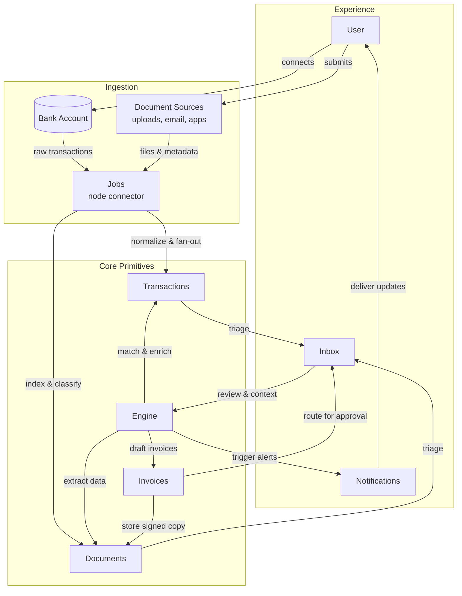

# Midday-to-Zeke Feature Mapping

## How This Architecture Works

### The Three Layers Explained

**Experience Layer (Right side)** - Where humans interact with the system:
- **User**: That's you! The person who feeds data into the system and gets insights back
- **Inbox**: Your command center where stuff that needs your attention piles up (think Gmail but for all your business data)
- **Notifications**: The system tapping you on the shoulder when something important happens

**Ingestion Layer (Left side)** - The data vacuum that sucks everything in:
- **Bank Account**: Direct connection to financial data (automated bank feeds)
- **Document Sources**: All the random files you throw at it - PDFs, emails, spreadsheets, whatever
- **Jobs**: Background workers that process all this crap without you having to babysit them

**Core Primitives (Bottom/Center)** - Where the magic happens:
- **Transactions (TX)**: Individual financial records or in Zeke's world, discrete pieces of information
- **Documents (DOCS)**: Stored files with metadata, searchable and organized
- **Engine (ENG)**: The brain that matches, enriches, and makes sense of everything
- **Invoices (INV)**: Generated outputs/reports (or in Zeke terms, your "Briefs")

### The Data Flow (Follow the Arrows - It's a Loop!)

The genius here is that this isn't a straight line - it's a circular system where data keeps flowing and improving:

1. **Starting Point (Top Right)**: User connects bank accounts or uploads documents
2. **Left Side Processing**: Raw data flows into Jobs which:
   - Normalize and fan out to create Transactions
   - Index and classify to create Documents
3. **Bottom Convergence**: Everything flows down and across to the center where:
   - Transactions and Documents both feed into the Inbox
   - The Inbox becomes the central review point
4. **The Engine Magic (Center-Bottom)**: The Engine processes everything:
   - Enriches transactions with matched documents
   - Extracts data to create new documents
   - Generates invoices/reports
5. **Back Up to Experience (Right Side)**:
   - Notifications flow back up to the User
   - Invoices route through Inbox for approval
   - Approved stuff becomes Documents (feeding back into the system)

**The key insight**: This creates a self-improving loop where processed data becomes better source material for future processing

### Why This Matters for Zeke

This is basically showing how Midday's financial automation flow can be repurposed for Zeke's knowledge management. Instead of:
- Bank transactions → Think "data sources"
- Receipts → Think "evidence/citations"
- Invoice generation → Think "brief/report creation"
- Financial matching → Think "insight correlation"

The beauty is that the same pipeline architecture works whether you're processing bank statements or research documents. It's all just data flowing through transformation stages until it becomes something useful.

This document maps key features of the Midday open-source project to the Zeke platform's core primitives-Stories, Sources, Insights, Briefs, and Playbooks-and outlines how to adapt or rename them. It also highlights architectural patterns from Midday (tRPC structure, Supabase usage, modal flows, sync jobs) that Zeke can emulate. All mappings cover both UI components and backend/data alignment.

## Feature Mappings

### Import Modal (CSV Import for Transactions) -> Sources (Data Ingestion)
**Description / Justification**
Midday's import modal allows users to upload a CSV of bank transactions, acting as an entry point for external data. This aligns with Sources in Zeke, which represent incoming raw information. The multi-step import flow (file selection, field mapping, confirmation) mirrors adding a new source of data.

**Implementation Notes**
- Reuse Midday's multi-stage modal design for "Add Source," e.g., a Source Import Modal with steps: select file/type -> map fields -> confirm import.
- Create a server action such as `importSourceAction`, modeled after Midday's `importTransactionsAction`, to handle file upload and processing, store files in Supabase, and trigger an ingestion job.
- Leverage URL query parameters (for example, `?step=import`) to control modal state, enabling deep links and state persistence.
- Seed the modal with a default catalog of source types (Upload PDF/Doc, RSS feed, Newsletter forward-to-email, Podcast RSS, YouTube subscription) and make the list extensible so teams can register additional connectors without losing the base five options.
- For newsletters, guide users to forward messages to a team-specific inbox address; for feeds (RSS, podcast, YouTube) capture the URL and schedule periodic fetch jobs that drop new items into the Source Inbox.

### Magic Inbox (Automated Receipt Inbox) -> Sources (Ingestion Pipeline)
**Description / Justification**
Midday's Magic Inbox automatically ingests incoming invoices/receipts and matches them to transactions. In Zeke, this concept maps to Sources handling automated input feeds-an inbox of raw source materials (emails, files, etc.) that are processed upon arrival. The Magic Inbox performs OCR and classification on documents, akin to Zeke ingesting and analyzing source content on arrival.

**Implementation Notes**
- Introduce a Source Inbox in Zeke where users can forward emails or upload files to a unique inbox address or folder.
- Use background jobs to extract text, classify content, and link sources to relevant insights or stories; Midday's upload -> OCR -> match pipeline can serve as a baseline playbook.
- Support the inbox via a dedicated table and tRPC router to manage incoming records and their processing status. Rename "Magic Inbox" to Source Inbox or Imports for clarity.
- Let teams register diverse feed connectors (newsletter forwarders, PDF drop folders, RSS/podcast/YT subscriptions) that all funnel into the inbox, each tagged with the originating connector and desired downstream playbook.
- Expose an editable pipeline builder per connector so operators can tweak the default steps (e.g., swap OCR provider, add a summarization stage, invoke custom webhooks) while inheriting sensible defaults from the baseline ingestion playbook.

### Vault (Document Storage & UI) -> Library (Processed Source Catalog)
**Description / Justification**
Midday's Vault is a secure file repository for important documents. Zeke's Library expands that concept into a catalog of every processed source across the ecosystem: uploads, feeds, forwards, and auto-pulled items. Each row reflects the end result of our ingestion and analysis jobs (raw item → content → story overlay), giving operators a single table to review what entered the system and what intelligence ("why it matters," insights, playbook suggestions) was generated on top.

**Implementation Notes**
- Repurpose Midday's Vault module as the Library view: a table/grid backed by `sources`, `raw_items`, `contents`, and `story_overlays` queries that surfaces columns like Source title, connector type, first-seen date, last-sync timestamp, health state (`source_health`), and pipeline progress (ingest → enrich → analyze).
- Show generated intelligence inline: include a clickable "Why it matters" cell (from `story_overlays.why_it_matters`), counts of linked insights/highlights, and quick actions to open the associated Story, Brief, or recommended Playbooks.
- Hook row status badges to the Trigger.dev jobs we run today (`tasks/sources/ingest/*`, `tasks/sources/enrich/fetch-content`, `tasks/insights/generate`) so operators can see whether items completed ingestion, are awaiting content fetch, or failed analysis-with retry controls in-context.
- Keep the existing Supabase storage layout for binary assets, but expose search and filters that fan out across text embeddings and metadata (authority score, tags, goal alignment) using the same query helpers in `packages/db/src/queries/sources.ts`.
- Allow teams to extend the table with custom connectors or fields while shipping with default views for the five starter source types; new connectors should automatically register their pipeline steps so the Library reflects their contributions without manual wiring.

### Transactions (Financial Records & Matching) -> Insights (Discrete Findings or Internal Data Model)
**Description / Justification**
Midday's transactions are granular financial records enriched by matching receipts. Even if Zeke does not handle bank data, an Insight can be treated similarly: an atomic piece of information with metadata linked to source evidence. Transaction status (unmatched/matched) parallels an insight's validation or review state.

**Implementation Notes**
- Adopt a transaction-like schema for insights, with fields for content, source references, tags, and status.
- Use Midday's transaction router and matching logic as guidance for linking insights to source documents (akin to `transaction_attachments`).
- Apply Midday's patterns-Zod schemas and routers-for insight creation and consider automated matching to connect new sources with existing insights or stories.

### Reports (Financial Overview & Analytics) -> Briefs (Compiled Reports)
**Description / Justification**
Midday's reports module generates summaries of financial data. This equates to Zeke's Briefs: compiled reports or synthesized narratives built from insights. Once data is reconciled, Midday enables powerful reporting; Zeke's Briefs deliver similar higher-level aggregation.

**Implementation Notes**
- Use Midday's reports UI as a template for a Brief viewer/editor combining prose with visualizations.
- Back the feature with queries that aggregate source-derived insights, mirroring how Midday composes reports from transactions and documents.
- Supply brief templates inspired by Midday's predefined report types, enabling save/edit flows and potentially collaborative sharing similar to Midday's invoicing work.

### AI Assistant & Insights (Tailored Analysis) -> Insights (AI-Generated or Query-Driven)
**Description / Justification**
Midday's AI assistant answers financial questions, surfacing insights from underlying data. For Zeke, the assistant also elicits a lightweight profile of the team's objectives and current projects so the generated insights are anchored to the operator's business goals. Those "goal-aware" insights become the raw ingredients that Playbooks later operationalize.

**Implementation Notes**
- Implement an AI Insight Assistant that queries embeddings of source content via a tRPC endpoint (`search` or `ask`) similar to Midday's approach with OpenAI and pgvector, while tracking goal-aligned metadata (goal id, time horizon, owner) per insight.
- Fold a goal-discovery step into the conversation (assistant asks clarifying questions, fetches past playbooks, infers objectives from briefs) so the AI can ground its recommendations in tangible outcomes.
- Allow operators to confirm, edit, or reject the proposed context before persisting it, then promote confirmed responses into structured insights ready to seed playbooks or briefs.
- Repurpose Midday's intelligent filtering utilities (e.g., `generate-transactions-filters.ts`, `generate-vault-filters.ts`) to help users sift through sources and surface playbook-ready signals.

### Ingestion Workflows (Matching Engine) -> Playbooks (Automated Sequences)
**Description / Justification**
Midday's backend workflows-document matching, background jobs, Trigger.dev sequences-are orchestrated steps (upload -> OCR -> match -> notify). These map directly to Zeke's Playbooks: repeatable automation chains that operate on sources to yield outcomes, with goal-aware insights acting as the playbook inputs. The playbook primitive should only surface when it can drive a concrete next action; if no actionable use case exists, the assistant leaves the insight as informational rather than forcing a workflow.

**Implementation Notes**
- Define playbooks as configurable sequences, using background workers or serverless functions to run long-lived jobs, and parameterize each run with the goals and constraints captured by the assistant.
- Introduce a goal-to-playbook recommendation step: once an insight is confirmed, suggest relevant playbooks (and pre-fill variables) based on matching tags, past outcomes, or Midday-style rule libraries.
- Mirror Midday's Trigger.dev integration (`tasks.trigger(...)`) alongside a realtime status hook (like `useSyncStatus`) to monitor progress in the UI, and surface progress back to the assistant thread so users can ask follow-up questions.
- Combine URL-driven flows, background tasks, and realtime updates so users can launch, observe, and reuse playbooks (e.g., a "Source Ingestion Playbook" modeled after Midday's Magic Inbox) while logging completions to enrich future goal-discovery prompts.
- Add a guardrail stage ("is this actionable?") that validates prerequisites before a playbook run starts; if the answer is no, capture why and feed that back into assistant messaging so the user understands the limitation and can address it manually.

_Notes:_ Midday's Team Management concepts are already ported into Zeke's primitives. Time Tracking still lacks a clear application, though adjacent patterns (project timelines, multi-tenancy) may inspire future work.

## Architectural Patterns & Best Practices from Midday
- **Modular tRPC router structure:** Separate routers by domain (transactions, documents, inbox, reports) with shared Zod schemas and a dedicated types package. Mirror this by creating routers for each Zeke primitive to maintain end-to-end type safety.
- **Supabase for database and storage:** Use Supabase Postgres (with Row-Level Security) and storage buckets organized by team-scoped paths, issuing signed URLs for access. The same setup suits Zeke's source files, insights, and realtime updates.
- **URL-state driven modal flows:** Manage workflows via query parameters (`?step=import`, etc.) so modals and sidebars are shareable, refresh-safe, and navigable. Implement a hook like Midday's `useQueryStates` for consistent state handling.
- **Sync status and background jobs:** Kick off background work through actions that return a `runId`, then observe job state with hooks (e.g., `useSyncStatus`) and refresh affected queries on completion to keep the UI responsive.
- **Modal & inline server actions:** Follow Midday's pattern of React server actions (wrapped with an auth-aware client) for mutations such as story creation, source uploads, and brief generation to enforce auth and type safety.
- **Supabase realtime & sync:** Subscribe to changes on critical tables (Sources, Insights, etc.) so collaborators see live updates, complementing manual cache invalidation.
- **Design system & UI components:** Reuse Midday's ShadCN/Tailwind component patterns for dialogs, list views, empty states, and layout structure to accelerate Zeke's UI build-out.

## Source Import Modal Vision & Flow
To integrate the patterns above, Zeke can adopt a Source Import Modal flow inspired by Midday's process. The flow covers adding a new Source-uploading a document or connecting an external feed-in a guided, multi-step experience:

1. **Launch import flow:** Clicking "Add Source" updates the URL (for example, `?step=import`) and opens the Import Source modal via a hook that inspects query params.
2. **Choose source type:** Present options such as Upload File, Enter URL, or Connect Account. For connected integrations, initiate OAuth inline or in a pop-up before returning to the modal.
3. **Upload & preview:** After selection, advance automatically (e.g., `?step=import&stage=mapping`). Upload files immediately to Supabase storage, show previews (document text, file metadata, or CSV column mapping), and let users adjust field mappings when applicable.
4. **Confirmation & ingestion:** On submit, call a server action (`importSourceAction`) that stores a Source record, kicks off extraction or parsing jobs, and queues any downstream playbooks (e.g., `tasks.trigger("ingest-source", { sourceId })`).
5. **Progress tracking:** Display progress indicators while the background job runs, subscribing to status updates through Supabase Realtime, Trigger.dev listeners, or polling.
6. **Completion & feedback:** Close the modal when the job reports completion, refresh relevant queries (Sources list, dashboards), and show success or error toasts to guide next steps.
7. **Post-import linking (optional):** Prompt users to link the new source to Stories or convert findings into Insights, similar to Midday's automatic receipt-to-transaction matching.

## References
- `repomix-output.txt` (local diagnostics)
- Midday GitHub: <https://github.com/midday-ai/midday>
- Midday update log: <https://midday.ai/updates/48>
