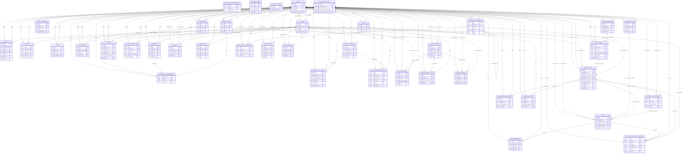

# Database ER Diagram

The diagram below focuses on primary identifiers and foreign keys defined in `db.ts`. Nullable relationships are noted in the edge labels when helpful.

```mermaid
erDiagram
    ACTIVITIES {
        string id PK
        string team_id FK
        string user_id FK
        string group_id
        string status
        string type
        string source
    }
    API_KEYS {
        string id PK
        string team_id FK
        string user_id FK
        string name
        boolean is_active
    }
    APPS {
        string id PK
        string app_id
        string team_id FK
        string created_by FK
    }
    BANK_ACCOUNTS {
        string id PK
        string account_id
        string team_id FK
        string bank_connection_id FK
        string created_by FK
        boolean enabled
    }
    BANK_CONNECTIONS {
        string id PK
        string team_id FK
        string institution_id
        string status
    }
    CUSTOMER_TAGS {
        string id PK
        string customer_id FK
        string tag_id FK
        string team_id FK
    }
    CUSTOMERS {
        string id PK
        string team_id FK
        string name
        string email
    }
    DOCUMENT_TAG_ASSIGNMENTS {
        string document_id FK
        string tag_id FK
        string team_id FK
    }
    DOCUMENT_TAG_EMBEDDINGS {
        string slug PK
        string name
        string embedding
    }
    DOCUMENT_TAGS {
        string id PK
        string team_id FK
        string name
        string slug
    }
    DOCUMENTS {
        string id PK
        string team_id FK
        string owner_id FK
        string name
        string object_id
    }
    EXCHANGE_RATES {
        string id PK
        string base
        string target
        number rate
    }
    INBOX {
        string id PK
        string team_id FK
        string inbox_account_id FK
        string transaction_id FK
        string attachment_id FK
    }
    INBOX_ACCOUNTS {
        string id PK
        string team_id FK
        string email
        string status
    }
    INBOX_EMBEDDINGS {
        string id PK
        string inbox_id FK
        string team_id FK
        string model
    }
    INVOICE_COMMENTS {
        string id PK
        string created_at
    }
    INVOICE_TEMPLATES {
        string id PK
        string team_id FK
        string currency
        string delivery_type
    }
    INVOICES {
        string id PK
        string team_id FK
        string customer_id FK
        string user_id FK
        string invoice_number
        string status
    }
    NOTIFICATION_SETTINGS {
        string id PK
        string team_id FK
        string user_id FK
        string notification_type
        boolean enabled
    }
    OAUTH_ACCESS_TOKENS {
        string id PK
        string team_id FK
        string application_id FK
        string user_id FK
        string token
        string expires_at
    }
    OAUTH_APPLICATIONS {
        string id PK
        string team_id FK
        string created_by FK
        string client_id
        string name
    }
    OAUTH_AUTHORIZATION_CODES {
        string id PK
        string team_id FK
        string application_id FK
        string user_id FK
        string code
        string redirect_uri
    }
    REPORTS {
        string id PK
        string team_id FK
        string created_by FK
        string type
    }
    SHORT_LINKS {
        string id PK
        string team_id FK
        string user_id FK
        string short_id
        string url
    }
    TAGS {
        string id PK
        string team_id FK
        string name
    }
    TEAMS {
        string id PK
        string name
        string plan
        string base_currency
    }
    TEAM_LIMITS_METRICS {
        string team_id PK
        number number_of_users
        number inbox_created_this_month
        number invoices_created_this_month
    }
    TRACKER_ENTRIES {
        string id PK
        string team_id FK
        string project_id FK
        string assigned_id FK
        string date
    }
    TRACKER_PROJECT_TAGS {
        string id PK
        string team_id FK
        string tracker_project_id FK
        string tag_id FK
    }
    TRACKER_PROJECTS {
        string id PK
        string team_id FK
        string customer_id FK
        string name
        string status
    }
    TRACKER_REPORTS {
        string id PK
        string team_id FK
        string project_id FK
        string created_by FK
    }
    TRANSACTION_ATTACHMENTS {
        string id PK
        string team_id FK
        string transaction_id FK
        string path
    }
    TRANSACTION_CATEGORIES {
        string id PK
        string team_id FK
        string parent_id FK
        string slug
        string name
    }
    TRANSACTION_EMBEDDINGS {
        string id PK
        string team_id FK
        string transaction_id FK
        string model
    }
    TRANSACTION_ENRICHMENTS {
        string id PK
        string team_id FK
        string category_slug FK
        string name
    }
    TRANSACTION_MATCH_SUGGESTIONS {
        string id PK
        string team_id FK
        string inbox_id FK
        string transaction_id FK
        string user_id FK
        string status
    }
    TRANSACTION_TAGS {
        string id PK
        string team_id FK
        string transaction_id FK
        string tag_id FK
    }
    TRANSACTIONS {
        string id PK
        string team_id FK
        string bank_account_id FK
        string assigned_id FK
        string category_slug FK
        string internal_id
        string method
        string status
    }
    USER_INVITES {
        string id PK
        string team_id FK
        string invited_by FK
        string email
        string role
    }
    USERS {
        string id PK
        string team_id FK
        string email
        string full_name
    }
    USERS_ON_TEAM {
        string id PK
        string team_id FK
        string user_id FK
        string role
    }

    TEAMS ||--o{ ACTIVITIES : "team_id"
    TEAM_LIMITS_METRICS ||--o{ ACTIVITIES : "team_id"
    USERS ||--o{ ACTIVITIES : "user_id (nullable)"

    TEAMS ||--o{ API_KEYS : "team_id"
    TEAM_LIMITS_METRICS ||--o{ API_KEYS : "team_id"
    USERS ||--o{ API_KEYS : "user_id"

    TEAMS ||--o{ APPS : "team_id"
    TEAM_LIMITS_METRICS ||--o{ APPS : "team_id"
    USERS ||--o{ APPS : "created_by (nullable)"

    TEAMS ||--o{ BANK_ACCOUNTS : "team_id"
    TEAM_LIMITS_METRICS ||--o{ BANK_ACCOUNTS : "team_id"
    BANK_CONNECTIONS ||--o{ BANK_ACCOUNTS : "bank_connection_id (nullable)"
    USERS ||--o{ BANK_ACCOUNTS : "created_by"

    TEAMS ||--o{ BANK_CONNECTIONS : "team_id"
    TEAM_LIMITS_METRICS ||--o{ BANK_CONNECTIONS : "team_id"

    TEAMS ||--o{ CUSTOMER_TAGS : "team_id"
    TEAM_LIMITS_METRICS ||--o{ CUSTOMER_TAGS : "team_id"
    CUSTOMERS ||--o{ CUSTOMER_TAGS : "customer_id"
    TAGS ||--o{ CUSTOMER_TAGS : "tag_id"

    TEAMS ||--o{ CUSTOMERS : "team_id"
    TEAM_LIMITS_METRICS ||--o{ CUSTOMERS : "team_id"

    TEAMS ||--o{ DOCUMENT_TAG_ASSIGNMENTS : "team_id"
    TEAM_LIMITS_METRICS ||--o{ DOCUMENT_TAG_ASSIGNMENTS : "team_id"
    DOCUMENTS ||--o{ DOCUMENT_TAG_ASSIGNMENTS : "document_id"
    DOCUMENT_TAGS ||--o{ DOCUMENT_TAG_ASSIGNMENTS : "tag_id"

    TEAMS ||--o{ DOCUMENT_TAGS : "team_id"
    TEAM_LIMITS_METRICS ||--o{ DOCUMENT_TAGS : "team_id"

    TEAMS ||--o{ DOCUMENTS : "team_id"
    TEAM_LIMITS_METRICS ||--o{ DOCUMENTS : "team_id"
    USERS ||--o{ DOCUMENTS : "owner_id (nullable)"

    TEAMS ||--o{ INBOX : "team_id (nullable)"
    TEAM_LIMITS_METRICS ||--o{ INBOX : "team_id (nullable)"
    INBOX_ACCOUNTS ||--o{ INBOX : "inbox_account_id (nullable)"
    TRANSACTIONS ||--o{ INBOX : "transaction_id (nullable)"
    TRANSACTION_ATTACHMENTS ||--o{ INBOX : "attachment_id (nullable)"

    TEAMS ||--o{ INBOX_ACCOUNTS : "team_id"
    TEAM_LIMITS_METRICS ||--o{ INBOX_ACCOUNTS : "team_id"

    TEAMS ||--o{ INBOX_EMBEDDINGS : "team_id"
    TEAM_LIMITS_METRICS ||--o{ INBOX_EMBEDDINGS : "team_id"
    INBOX ||--o| INBOX_EMBEDDINGS : "inbox_id"

    TEAMS ||--|| INVOICE_TEMPLATES : "team_id"
    TEAM_LIMITS_METRICS ||--|| INVOICE_TEMPLATES : "team_id"

    TEAMS ||--o{ INVOICES : "team_id"
    TEAM_LIMITS_METRICS ||--o{ INVOICES : "team_id"
    CUSTOMERS ||--o{ INVOICES : "customer_id (nullable)"
    USERS ||--o{ INVOICES : "user_id (nullable)"

    TEAMS ||--o{ NOTIFICATION_SETTINGS : "team_id"
    TEAM_LIMITS_METRICS ||--o{ NOTIFICATION_SETTINGS : "team_id"
    USERS ||--o{ NOTIFICATION_SETTINGS : "user_id"

    TEAMS ||--o{ OAUTH_ACCESS_TOKENS : "team_id"
    TEAM_LIMITS_METRICS ||--o{ OAUTH_ACCESS_TOKENS : "team_id"
    OAUTH_APPLICATIONS ||--o{ OAUTH_ACCESS_TOKENS : "application_id"
    USERS ||--o{ OAUTH_ACCESS_TOKENS : "user_id"

    TEAMS ||--o{ OAUTH_APPLICATIONS : "team_id"
    TEAM_LIMITS_METRICS ||--o{ OAUTH_APPLICATIONS : "team_id"
    USERS ||--o{ OAUTH_APPLICATIONS : "created_by"

    TEAMS ||--o{ OAUTH_AUTHORIZATION_CODES : "team_id"
    TEAM_LIMITS_METRICS ||--o{ OAUTH_AUTHORIZATION_CODES : "team_id"
    OAUTH_APPLICATIONS ||--o{ OAUTH_AUTHORIZATION_CODES : "application_id"
    USERS ||--o{ OAUTH_AUTHORIZATION_CODES : "user_id"

    TEAMS ||--o{ REPORTS : "team_id (nullable)"
    TEAM_LIMITS_METRICS ||--o{ REPORTS : "team_id (nullable)"
    USERS ||--o{ REPORTS : "created_by (nullable)"

    TEAMS ||--o{ SHORT_LINKS : "team_id"
    TEAM_LIMITS_METRICS ||--o{ SHORT_LINKS : "team_id"
    USERS ||--o{ SHORT_LINKS : "user_id"

    TEAMS ||--o{ TAGS : "team_id"
    TEAM_LIMITS_METRICS ||--o{ TAGS : "team_id"

    TEAMS ||--o{ TRACKER_ENTRIES : "team_id (nullable)"
    TEAM_LIMITS_METRICS ||--o{ TRACKER_ENTRIES : "team_id (nullable)"
    TRACKER_PROJECTS ||--o{ TRACKER_ENTRIES : "project_id (nullable)"
    USERS ||--o{ TRACKER_ENTRIES : "assigned_id (nullable)"

    TEAMS ||--o{ TRACKER_PROJECT_TAGS : "team_id"
    TEAM_LIMITS_METRICS ||--o{ TRACKER_PROJECT_TAGS : "team_id"
    TRACKER_PROJECTS ||--o{ TRACKER_PROJECT_TAGS : "tracker_project_id"
    TAGS ||--o{ TRACKER_PROJECT_TAGS : "tag_id"

    TEAMS ||--o{ TRACKER_PROJECTS : "team_id (nullable)"
    TEAM_LIMITS_METRICS ||--o{ TRACKER_PROJECTS : "team_id (nullable)"
    CUSTOMERS ||--o{ TRACKER_PROJECTS : "customer_id (nullable)"

    TEAMS ||--o{ TRACKER_REPORTS : "team_id (nullable)"
    TEAM_LIMITS_METRICS ||--o{ TRACKER_REPORTS : "team_id (nullable)"
    TRACKER_PROJECTS ||--o{ TRACKER_REPORTS : "project_id (nullable)"
    USERS ||--o{ TRACKER_REPORTS : "created_by (nullable)"

    TEAMS ||--o{ TRANSACTION_ATTACHMENTS : "team_id (nullable)"
    TEAM_LIMITS_METRICS ||--o{ TRANSACTION_ATTACHMENTS : "team_id (nullable)"
    TRANSACTIONS ||--o{ TRANSACTION_ATTACHMENTS : "transaction_id (nullable)"

    TEAMS ||--o{ TRANSACTION_CATEGORIES : "team_id"
    TEAM_LIMITS_METRICS ||--o{ TRANSACTION_CATEGORIES : "team_id"
    TRANSACTION_CATEGORIES ||--o{ TRANSACTION_CATEGORIES : "parent_id (nullable)"

    TEAMS ||--o{ TRANSACTION_EMBEDDINGS : "team_id"
    TEAM_LIMITS_METRICS ||--o{ TRANSACTION_EMBEDDINGS : "team_id"
    TRANSACTIONS ||--|| TRANSACTION_EMBEDDINGS : "transaction_id"

    TEAMS ||--o{ TRANSACTION_ENRICHMENTS : "team_id (nullable)"
    TEAM_LIMITS_METRICS ||--o{ TRANSACTION_ENRICHMENTS : "team_id (nullable)"
    TRANSACTION_CATEGORIES ||--o{ TRANSACTION_ENRICHMENTS : "category_slug+team_id"

    TEAMS ||--o{ TRANSACTION_MATCH_SUGGESTIONS : "team_id"
    TEAM_LIMITS_METRICS ||--o{ TRANSACTION_MATCH_SUGGESTIONS : "team_id"
    INBOX ||--o{ TRANSACTION_MATCH_SUGGESTIONS : "inbox_id"
    TRANSACTIONS ||--o{ TRANSACTION_MATCH_SUGGESTIONS : "transaction_id"
    USERS ||--o{ TRANSACTION_MATCH_SUGGESTIONS : "user_id (nullable)"

    TEAMS ||--o{ TRANSACTION_TAGS : "team_id"
    TEAM_LIMITS_METRICS ||--o{ TRANSACTION_TAGS : "team_id"
    TRANSACTIONS ||--o{ TRANSACTION_TAGS : "transaction_id"
    TAGS ||--o{ TRANSACTION_TAGS : "tag_id"

    TEAMS ||--o{ TRANSACTIONS : "team_id"
    TEAM_LIMITS_METRICS ||--o{ TRANSACTIONS : "team_id"
    USERS ||--o{ TRANSACTIONS : "assigned_id (nullable)"
    BANK_ACCOUNTS ||--o{ TRANSACTIONS : "bank_account_id (nullable)"
    TRANSACTION_CATEGORIES ||--o{ TRANSACTIONS : "category_slug+team_id"

    TEAMS ||--o{ USER_INVITES : "team_id (nullable)"
    TEAM_LIMITS_METRICS ||--o{ USER_INVITES : "team_id (nullable)"
    USERS ||--o{ USER_INVITES : "invited_by (nullable)"

    TEAMS ||--o{ USERS : "team_id (nullable)"
    TEAM_LIMITS_METRICS ||--o{ USERS : "team_id (nullable)"

    TEAMS ||--o{ USERS_ON_TEAM : "team_id"
    TEAM_LIMITS_METRICS ||--o{ USERS_ON_TEAM : "team_id"
    USERS ||--o{ USERS_ON_TEAM : "user_id"
```
